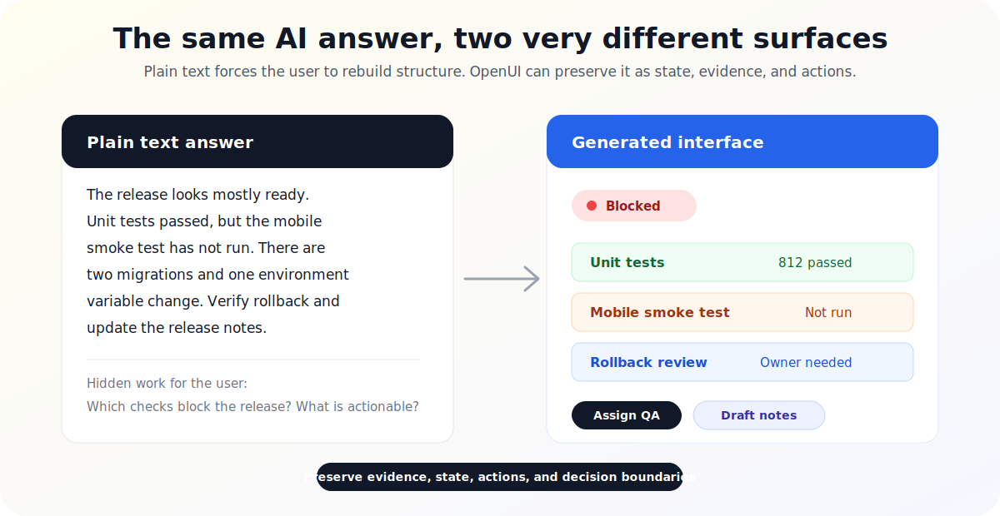

# 5 AI Answers That Should Be Interfaces

Most AI products still treat the answer as a paragraph. That works when the user asked for a definition, a rewrite, or a short explanation. It breaks down when the answer has structure the user needs to inspect, compare, approve, or act on.

The problem is not that plain text is ugly. The problem is that plain text throws away useful interface state. It turns evidence into prose, actions into suggestions, choices into bullets, and progress into scrollback.

Generative UI fixes that only when it preserves the shape of the task. OpenUI is useful here because the model can return an interface instead of forcing the product to translate every complex answer back into a chat bubble.



The goal is not to make every answer more visual. The goal is to keep the parts that matter as first-class UI: evidence stays attached to claims, state stays visible, actions have stable targets, and decisions remain reviewable before anything executes.

Here are five outputs that degrade badly as plain text, and what changes when the same answer becomes a rendered UI.

## 1. Incident Triage

Plain text is especially weak when the user needs to understand what changed, what is still happening, and what to do next.

A text-only incident assistant usually sounds like this:

```text
The spike appears to have started around 14:08 UTC. The most likely cause is
the deploy at 14:02 UTC because error rates increased shortly afterward. The
checkout service is affected. You should consider rolling back the deploy,
checking database latency, and notifying support.
```

That paragraph may be accurate, but it forces the user to do interface work in their head:

- Which claim is supported by logs?
- Which action is safest?
- What has already been checked?
- Is rollback a button, a command, or just advice?

The better version is an incident card with a timeline, evidence, confidence, and guarded actions.

```tsx
<IncidentTriage
  service="checkout-api"
  severity="high"
  startedAt="14:08 UTC"
  likelyCause={{
    label: "Deploy 2026.05.13.1402",
    confidence: 0.82,
    evidence: ["5xx +18%", "p95 latency +430ms", "first error after deploy"]
  }}
  timeline={[
    { time: "14:02", label: "Deploy started" },
    { time: "14:08", label: "Error spike detected" },
    { time: "14:11", label: "Database latency normal" }
  ]}
  actions={[
    { id: "rollback", label: "Prepare rollback", risk: "medium" },
    { id: "notify-support", label: "Draft support update", risk: "low" }
  ]}
/>
```

The interface version does not merely look nicer. It separates the diagnosis from the supporting evidence and the available actions. The user can scan the timeline, check why the model believes the deploy is related, and choose an action with a visible risk label.

That matters because incident response is not a reading task. It is a sequencing task under pressure. A generative UI can make the next safe action explicit while still showing the evidence that supports it.

## 2. Data Reconciliation

Plain text is a poor format for conflicts. It tends to hide the exact field that changed.

Imagine an operations assistant comparing two customer records:

```text
There are differences between the CRM and billing system. The company name is
slightly different, billing says the account is on the Team plan while CRM says
Business, and the billing contact email changed last week. You may want to
update CRM to match billing.
```

That answer has three different classes of information:

- A harmless naming variation.
- A billing-plan conflict that may affect access.
- A contact change with a recency signal.

Plain text flattens all of them into one recommendation. A reviewable interface can keep the conflicts separate.

```tsx
<RecordReconciliation
  sourceA="CRM"
  sourceB="Billing"
  conflicts={[
    {
      field: "Company name",
      crm: "Northstar Labs, Inc.",
      billing: "Northstar Labs",
      severity: "low",
      recommendation: "Keep CRM value"
    },
    {
      field: "Plan",
      crm: "Business",
      billing: "Team",
      severity: "high",
      recommendation: "Review before syncing"
    },
    {
      field: "Billing contact",
      crm: "ops@northstar.example",
      billing: "finance@northstar.example",
      severity: "medium",
      recommendation: "Update CRM after confirmation"
    }
  ]}
/>
```

Now the user can approve the easy difference, pause the risky one, and inspect the contact change separately. This is exactly where generated UI earns its place: the model found the differences, but the product still needs a surface for human review.

The key is that the UI preserves decision boundaries. It does not ask the user to copy values out of prose or infer which recommendation belongs to which field.

## 3. Release Readiness

Plain text turns readiness into vibes.

A release assistant might say:

```text
The release looks mostly ready. Unit tests passed, but the mobile smoke test
has not run yet. There are two migrations and one environment variable change.
You should verify the migration rollback path and update the release notes.
```

This is useful as a summary, but weak as an operational surface. Release work has state: passed, failed, blocked, not run, requires approval, owner needed, and safe to ship.

A better answer is a readiness panel.

```tsx
<ReleaseReadiness
  version="2.8.0"
  status="blocked"
  checks={[
    { name: "Unit tests", state: "passed", evidence: "812 passed" },
    { name: "API contract tests", state: "passed", evidence: "24 passed" },
    { name: "Mobile smoke test", state: "not_run", owner: "QA" },
    { name: "Migration rollback", state: "needs_review", owner: "Backend" },
    { name: "Release notes", state: "draft_needed", owner: "DevRel" }
  ]}
  blockers={[
    "Mobile smoke test has not run",
    "Rollback path for migration 20260513_add_plan_flags needs review"
  ]}
/>
```

The UI makes the release decision visible. The model can still write a narrative summary, but the primary output should be structured enough to drive the next step.

This also makes the assistant easier to trust. When the status says `blocked`, the user can see exactly which checks caused that state. If a check is wrong, they can challenge the specific row instead of arguing with a paragraph.

## 4. Approval Queues

Approval workflows are awkward in chat because the action and the evidence live in different places.

The text-only version looks harmless:

```text
I found three refund requests. The first one appears valid because the customer
was double charged. The second may be valid but the logs are incomplete. The
third should probably be denied because the request is outside the refund
window.
```

That output is readable, but it is not a good approval surface. The user has to remember which request is which, scroll back for evidence, then type something like "approve the first one and reject the third."

That is fragile. Approvals need explicit targets.

```tsx
<ApprovalQueue
  title="Refund requests"
  items={[
    {
      id: "rf_1029",
      customer: "Avery Chen",
      amount: "$49.00",
      recommendation: "approve",
      confidence: 0.91,
      evidence: ["duplicate charge", "same invoice id", "payment captured twice"]
    },
    {
      id: "rf_1030",
      customer: "Mina Patel",
      amount: "$19.00",
      recommendation: "hold",
      confidence: 0.54,
      evidence: ["support ticket mentions outage", "usage logs unavailable"]
    },
    {
      id: "rf_1031",
      customer: "Riley Brooks",
      amount: "$99.00",
      recommendation: "deny",
      confidence: 0.78,
      evidence: ["outside 30-day window", "feature used after purchase"]
    }
  ]}
  actions={["approve", "hold", "deny", "request_more_info"]}
/>
```

The interface is not just displaying the answer. It is turning the answer into a safe handoff between the model and the human.

Good generated approval UI should include stable identifiers, evidence, recommendation confidence, and an explicit action set. Without those, the product risks approving "the first one" after the order changes or after another message enters the conversation.

## 5. Multi-Option Decisions

Plain text is passable for one recommendation. It falls apart when the user has to compare several options across tradeoffs.

A model can write:

```text
Option A is cheaper and faster to ship, but it has less auditability. Option B
is more expensive but gives you better control and rollback safety. Option C is
the most flexible, but it requires more maintenance and introduces another
service dependency.
```

That is the start of an answer, not the answer. The user still has to build the comparison table mentally.

The UI version should make the tradeoffs visible.

```tsx
<DecisionMatrix
  question="How should we add export support?"
  options={[
    {
      name: "CSV-only export",
      cost: "low",
      shipTime: "1 day",
      auditability: "low",
      rollback: "simple",
      recommendation: "best for internal beta"
    },
    {
      name: "Queued export worker",
      cost: "medium",
      shipTime: "3-4 days",
      auditability: "medium",
      rollback: "safe",
      recommendation: "best default"
    },
    {
      name: "External export service",
      cost: "high",
      shipTime: "1-2 weeks",
      auditability: "high",
      rollback: "depends on vendor",
      recommendation: "best for compliance-heavy customers"
    }
  ]}
/>
```

A matrix lets the reader compare horizontally. It also gives the product room for filters, sorting, annotations, and a "choose this path" action. Those interactions are difficult to represent cleanly in text.

This is one of the simplest rules for deciding whether an AI answer should become UI: if the user has to compare three or more things across three or more attributes, a paragraph is probably the wrong surface.

## A Practical Rubric

Not every AI answer needs a generated interface. Text is still the right output for short explanations, drafts, definitions, and anything where the user's next step is simply to read or copy.

But if the answer includes any of these, plain text should be treated as a fallback:

- State: passed, failed, pending, blocked, approved, rejected.
- Evidence: logs, traces, field diffs, citations, checks, confidence.
- Actions: approve, retry, roll back, assign, compare, sync, export.
- Multiple records: customers, tickets, alerts, jobs, invoices, files.
- Reversible decisions: anything that should be reviewed before it is executed.

OpenUI is interesting because it lets the product keep those parts as interface instead of flattening them into prose. The model can still generate the shape of the response, but the user receives something closer to the task they actually need to complete.

The best generative UI does not replace text with decoration. It turns model output into a reviewable object: structured, inspectable, and actionable.

That is the real failure mode of plain text. It does not just look bad. It makes users rebuild the interface themselves, one paragraph at a time.
