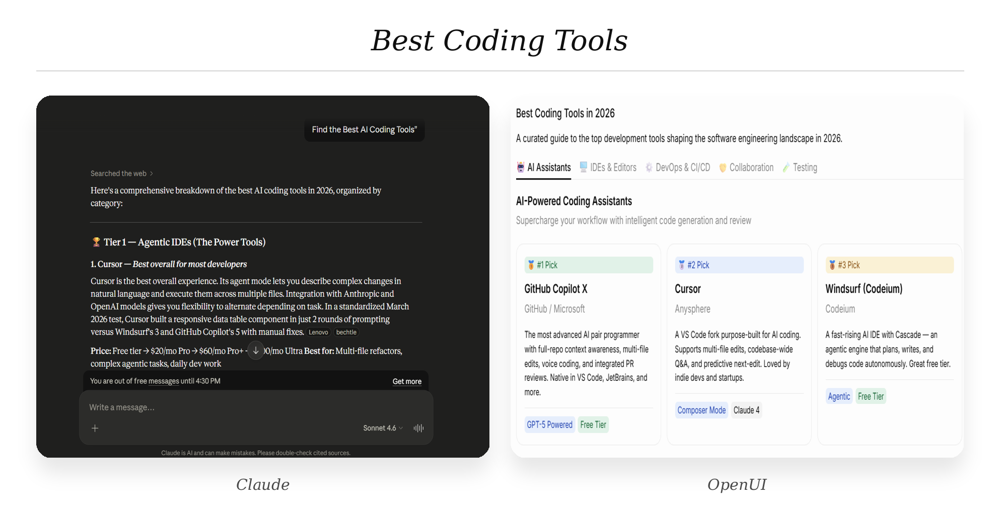

# 5 Things That Look Terrible as Plain Text (And How OpenUI Fixes Them)

Most AI products still respond like it's 2023. You ask a question, a cursor blinks, and you get paragraphs. The model behind it got smarter. It can reason, plan, compare, analyze. The output pipe did not change. Everything gets squeezed into the same wall-of-text format from three years ago.

The structure is already there. When a model says "React has a large ecosystem, Vue is more lightweight, Angular is more opinionated," it already had a table in its head. It understood those as rows. It knew ecosystem, learning curve, and best use case were columns. Then it threw the shape away and handed you a paragraph.

OpenUI is a rendering spec meant to close that gap. Instead of generating prose, a model outputs OpenUI Lang, a compact, code-like syntax that maps to real UI components. The result renders live in the interface instead of being interpreted by your brain.

Here are five kinds of AI output that break as plain text, and what they look like when the interface keeps up.

---

## 1. Framework and Tool Comparisons

Comparisons are the clearest case. Ask any AI assistant to compare React, Vue, and Svelte, and you get three separate paragraphs. Pros here, cons there, best for at the end. You read them in order and try to hold all three in working memory long enough to decide.

Plain text forces you to serialize the comparison. Read option A, remember it, read option B, hold both, read option C, now compare. That is a working memory issue, not a content issue. Interfaces let you scan across a row, filter by a column, and anchor on the one attribute that matters. The model had the right answer. The format threw away the shape.

.png)

The model searched the web, categorized the tools, and identified pricing tiers. The analysis is good. But you still have to mentally organize everything yourself.

Same information. Each tool gets a card with its category label, key feature tags, and a pro/con summary. Below that, a comparison table puts every tool side by side across the dimensions that matter. You scan instead of read. I keep asking for comparisons, then open a sheet anyway just to line things up. The model does not change. The format does.

```
root = Stack([header, comparisonTable])
header = TextContent("AI Coding Tools", "large-heavy")
comparisonTable = Table([
  Col("Tool", tools.name),
  Col("Best For", tools.useCase),
  Col("IDE Support", tools.ide),
  Col("Pricing", tools.pricing)
])
tools = Query("list_tools", {}, {rows: []})
```

The `Query` calls your tool directly. The table columns map to your schema. The model describes the structure once. The renderer does the rest.

Another gap is discoverability. Chat is reactive. It only surfaces information in response to something the user already knows to ask. An interface is discoverable. The columns in that table tell you what dimensions exist. The filter controls show what options are available. The user does not need to already know that "IDE Support" is a relevant axis. The table makes it visible. Chat assumes you know what to ask. Interfaces show what is possible.

---

## 2. Analytics and Live Data

Some information is meant to be scanned, filtered, grouped, and compared visually. Chat interfaces flatten it into sequential paragraphs.

Weather. Search results. Dashboards. Pricing pages. These look different but they share a problem. The user needs to cross-reference multiple data points at once, and a paragraph makes that nearly impossible.

```
Chat Interface
     Question
        ↓
     Paragraph
        ↓
  User manually extracts structure
        ↓
  User manually executes action

Generative UI
     Question
        ↓
  Structured Interface
        ↓
  State + Actions + Data already connected
        ↓
  Direct interaction
```

Weather does not fit paragraphs. "Temperatures rise from 28°C at 8am to 35°C at 2pm, with humidity increasing through the afternoon and precipitation probability peaking around 4pm." You can read that sentence. You cannot see the curve.

.png)

The response is accurate. Still annoying to use. A paragraph forces every relationship between variables into syntax instead of visuals. You have to reconstruct the time series from words.

Current conditions surface immediately. Data is grouped by relevance. A follow-up query can pull in an hourly chart without a second LLM call. The `Query` primitive wires up the data source once, and the runtime handles updates.

```
root = Stack([currentConditions, detailGrid])
currentConditions = Card([StatCard("Tokyo", "18°C", "flat"), StatCard("Feels Like", "16°C", "flat")])
detailGrid = Grid([
  StatCard("Humidity", "65%", "flat"),
  StatCard("Wind", "12 km/h SW", "flat"),
  StatCard("Condition", "Partly Cloudy", "flat")
])
weatherData = Query("get_weather", {city: "Tokyo"}, {})
```

Search needs filtering. You want something open source, under $50/month, with VS Code support. The AI gives you eight tools in eight paragraphs. You read all eight and mentally cross-reference three criteria, hoping you do not miss one.



The `@Filter` primitive makes the filter controls work. Changing the select immediately re-evaluates the result list. No second model call. No round trip. That distinction matters beyond UX. In a chat interface, every refinement ("show me only the free ones") becomes a new prompt, a new model call, additional latency, and additional token cost. In a stateful interface, the same interaction is a local state update. The model is not involved. The filter re-runs client-side in milliseconds.

```
$pricingFilter = "all"
filterBar = Stack([
  Select("pricing", $pricingFilter, [
    SelectItem("all", "All"),
    SelectItem("free", "Free"),
    SelectItem("paid", "Paid")
  ])
], "row")
filtered = @Filter(tools.rows, "pricing", "==", $pricingFilter)
results = Grid([Card([TextContent(filtered.name), Badge(filtered.pricing)])])
tools = Query("list_tools", {}, {rows: []})
```

Dashboards need hierarchy. Status at the top, details below, actions inline. A paragraph has no hierarchy. It has sentences.

The pattern across all three is simple. The model has structured data internally. Plain text throws the structure away. OpenUI keeps it. Because that structure lives in the interface instead of being reconstructed on each response, later interactions become local operations instead of extra model round trips.

---

## 3. Multi-Step Onboarding and Setup Flows

Chat interfaces are stateless by default. Real workflows are not.

This is the mismatch. Numbered steps are fine for simple tasks. They fall apart when the task is long, stateful, or needs input validation. "Step 3: Configure your database connection" does not know whether you completed step 2. It cannot validate your connection string before you move on. It does not remember where you left off if you close the tab.

There is an important distinction between statefulness and persistence. Statefulness is the current interaction state. Which step is active, which fields are filled, what the form currently contains. Persistence is state surviving across time. Reopening a half-finished setup flow and continuing from where you stopped, not from the beginning.

Chat history stores conversation. Interfaces store application state. Those are not the same thing. Your chat log from last Tuesday tells you what was discussed. It does not restore the form values you entered, the steps you completed, or the environment variables you configured. A persistent interface does. Come back three days later, the stepper is still on step 3, your database host is still filled in, the validated fields are still green.

Real workflows involve both. Which steps are done, which fields are valid, what the current values are, what comes next based on what you entered, and whether any of that survives closing the tab. A chat message holds none of it.

**Plain text response:**

A numbered list. Maybe with headers for each step. When you finish, you're not sure you did it right. When you come back, you're not sure where you stopped.

.png)

Both show what text cannot show. State. Completed steps are checked. The current step is highlighted. Future steps are dimmed. The database form validates inline before letting you continue. The environment variables table lets you audit what has been configured. The Export to Sheets button wires directly to a tool action.

The reactive variable `$currentStep` is what makes navigation work without any LLM involvement after the initial generation:

```
root = Stack([header, stepper, currentStep])
stepper = Stepper($currentStep, ["Environment", "Database", "Deploy", "Review"])
$currentStep = 0

currentStep = $currentStep == 0 ? envStep :
              $currentStep == 1 ? dbStep :
              $currentStep == 2 ? deployStep : reviewStep

dbStep = Card([
  TextContent("Connect your PostgreSQL database", "body"),
  Input("host", $dbHost, "example.cluster.amazonaws.com"),
  Button("Test Connection", Action([@Run(testConn)]))
])
```

When Test Connection fires, the mutation runs and the UI updates. The model is not involved. The state lives in the interface, not in the conversation history.

The screenshot below shows a resumable workflow. A previously incomplete setup flow with saved progress, reopened and continuing from where it stopped:


This falls out of the architecture instead of being a feature bolted on top. UI state is managed in the renderer rather than reconstructed from chat history on every turn, so it can be stored, restored, and shared. Collaborative setup flows become possible. One team member completes the environment step, another continues from the database step. The interface holds the state, not a private conversation thread.

This is stateful interaction. Not a nice onboarding UI. The distinction generalizes to every wizard, configuration flow, and multi-step process in your product.

---

## 4. Error States and Operational Systems

Current AI chat interfaces separate diagnosis from execution. This gap costs the most time in practice.

Something fails in production. You ask your AI assistant what happened. It tells you in three paragraphs. What broke, why it broke, what to do about it. Then you open your deployment dashboard to fix it. You copy the environment variable name from the chat. You navigate to the settings page. You paste the value. You lose time switching tabs. The AI did the hard part and left you with the busywork.

.png)

This is already better than raw prose. The error has structure. Action buttons are present. Logs are expandable. But the buttons do not actually retry the deployment. They navigate you somewhere else to do it. The diagnosis and the fix are on different surfaces.

The Retry Deployment button here is wired to a `Mutation` that actually fires the retry. The model generated both the diagnosis and the fix in one pass:

```
root = Stack([header, errorSummary, serviceGrid])
header = TextContent("Deployment Failed", "large-heavy")
errorSummary = Alert("Missing Environment Variable - DATABASE_URL", "error")
serviceGrid = Grid([
  StatusCard("nextjs-commerce-prod", "failed", "Missing DATABASE_URL", retryBtn),
])
retryBtn = Button("Retry Deployment", Action([@Run(retryDeploy)]))
configBtn = Button("Configure Environment Variables", Action([@Run(openEnvSettings)]))
retryDeploy = Mutation("retry_deployment", {project: "nextjs-commerce-prod-157f"})
```

OpenUI collapses explanation, action, state, and execution into one surface. Plain text describes what broke. This lets you fix it without leaving the interface.

Any time an AI response ends with "now go do X in your dashboard," that is a gap where an interface should be. The model already knows what action needs to happen. It just has no way to surface that action in the same place as the explanation.

There is a reliability argument here too. Every tab switch is a context switch. Every copy-paste is a potential error. The more steps between diagnosis and resolution, the more places the process can fail. Collapsing those steps into a single interface is not a UX preference. It reduces the failure surface of the remediation workflow itself.

---

## 5. Scheduling Requires Visual Coordination

Scheduling is one of the clearest examples of information that breaks when flattened into prose.

A calendar is spatial and temporal reasoning. Chat forces it into sequential language.

Ask an AI assistant to coordinate a meeting between three people in different timezones and the response usually becomes a wall of availability windows, timezone conversions, conflicts, and caveats:

"Sarah is free Tuesday after 3pm PST, Alex prefers mornings CET, and you are blocked Wednesday afternoon EST."

The information is technically correct. The problem is that the user now has to mentally reconstruct overlapping schedules from paragraphs.

That reconstruction becomes expensive quickly. You are comparing multiple calendars, converting timezones, tracking conflicts, and evaluating tradeoffs at the same time. The AI already identified the structure internally. Plain text threw the structure away.

.png) 	


The OpenUI version keeps the scheduling structure intact. Overlapping availability becomes immediately visible. Conflicts are surfaced visually instead of buried in paragraphs. Recommended meeting slots are highlighted directly inside the calendar grid.

Timezone coordination also becomes dramatically easier. Instead of mentally translating PST, EST, and CET from text, the interface localizes times automatically while preserving participant context inline.

The important shift is not visual polish. It is interaction.

Selecting a slot becomes a direct UI action instead of another prompt. The user can inspect conflicts, choose an alternative window, add a meeting link, or schedule immediately without leaving the interface.

```
Question
   ↓
LLM reasoning
   ↓
Structured semantic representation
   ↓
OpenUI rendering
   ↓
Interactive interface
```

```
slots = Query("find_meeting_slots", {
  participants: ["You", "Sarah", "Alex"],
  duration: "45m"
})
calendar = AvailabilityGrid(slots)
bookBtn = Button("Book Best Match", Action([@Run(bookSlot)]))
suggestBtn = Button("Suggest Another Time", Action([@ToAssistant("Suggest another time")]))

```

This is the broader pattern behind scheduling interfaces. Plain text forces users to manually reconstruct time, availability, and coordination from language. Interactive interfaces preserve the structure the model already understood.

---

## Chat Is Becoming The Wrong Abstraction Layer

Chat works well for questions with text answers. It begins to break down once the interaction becomes stateful, spatial, or operational.

Comparisons force serialized reading where tables allow parallel scanning. Time-series data loses visual hierarchy inside paragraphs. Workflows lose progress and validation state. Operational systems separate diagnosis from execution. Scheduling forces users to mentally reconstruct calendars, conflicts, and timezones from prose.

The failure mode is consistent across all of these. Something that should be a local UI interaction becomes a new prompt instead. Filtering a list becomes a round trip. Advancing a stepper becomes a new message. Retrying a deployment becomes copy-pasting from a chat thread into a dashboard.

These are not edge cases. They are some of the most common things people ask AI systems to help with.

What comes next is not a smarter chatbot. It is a different interface paradigm entirely — one where the model generates the surface the user interacts with, not just the text they read.

Comparisons render as tables you can filter. Workflows render as steppers that track progress. Errors render with buttons that actually fix them. Schedules render as calendars where you click to book.

The interface layer is what needed to catch up.

*Built with [OpenUI](https://www.openui.com/) — the open standard for generative UI. Explore the [GitHub repository](https://github.com/thesysdev/openui) or try the [OpenUI Playground](https://openui.com/playground).*
---

