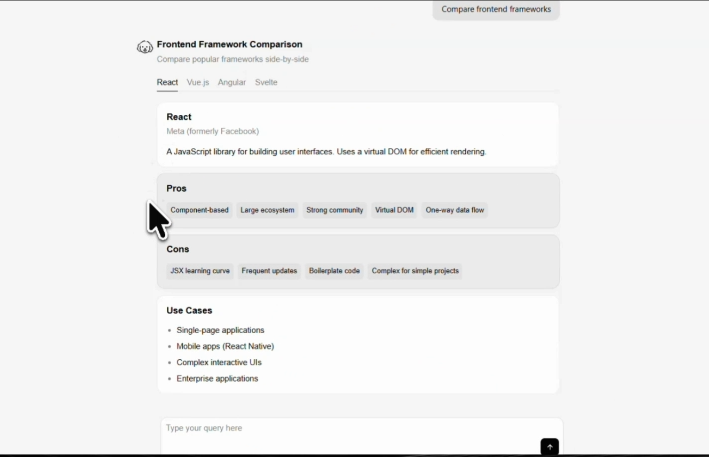
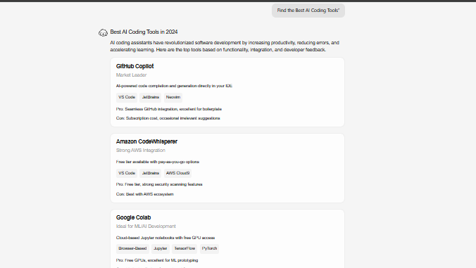
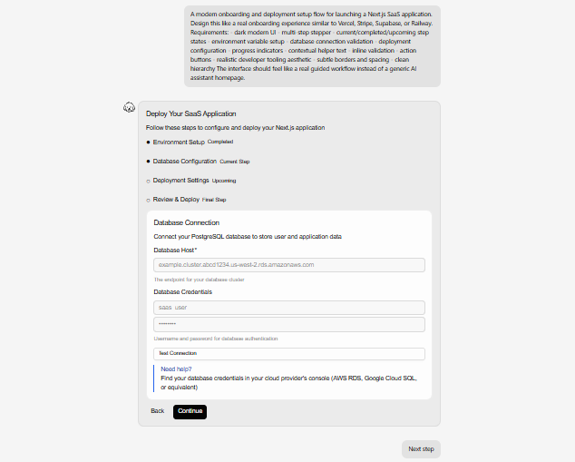

# 5 Things That Look Terrible as Plain Text (And How OpenUI Fixes Them)

Most AI products still respond like it's 2023. You ask a question, a cursor blinks, and you get paragraphs. The model doing the work behind the scenes has gotten dramatically smarter. It can reason, plan, compare, analyze — but the output pipe hasn't changed. Everything gets squeezed into the same wall-of-text format that chatbots used three years ago.

The structure is already there. When a model tells you "React has a large ecosystem, Vue is more lightweight, Angular is more opinionated," it already had a table in its head. It understood those as rows. It knew ecosystem, learning curve, and best use case were columns. Then it threw that shape away and handed you a paragraph.

OpenUI is a rendering specification designed to close that gap. Instead of generating prose, a model outputs OpenUI Lang — a compact, code-like syntax that maps directly to real UI components. The result renders live in the interface instead of being interpreted by the user's brain.

Here are five categories of AI output that break badly as plain text, and what they look like when the interface actually keeps up with the model.

---

## 1. Framework and Tool Comparisons

Comparisons are the clearest case. Ask any AI assistant to compare React, Vue, and Svelte, and you will get three separate paragraphs — one per framework, structured almost identically. Pros here, cons there, best for at the end. You read them sequentially and try to hold all three in working memory long enough to make a decision.

The problem is structural. Plain text forces users to serialize comparison — read option A, remember it, read option B, hold both, read option C, now compare. That is a working memory problem, not a content problem. Interfaces let users process multiple dimensions in parallel: scan across a row, filter by a column, anchor your eye on the one attribute that matters. The model had the right answer. The format threw away the shape.

**Claude response:**

.png)

The model searched the web, categorized the tools, and identified pricing tiers. The analysis is good. But you still have to mentally organize everything yourself.

**OpenUI response:**



Same information. Each tool gets a card with its category label, key feature tags, and a pro/con summary. Below that, a comparison table puts every tool side by side across the dimensions that matter. You scan instead of read. The model doesn't change. What changes is the format it's allowed to answer in.

```
root = Stack([header, comparisonTable])
header = TextContent("AI Coding Tools", "large-heavy")
comparisonTable = Table([
  Col("Tool", tools.name),
  Col("Best For", tools.useCase),
  Col("IDE Support", tools.ide),
  Col("Pricing", tools.pricing)
])
tools = Query("list_tools", {}, {rows: []})
```

The `Query` calls your tool directly. The table columns map to your schema. The model describes the structure once; the renderer does the rest.

There is also a discoverability gap that plain text cannot close. Chat is reactive — it only surfaces information in response to something the user already knows to ask. An interface is discoverable: the columns in that table tell you what dimensions exist. The filter controls tell you what options are available. The user does not need to already know that "IDE Support" is a relevant axis — the table makes that visible. Chat assumes the user knows what to ask. Interfaces expose what is possible.

---

## 2. Plain Text Breaks Down When Information Needs To Be Scanned

Some information is meant to be scanned, filtered, grouped, and compared visually. Chat interfaces flatten all of it into sequential paragraphs.

Weather. Search results. Dashboards. Pricing pages. These look like different problems but they are all the same problem underneath: the user needs to cross-reference multiple data points at once, and a paragraph makes that impossible.

```
Chat Interface
     Question
        ↓
     Paragraph
        ↓
  User manually extracts structure
        ↓
  User manually executes action

Generative UI
     Question
        ↓
  Structured Interface
        ↓
  State + Actions + Data already connected
        ↓
  Direct interaction
```

Weather is a time-series problem. "Temperatures rise from 28°C at 8am to 35°C at 2pm, with humidity increasing through the afternoon and precipitation probability peaking around 4pm." You can read that sentence. You cannot see the curve.

**Claude response:**

.png)

The response is accurate. Still annoying to use. A paragraph forces every relationship between variables to be encoded in syntax rather than shown visually. The reader has to reconstruct the time series from words.

**OpenUI response:**

.png)

Current conditions surface immediately. Data is grouped by relevance. A follow-up query can pull in an hourly chart without a second LLM call — the `Query` primitive wires up the data source once, and the runtime handles updates.

```
root = Stack([currentConditions, detailGrid])
currentConditions = Card([StatCard("Tokyo", "18°C", "flat"), StatCard("Feels Like", "16°C", "flat")])
detailGrid = Grid([
  StatCard("Humidity", "65%", "flat"),
  StatCard("Wind", "12 km/h SW", "flat"),
  StatCard("Condition", "Partly Cloudy", "flat")
])
weatherData = Query("get_weather", {city: "Tokyo"}, {})
```

Search is a filtering problem. You want something open source, under $50/month, with VS Code support. The AI gives you eight tools in eight paragraphs. You read all eight, mentally cross-referencing three criteria, hoping you don't miss one.

**Plain text response:**

.png)

**OpenUI response:**



The `@Filter` primitive makes the filter controls actually work. Changing the select immediately re-evaluates the result list — no second model call, no round trip. That distinction matters beyond UX: in a chat interface, every refinement ("show me only the free ones") becomes a new prompt, a new model call, additional latency, and additional token cost. In a stateful interface, that same interaction is a local state update. The model is not involved. The filter re-runs client-side in milliseconds.

```
$pricingFilter = "all"
filterBar = Stack([
  Select("pricing", $pricingFilter, [
    SelectItem("all", "All"),
    SelectItem("free", "Free"),
    SelectItem("paid", "Paid")
  ])
], "row")
filtered = @Filter(tools.rows, "pricing", "==", $pricingFilter)
results = Grid([Card([TextContent(filtered.name), Badge(filtered.pricing)])])
tools = Query("list_tools", {}, {rows: []})
```

Dashboards are a hierarchy problem. Status at the top, details below, actions inline. A paragraph has no hierarchy. It has sentences.

The pattern across all three: the model has structured data internally. Plain text throws the structure away. OpenUI keeps it — and because that structure lives in the interface rather than being reconstructed in each response, subsequent interactions become local operations rather than additional round trips to the model.

---

## 3. Multi-Step Onboarding and Setup Flows

Chat interfaces are stateless by default. Real workflows are not.

This is the core mismatch. Numbered steps are fine for simple tasks. They fall apart when the task is long, stateful, or requires input validation. "Step 3: Configure your database connection" doesn't know whether you completed step 2. It can't validate your connection string before you move on. It doesn't remember where you left off if you close the tab.

There is an important distinction between statefulness and persistence. Statefulness is current interaction state — which step is active, which fields are filled, what the form currently contains. Persistence is state surviving across time — reopening a half-finished setup flow and continuing from where you stopped, not from the beginning.

Chat history stores conversation. Interfaces store application state. Those are not the same thing. Your chat log from last Tuesday tells you what was discussed. It does not restore the form values you entered, the steps you completed, or the environment variables you configured. A persistent interface does. Come back three days later, the stepper is still on step 3, your database host is still filled in, the validated fields are still green.

Real workflows involve both: which steps are done, which fields are valid, what the current values are, what comes next based on what you entered, and whether any of that survives closing the tab. A chat message holds none of it.

**Plain text response:**

A numbered list. Maybe with headers for each step. When you finish, you're not sure you did it right. When you come back, you're not sure where you stopped.

**OpenUI response (light theme):**

.png)

**OpenUI response (dark theme):**



Both show what text fundamentally cannot: state. Completed steps are checked. The current step is highlighted. Future steps are dimmed. The database form validates inline before letting you continue. The environment variables table lets you audit what has been configured. The Export to Sheets button wires directly to a tool action.

The reactive variable `$currentStep` is what makes navigation work without any LLM involvement after the initial generation:

```
root = Stack([header, stepper, currentStep])
stepper = Stepper($currentStep, ["Environment", "Database", "Deploy", "Review"])
$currentStep = 0

currentStep = $currentStep == 0 ? envStep :
              $currentStep == 1 ? dbStep :
              $currentStep == 2 ? deployStep : reviewStep

dbStep = Card([
  TextContent("Connect your PostgreSQL database", "body"),
  Input("host", $dbHost, "example.cluster.amazonaws.com"),
  Button("Test Connection", Action([@Run(testConn)]))
])
```

When Test Connection fires, the mutation runs and the UI updates. The model is not involved. The state lives in the interface, not in the conversation history.

The screenshot below shows a resumable workflow — a previously incomplete setup flow with saved progress, reopened and continuing from where it stopped:


This falls out of the architecture rather than being a feature bolted on top. Because UI state is managed in the renderer rather than reconstructed from chat history on every turn, it can be stored, restored, and shared. Collaborative setup flows become possible — one team member completes the environment step, another continues from the database step — because the interface holds the state, not a private conversation thread.

This is stateful interaction. Not a nice onboarding UI. The distinction generalises to every wizard, configuration flow, and multi-step process in your product.

---

## 4. Plain Text Explains Problems. Interfaces Help Resolve Them

Current AI chat interfaces separate diagnosis from execution. This is the gap that costs the most time in practice.

Something fails in production. You ask your AI assistant what happened. It tells you in three paragraphs — what broke, why it broke, what to do about it — and then you go open your deployment dashboard to actually fix it. You copy the environment variable name from the chat. You navigate to the settings page. You paste the value. You lose context switching between tabs. The AI did the hard part and left you with the busywork.

**AI response (text-based):**

.png)

This is already better than raw prose. The error has structure. Action buttons are present. Logs are expandable. But notice: the buttons don't actually retry the deployment. They navigate you somewhere else to do it. The diagnosis and the fix are on different surfaces.

**OpenUI response:**

.png)

The Retry Deployment button here is wired to a `Mutation` that actually fires the retry. The model generated both the diagnosis and the fix in one pass:

```
root = Stack([header, errorSummary, serviceGrid])
header = TextContent("Deployment Failed", "large-heavy")
errorSummary = Alert("Missing Environment Variable - DATABASE_URL", "error")
serviceGrid = Grid([
  StatusCard("nextjs-commerce-prod", "failed", "Missing DATABASE_URL", retryBtn),
])
retryBtn = Button("Retry Deployment", Action([@Run(retryDeploy)]))
configBtn = Button("Configure Environment Variables", Action([@Run(openEnvSettings)]))
retryDeploy = Mutation("retry_deployment", {project: "nextjs-commerce-prod-157f"})
```

OpenUI collapses explanation, action, state, and execution into one surface. Plain text describes what broke. This lets you fix it without leaving the interface.

The broader principle: any time an AI response ends with "now go do X in your dashboard," that is a gap where an interface should be. The model already knows what action needs to happen. It just has no way to surface that action in the same place as the explanation.

There is a reliability argument here too. Every tab switch is a context switch. Every copy-paste is a potential error. The more steps between diagnosis and resolution, the more places the process can fail. Collapsing those steps into a single interface is not a UX preference — it reduces the failure surface of the remediation workflow itself.

---

## 5. The Interface Already Exists Inside The Model

Here is something most GenUI discussions skip past: the model already knows what shape the UI should be. The problem is the format it is forced to express that shape in.

The OpenUI runtime flow looks like this:

```
Component Library
       ↓
  System Prompt
       ↓
      LLM
       ↓
OpenUI Lang Stream
       ↓
    Renderer
       ↓
    Live UI
```

Your component library defines what the model is allowed to render. `library.prompt()` converts those definitions into the system prompt. The model generates OpenUI Lang. The renderer maps each statement to a real React component as tokens arrive. The UI appears progressively — the first component renders while the model is still generating the last one.

That last point matters. JSON-based rendering systems cannot do this. A JSON document is not valid until it closes. A missing `}` on line 12 corrupts everything after it — the renderer has to wait for the full document before it can paint anything. OpenUI Lang fails per statement, not per document. Each line is self-contained. The renderer does not wait.

Look at this simple greeting card generated in the playground:

```
root = Stack([card])
card = Card([header, text, btns])
header = CardHeader("Hey there! 👋", "How can I help you today?")
text = TextContent("I can help you build interactive UIs, visualize data, create forms, display charts, and much more. Just let me know what you need!")
btns = Buttons([b1, b2, b3], "row")
b1 = Button("Build a form", Action([@ToAssistant("Build me a form")]))
b2 = Button("Show a chart", Action([@ToAssistant("Show me a chart")]))
b3 = Button("Create a table", Action([@ToAssistant("Create a table")]))
```

That is 8 lines. 158 tokens. The playground shows you exactly what the parser produces from the same UI in JSON:


844 tokens. Same UI. 82% more tokens spent on structure instead of meaning.

Here is what those 844 tokens look like — just the button action, not the full response:

```json
{
  "type": "element",
  "typeName": "Button",
  "props": {
    "label": "Build a form",
    "action": {
      "k": "Comp",
      "name": "Action",
      "args": [{
        "k": "Arr",
        "els": [{
          "k": "Comp",
          "name": "ToAssistant",
          "args": [{ "k": "Str", "v": "Build me a form" }]
        }]
      }]
    }
  },
  "partial": false,
  "hasDynamicProps": true,
  "statementId": "b1"
}
```

In OpenUI Lang: `b1 = Button("Build a form", Action([@ToAssistant("Build me a form")]))`

One line versus eighteen. Every node carries `"partial": false` and `"hasDynamicProps": true` as boilerplate repeated on every element. Every action is a deeply nested tree of `k`, `Comp`, `Arr`, `els` metadata that the model would have to generate from scratch in a JSON-native system. The model spends tokens on parser scaffolding, not UI logic.

This is not a cosmetic difference. It is an architectural one. JSON was designed for machines to parse. OpenUI Lang was designed for models to generate. The format matches how models think — line-oriented, code-like, composable — rather than how parsers work.

The token efficiency benchmark across seven real UI scenarios makes this concrete:

| Scenario | Vercel JSON-Render | Thesys C1 JSON | OpenUI Lang | vs Vercel | vs C1 |
|---|---|---|---|---|---|
| simple-table | 340 | 357 | 148 | -56.5% | -58.5% |
| chart-with-data | 520 | 516 | 231 | -55.6% | -55.2% |
| contact-form | 893 | 849 | 294 | -67.1% | -65.4% |
| dashboard | 2,247 | 2,261 | 1,226 | -45.4% | -45.8% |
| pricing-page | 2,487 | 2,379 | 1,195 | -52.0% | -49.8% |
| settings-panel | 1,244 | 1,205 | 540 | -56.6% | -55.2% |
| e-commerce-product | 2,449 | 2,381 | 1,166 | -52.4% | -51.0% |
| **TOTAL** | **10,180** | **9,948** | **4,800** | **-52.8%** | **-51.7%** |

*Measured with tiktoken (GPT-5 encoder) across identical UI scenarios. Full methodology in [benchmarks/](https://github.com/thesysdev/openui/tree/main/benchmarks).*

The contact form row is worth sitting with. A form that every app has — name, email, password, submit — costs 849 tokens in C1 JSON and 294 in OpenUI Lang. At 60 tokens per second, that is the difference between your form appearing in roughly 5 seconds versus 14 seconds. Users feel that. And because the format is line-oriented and streams progressively, the first field renders before the last field is generated. The perceived latency is lower than the raw numbers suggest.

Most GenUI systems spend their token budget describing structure instead of meaning. OpenUI Lang inverts that: the structure is implicit in the syntax, and the tokens go toward the actual UI logic.

---

## Chat Is Becoming The Wrong Abstraction Layer

Chat works well for questions with text answers. It breaks for everything else.

It breaks for comparisons, because plain text forces serialized reading where a table allows parallel scanning. It breaks for time-series and filtered data, because a paragraph cannot encode visual hierarchy. It breaks for stateful workflows, because a message cannot track which steps are done, validate a field, or survive a tab close. It breaks for operational systems, because reading a diagnosis in one tab and executing the fix in another is context switching that the interface should eliminate.

The failure mode is consistent across all of these: something that should be a local UI interaction becomes a new prompt instead. Filtering a list becomes a round trip. Advancing a stepper becomes a new message. Retrying a deployment becomes copy-pasting from a chat thread into a dashboard. Every interaction that should be instant carries model latency, token cost, and the risk of a different answer than the one before it.

These are not edge cases. They are the most common things people ask AI assistants to help with.

The models are not the bottleneck. GPT-5, Claude, Gemini — they have the structured information internally. They understand what a comparison table is. They know what a stepper should do. They know what a retry button means. They have been generating this logic correctly for years.

The limitation is no longer model intelligence. It is the interface we force models to speak through.

Plain text was the right output format when models could only generate text. That constraint no longer exists. The interface needs to catch up.

---

*Built with [OpenUI](https://openui.com) — open source generative UI framework. Star on [GitHub](https://github.com/thesysdev/openui). Try the [Playground](https://openui.com/playground).*