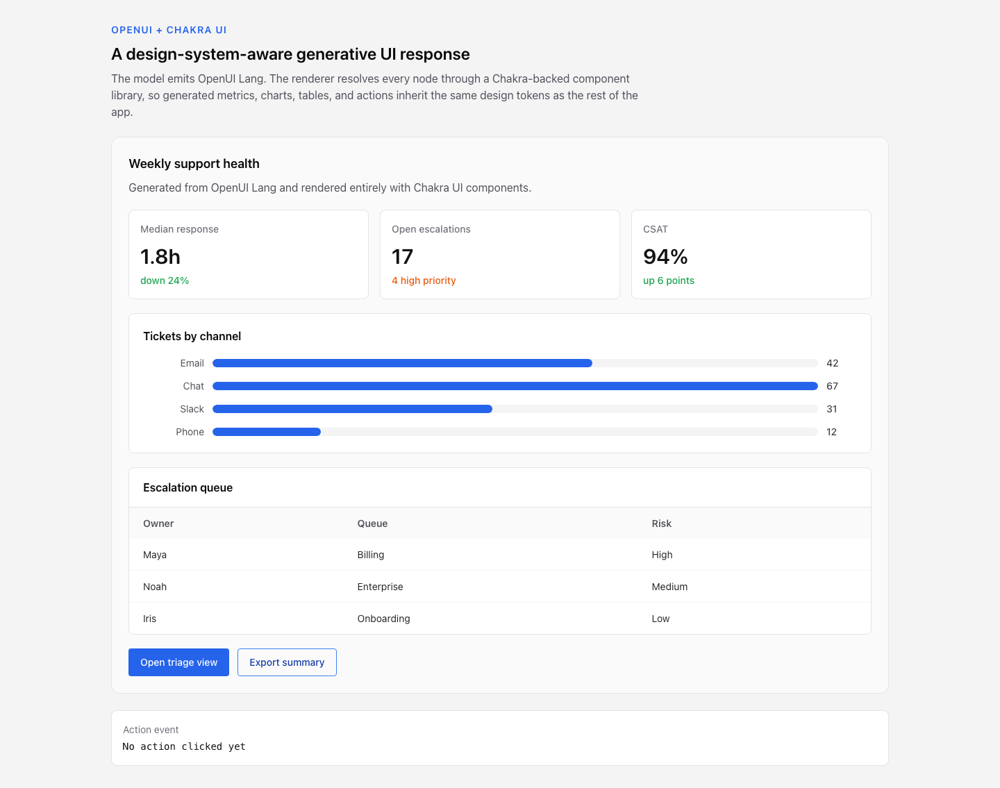
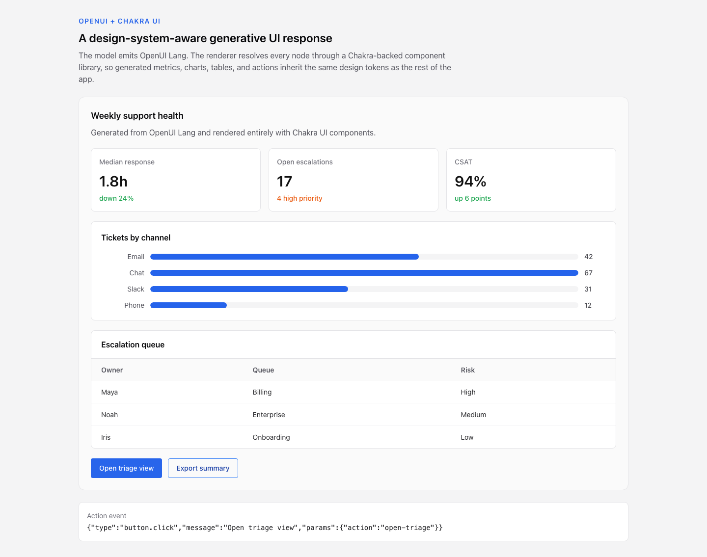
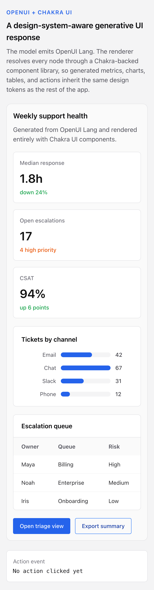

# Chakra UI + OpenUI: Building a Design-System-Aware Generative UI App

Most production teams do not start from a blank canvas. They already have a component library, theme tokens, spacing rules, button variants, table patterns, and review standards that keep the product consistent.

That is the interesting challenge for generative UI. It is not enough for an agent to return "some React". In a real app, the generated interface has to land inside the design system the team already uses.

This tutorial shows one practical way to do that with Chakra UI and OpenUI. We will build a small support-dashboard response where the model emits OpenUI Lang and OpenUI renders it through a Chakra-backed component library.

## Companion repo

[OpenUI Chakra Demo](https://github.com/adamsardo/openui-chakra-demo)

The companion project includes a Vite + React + TypeScript app using:

- `@openuidev/react-lang`
- `@chakra-ui/react`
- `zod`

The demo was checked with `npm run lint`, `npm run build`, and a Playwright smoke test that loaded the dashboard, verified the chart/table content, clicked an action button, and checked the emitted action state.

## Result

Here is the generated OpenUI response rendered entirely with Chakra components:



After clicking the generated primary action, the app receives a typed action event from OpenUI:



The same component library also works on a narrow viewport:



## What we are building

The demo has three layers:

1. A Chakra theme and provider that define the app's visual system.
2. An OpenUI component library that exposes only the Chakra-backed components the model is allowed to use.
3. A `Renderer` that takes OpenUI Lang and turns it into React elements.

The important architectural point is that the model does not choose arbitrary JSX. It chooses from the component vocabulary you register.

For this tutorial, that vocabulary is intentionally small:

- `DashboardCard`
- `MetricGrid`
- `Metric`
- `BarChart`
- `DataTable`
- `ActionRow`
- `ActionButton`

That is enough to create a realistic dashboard, but constrained enough that the output still feels designed.

## 1. Set up Chakra around the OpenUI renderer

OpenUI renders React components, so the Chakra provider should sit above the OpenUI `Renderer` just like it would sit above the rest of your app.

In Chakra UI v3, the provider receives a system object:

```tsx
import {
  ChakraProvider,
  Box,
  Heading,
  Text,
  createSystem,
  defaultConfig,
  defineConfig,
} from "@chakra-ui/react";
import { Renderer } from "@openuidev/react-lang";
import { useState } from "react";
import { chakraOpenuiLibrary } from "./chakraOpenuiLibrary";

const system = createSystem(
  defaultConfig,
  defineConfig({
    theme: {
      tokens: {
        colors: {
          brand: {
            50: { value: "#eff6ff" },
            500: { value: "#2563eb" },
            600: { value: "#1d4ed8" },
            900: { value: "#172554" },
          },
        },
      },
    },
  }),
);
```

The exact token set is not the point. The point is that OpenUI output will be rendered inside the same provider as the rest of the app, so the generated interface can use the same theme decisions.

## 2. Define Chakra-backed OpenUI components

OpenUI's `defineComponent` API lets you describe the component the model can use, validate its props, and decide how it renders.

Here is the `Metric` component from the demo:

```tsx
import { Box, Text } from "@chakra-ui/react";
import { defineComponent } from "@openuidev/react-lang";
import { z } from "zod/v4";

const ToneSchema = z.enum(["good", "warning", "neutral"]);

export const Metric = defineComponent({
  name: "Metric",
  props: z.object({
    label: z.string(),
    value: z.string(),
    delta: z.string(),
    tone: ToneSchema.optional(),
  }),
  description: "Compact KPI card with label, value, and trend delta.",
  component: ({ props }) => {
    const tone = props.tone ?? "neutral";
    const toneColor =
      tone === "good" ? "green.600" : tone === "warning" ? "orange.600" : "gray.600";

    return (
      <Box
        borderWidth="1px"
        borderColor="gray.200"
        borderRadius="lg"
        bg="white"
        p={4}
        minH="120px"
        _dark={{ bg: "gray.900", borderColor: "gray.700" }}
      >
        <Text color="gray.500" fontSize="sm" fontWeight="medium">
          {props.label}
        </Text>
        <Text color="gray.950" fontSize="3xl" fontWeight="semibold" lineHeight="1.1" mt={3}>
          {props.value}
        </Text>
        <Text color={toneColor} fontSize="sm" fontWeight="medium" mt={2}>
          {props.delta}
        </Text>
      </Box>
    );
  },
});
```

There are three useful constraints here:

- The model can only provide `label`, `value`, `delta`, and `tone`.
- `tone` is validated against a small enum, not an open-ended color string.
- The component owns the Chakra styling, so the model cannot drift into one-off layout decisions.

That is the main pattern you will repeat: let the model decide content and intent, while your component library decides presentation.

## 3. Support nested generated layouts

OpenUI components can reference other components. A grid component can accept `Metric` children, then call `renderNode` to render whatever nodes the OpenUI response assigned to it.

```tsx
export const MetricGrid = defineComponent({
  name: "MetricGrid",
  props: z.object({
    children: z.array(Metric.ref),
  }),
  description: "Responsive grid for KPI Metric cards.",
  component: ({ props, renderNode }) => (
    <Box
      display="grid"
      gridTemplateColumns={{ base: "1fr", md: "repeat(3, minmax(0, 1fr))" }}
      gap={4}
    >
      {renderNode(props.children)}
    </Box>
  ),
});
```

This is where OpenUI starts to feel different from returning raw JSON. The generated response can describe a tree of interface objects, but your app still owns how each object is rendered.

## 4. Add a chart component

Charts are a good test for design-system-aware generation because they combine structured data, visual hierarchy, and layout constraints.

For this demo, the `BarChart` component is deliberately simple. The model supplies labels, values, and a palette choice. The component controls the actual rendering.

```tsx
export const BarChart = defineComponent({
  name: "BarChart",
  props: z.object({
    title: z.string(),
    labels: z.array(z.string()),
    values: z.array(z.number()),
    colorPalette: z.enum(["blue", "teal", "purple"]).optional(),
  }),
  description: "Simple bar chart for comparing values across categories.",
  component: ({ props }) => {
    const max = Math.max(...props.values, 1);
    const color =
      props.colorPalette === "teal"
        ? "#0f766e"
        : props.colorPalette === "purple"
          ? "#7c3aed"
          : "#2563eb";

    return (
      <Box borderWidth="1px" borderColor="gray.200" borderRadius="lg" bg="white" p={5}>
        <Heading as="h3" size="md" mb={4}>
          {props.title}
        </Heading>
        <Box display="grid" gap={3}>
          {props.values.map((value, index) => (
            <Box
              key={`${props.labels[index]}-${value}`}
              display="grid"
              gridTemplateColumns="88px 1fr 44px"
              alignItems="center"
              gap={3}
            >
              <Text color="gray.600" fontSize="sm" textAlign="right">
                {props.labels[index] ?? `Item ${index + 1}`}
              </Text>
              <Box h="12px" borderRadius="full" bg="gray.100" overflow="hidden">
                <Box
                  h="100%"
                  w={`${Math.max(8, (value / max) * 100)}%`}
                  borderRadius="full"
                  style={{ backgroundColor: color }}
                />
              </Box>
              <Text color="gray.700" fontSize="sm" fontWeight="medium">
                {value}
              </Text>
            </Box>
          ))}
        </Box>
      </Box>
    );
  },
});
```

In a production app, this could wrap a real charting library. The contract would stay the same: OpenUI receives a component with typed props, and Chakra or your chart layer controls the final visual output.

## 5. Register the library

Once the components exist, register them with `createLibrary`.

```tsx
import { createLibrary } from "@openuidev/react-lang";

export const chakraOpenuiLibrary = createLibrary({
  components: [
    DashboardCard,
    MetricGrid,
    Metric,
    BarChart,
    DataTable,
    ActionRow,
    ActionButton,
  ],
  componentGroups: [
    {
      name: "Layout",
      components: ["DashboardCard", "MetricGrid", "ActionRow"],
      notes: [
        "DashboardCard should be the root for dashboard-style responses.",
        "Keep generated layouts scan-friendly and avoid nested cards inside cards.",
      ],
    },
    {
      name: "Data display",
      components: ["Metric", "BarChart", "DataTable"],
      notes: [
        "Use MetricGrid for KPI summaries, BarChart for category comparison, and DataTable for record-level detail.",
      ],
    },
    {
      name: "Actions",
      components: ["ActionButton"],
      notes: ["Use one primary ActionButton per response unless the user explicitly needs multiple decisions."],
    },
  ],
});
```

The `componentGroups` are worth treating as part of your prompt surface. They help describe not only what components exist, but when each component should be chosen.

That matters for design systems. A design system is more than colors and borders. It is also usage guidance: when to use a table, when to use a metric, when an action should be primary, and when a chart is clearer than another list.

## 6. Render OpenUI Lang

For a deterministic demo, the companion repo uses a static OpenUI Lang response. In a real app, this string would usually come from your agent or model call.

```tsx
const sampleResponse = `root = DashboardCard("Weekly support health", "Generated from OpenUI Lang and rendered entirely with Chakra UI components.", [metrics, tickets, escalations, actions])
metrics = MetricGrid([m1, m2, m3])
m1 = Metric("Median response", "1.8h", "down 24%", "good")
m2 = Metric("Open escalations", "17", "4 high priority", "warning")
m3 = Metric("CSAT", "94%", "up 6 points", "good")
tickets = BarChart("Tickets by channel", ["Email", "Chat", "Slack", "Phone"], [42, 67, 31, 12], "blue")
escalations = DataTable("Escalation queue", ["Owner", "Queue", "Risk"], [["Maya", "Billing", "High"], ["Noah", "Enterprise", "Medium"], ["Iris", "Onboarding", "Low"]])
actions = ActionRow([primaryAction, secondaryAction])
primaryAction = ActionButton("Open triage view", "primary", "open-triage")
secondaryAction = ActionButton("Export summary", "secondary", "export-summary")`;
```

Then render it:

```tsx
function App() {
  const [lastAction, setLastAction] = useState("No action clicked yet");

  return (
    <ChakraProvider value={system}>
      <Box minH="100vh" bg="gray.100" px={{ base: 4, md: 8 }} py={{ base: 5, md: 8 }}>
        <Box maxW="1120px" mx="auto" display="grid" gap={6}>
          <Renderer
            response={sampleResponse}
            library={chakraOpenuiLibrary}
            isStreaming={false}
            onAction={(event) =>
              setLastAction(
                JSON.stringify({
                  type: event.type,
                  message: event.humanFriendlyMessage,
                  params: event.params,
                }),
              )
            }
          />
        </Box>
      </Box>
    </ChakraProvider>
  );
}
```

The first assigned statement should be `root`. The rest of the statements can define reusable nodes that `root` references.

This is a useful review boundary. You can log, inspect, validate, or store the OpenUI Lang response before it reaches React rendering.

## 7. Wire generated actions back to the app

Generated UI is not useful if it cannot trigger application behavior. In OpenUI, an action component can call `useTriggerAction`, and the parent `Renderer` can receive the event through `onAction`.

The demo keeps the hook inside a normal React component:

```tsx
import { Button } from "@chakra-ui/react";
import { useTriggerAction } from "@openuidev/react-lang";

type ActionButtonProps = {
  label: string;
  variant?: "primary" | "secondary" | "ghost";
  action?: string;
};

export function ChakraActionButton({ props }: { props: ActionButtonProps }) {
  const triggerAction = useTriggerAction();
  const variant = props.variant ?? "primary";

  return (
    <Button
      colorPalette="blue"
      variant={variant === "primary" ? "solid" : variant === "secondary" ? "outline" : "ghost"}
      onClick={() =>
        triggerAction(props.label, undefined, {
          type: "button.click",
          params: { action: props.action ?? props.label },
        })
      }
    >
      {props.label}
    </Button>
  );
}
```

Then the OpenUI component delegates rendering to that Chakra component:

```tsx
const ActionButtonPropsSchema = z.object({
  label: z.string(),
  variant: z.enum(["primary", "secondary", "ghost"]).optional(),
  action: z.string().optional(),
});

export const ActionButton = defineComponent({
  name: "ActionButton",
  props: ActionButtonPropsSchema,
  description: "Themed action button. Use primary for the main next step.",
  component: ChakraActionButton,
});
```

This split also keeps React linting happy because the hook lives in a named React component, not inside an anonymous callback that happens to return JSX.

## Design-system lessons from the example

### Keep model choice narrow

The model should not pick arbitrary Chakra props. If it can choose any color, spacing, border, and layout prop, you are back to reviewing generated design drift.

Expose meaningful product-level components instead:

- `Metric`
- `BarChart`
- `DataTable`
- `ActionButton`

Those names describe intent. The implementation describes presentation.

### Validate props as part of the UI contract

Zod schemas are not just TypeScript decoration. They are the boundary between model output and your app.

Use enums for values that map to design rules:

```tsx
z.enum(["good", "warning", "neutral"])
```

Prefer structured arrays or objects for data:

```tsx
labels: z.array(z.string()),
values: z.array(z.number()),
```

Avoid open-ended style props unless the whole point of the component is visual customization.

### Write descriptions like component documentation

The `description` field should explain when to use the component, not just what it renders.

Weak:

```tsx
description: "A card."
```

Better:

```tsx
description: "Compact KPI card with label, value, and trend delta."
```

Best:

```tsx
description: "Compact KPI card for a single top-level metric. Use inside MetricGrid."
```

That kind of description gives the generation layer useful constraints.

### Treat generated UI as app input, not app code

The model output is not trusted React code. It is structured input to a renderer that you control.

That gives you normal production options:

- reject output that uses unknown components
- reject props that fail schema validation
- log generated responses for debugging
- add tests for common response shapes
- keep sensitive actions behind app-owned handlers

OpenUI is useful here because it gives the agent a UI language without giving it direct control over your component implementation.

## Running the demo

Clone the companion repo:

```bash
git clone https://github.com/adamsardo/openui-chakra-demo.git
cd openui-chakra-demo
npm install
npm run dev
```

Then open the local Vite URL.

For production checks:

```bash
npm run lint
npm run build
```

## Where to take this next

This demo uses a static OpenUI Lang response so the integration is easy to inspect. The natural next step is to put an agent or model call in front of it.

A useful production shape is:

1. User asks a domain-specific question.
2. Agent chooses from the registered OpenUI component library.
3. App validates the OpenUI Lang response.
4. `Renderer` renders the response through Chakra components.
5. User actions route back into app-owned handlers.

That keeps the agent expressive enough to build dynamic interfaces, but constrained enough that the result still belongs inside your product.

The design system remains the source of truth. OpenUI becomes the bridge between agent intent and production UI.
