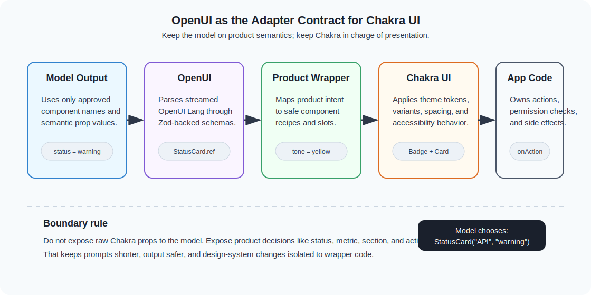

# Chakra UI + OpenUI: The Adapter Contract

Most teams evaluating generative UI already have a design system.

That is the real integration question. It is not "can the model render a card?" It is:

- can the model use the components your product already trusts?
- can the generated UI stay inside your theme tokens, variants, spacing, and accessibility rules?
- can you expose enough flexibility to be useful without turning the model into an unbounded layout engine?

Chakra UI is a good test case because many React teams use it as their product surface, not just as a component grab bag. OpenUI fits that world best when you treat Chakra as a rendering adapter behind a smaller set of product-level components.

The pattern is simple:

```text
OpenUI component schema -> product-level React wrapper -> Chakra primitives -> themed UI
```

The model should not be asked to compose arbitrary Chakra props. It should choose from an approved vocabulary. Your app keeps control of the design system.



The diagram above is the mental model for the rest of this article:

- the model only sees names, descriptions, examples, and Zod schemas
- OpenUI turns streamed language into validated component calls
- product wrappers translate semantic props into Chakra primitives
- Chakra renders the final UI through your normal theme system
- application code owns actions, permissions, and side effects

## The OpenUI Side Of The Contract

OpenUI's React package gives you three important pieces:

- `defineComponent()` for declaring model-usable components with Zod props
- `createLibrary()` for collecting those components into a promptable/renderable library
- `Renderer` for parsing OpenUI Lang output and rendering the resolved component tree

The important detail is that a component definition is not just a React component. It is a contract:

```tsx
import { defineComponent } from "@openuidev/react-lang";
import { z } from "zod/v4";

const StatusCard = defineComponent({
  name: "StatusCard",
  description: "Shows a labeled operational status summary",
  props: z.object({
    title: z.string().describe("Short card title"),
    status: z.enum(["healthy", "warning", "critical"]),
    detail: z.string().optional(),
  }),
  component: ({ props }) => {
    return null;
  },
});
```

The model sees the name, description, and prop schema. React sees a normal renderer function. Chakra does not need to know that a model generated the props.

That separation is why this works. OpenUI handles language, parsing, prompt generation, and evaluated props. Chakra handles the actual UI.

## Do Not Expose Raw Chakra

Chakra has a large prop surface. That is useful for developers and dangerous for model output.

For example, this is too much freedom:

```tsx
import { Box as ChakraBox } from "@chakra-ui/react";

const RawBox = defineComponent({
  name: "Box",
  description: "A Chakra Box",
  props: z.object({
    bg: z.string().optional(),
    p: z.any().optional(),
    borderRadius: z.any().optional(),
    display: z.any().optional(),
    gap: z.any().optional(),
    children: z.array(z.any()).optional(),
  }),
  component: ({ props }) => <ChakraBox {...props} />,
});
```

That looks flexible, but now the prompt has to explain your design system, the model has to choose raw style tokens, and the renderer has to tolerate arbitrary combinations. You will get off-brand spacing, unsupported color names, and layouts that only work by accident.

Use a product-level wrapper instead:

```tsx
const StatusCard = defineComponent({
  name: "StatusCard",
  description: "Shows a status card using approved product variants",
  props: z.object({
    title: z.string(),
    status: z.enum(["healthy", "warning", "critical"]),
    detail: z.string().optional(),
  }),
  component: StatusCardView,
});
```

The schema describes the decision the model should make. The Chakra wrapper decides how that decision looks.

## Build The Chakra Wrapper

In Chakra, the wrapper can map semantic values to theme-aware primitives:

```tsx
import {
  Badge,
  Card,
  HStack,
  Text,
  VStack,
} from "@chakra-ui/react";
import type { ComponentRenderProps } from "@openuidev/react-lang";

type StatusCardProps = {
  title: string;
  status: "healthy" | "warning" | "critical";
  detail?: string;
};

function StatusCardView({
  props,
}: ComponentRenderProps<StatusCardProps>) {
  const tone = {
    healthy: "green",
    warning: "yellow",
    critical: "red",
  }[props.status];

  return (
    <Card.Root variant="outline" size="sm">
      <Card.Body>
        <VStack align="stretch" gap="2">
          <HStack justify="space-between" gap="3">
            <Text fontWeight="semibold">{props.title}</Text>
            <Badge colorPalette={tone}>{props.status}</Badge>
          </HStack>
          {props.detail ? (
            <Text color="fg.muted" textStyle="sm">
              {props.detail}
            </Text>
          ) : null}
        </VStack>
      </Card.Body>
    </Card.Root>
  );
}
```

The model never chooses `colorPalette`, `variant`, `size`, spacing, or typography. It chooses `status`. The adapter maps that to Chakra.

This is the same reason backend APIs usually expose business operations rather than raw database queries. A smaller surface area is easier to validate, document, and keep stable.

## Define Child Slots Explicitly

Real generated UI needs composition. You may want a card that contains metrics, a table, or a callout. OpenUI component definitions can reference child components through their schemas, which lets the prompt describe legal nesting.

For a Chakra-backed dashboard, keep slots explicit:

```tsx
const Metric = defineComponent({
  name: "Metric",
  description: "Shows one KPI value with an optional trend",
  props: z.object({
    label: z.string(),
    value: z.string(),
    trend: z.enum(["up", "down", "flat"]).optional(),
  }),
  component: MetricView,
});

const DashboardSection = defineComponent({
  name: "DashboardSection",
  description: "Groups related dashboard content",
  props: z.object({
    title: z.string(),
    children: z.array(Metric.ref).describe("Metric cards in this section"),
  }),
  component: DashboardSectionView,
});
```

The section does not accept any possible React node. It accepts metrics. That makes the prompt clearer and keeps the UI predictable.

In the renderer, use the `renderNode` function from OpenUI's component render props:

```tsx
function DashboardSectionView({
  props,
  renderNode,
}: ComponentRenderProps<{
  title: string;
  children: Array<unknown>;
}>) {
  return (
    <Card.Root>
      <Card.Header>
        <Text fontWeight="bold">{props.title}</Text>
      </Card.Header>
      <Card.Body>
        <HStack align="stretch" gap="4" wrap="wrap">
          {props.children.map((child, index) => (
            <React.Fragment key={index}>
              {renderNode(child)}
            </React.Fragment>
          ))}
        </HStack>
      </Card.Body>
    </Card.Root>
  );
}
```

OpenUI keeps AST and parser concerns out of your Chakra components. The wrapper receives evaluated props and a helper for rendering child nodes.

## Create A Design-System Library

Once you have the wrappers, collect them into a library:

```tsx
import { createLibrary } from "@openuidev/react-lang";

export const productUiLibrary = createLibrary({
  root: "DashboardSection",
  componentGroups: [
    {
      name: "Dashboard",
      components: ["DashboardSection", "Metric", "StatusCard"],
      notes: [
        "Use StatusCard for operational health.",
        "Use Metric for KPI values.",
        "Do not invent colors; choose semantic status values.",
      ],
    },
  ],
  components: [DashboardSection, Metric, StatusCard],
});
```

This is the point where OpenUI and Chakra meet. The library is what OpenUI uses to generate prompts and parse model output. The components in the library are what Chakra renders.

OpenUI's built-in `openuiLibrary` follows the same broad shape: grouped components, notes, examples, and a root component. For a product app, you can borrow that structure without borrowing every default component.

## Generate A Prompt From The Library

The library can generate a model prompt from the approved component vocabulary:

```ts
const systemPrompt = productUiLibrary.prompt({
  preamble:
    "You render operational dashboards using the approved product UI library.",
  additionalRules: [
    "Use semantic status values instead of style props.",
    "Prefer concise card titles.",
    "Return OpenUI Lang only.",
  ],
  examples: [
    `root = DashboardSection("Release health", [build, api])
build = StatusCard("Build pipeline", "healthy", "All checks passed")
api = StatusCard("API latency", "warning", "p95 is above target")`,
  ],
});
```

The prompt should not say "use Chakra." The model is not using Chakra. It is using your OpenUI component library. Chakra is an implementation detail behind the renderer.

That distinction keeps prompts shorter and more stable. If you later move from Chakra to another component library, the model contract can stay mostly the same.

## Render Inside ChakraProvider

At runtime, mount the OpenUI renderer inside your Chakra provider:

```tsx
import { ChakraProvider } from "@chakra-ui/react";
import { Renderer } from "@openuidev/react-lang";
import { productUiLibrary } from "./product-ui-library";
import { system } from "./theme";

export function AssistantSurface({
  response,
  isStreaming,
}: {
  response: string;
  isStreaming: boolean;
}) {
  return (
    <ChakraProvider value={system}>
      <Renderer
        response={response}
        library={productUiLibrary}
        isStreaming={isStreaming}
        onAction={(event) => {
          console.log("OpenUI action", event);
        }}
      />
    </ChakraProvider>
  );
}
```

OpenUI's `Renderer` receives raw OpenUI Lang text plus the library. Chakra receives normal React components under its provider. The provider controls tokens, color mode, recipes, and global styling exactly as it would for hand-authored UI.

## Keep Actions Semantic Too

The same adapter rule applies to actions. Do not let the model generate arbitrary side-effect details. Give it safe, named actions:

```tsx
import { Button } from "@chakra-ui/react";
import { useTriggerAction } from "@openuidev/react-lang";

const ApprovalButton = defineComponent({
  name: "ApprovalButton",
  description: "Shows an approved action button for a review workflow",
  props: z.object({
    label: z.string(),
    action: z.enum(["approve", "request_changes", "dismiss"]),
  }),
  component: ({ props }) => {
    const triggerAction = useTriggerAction();

    return (
      <Button
        colorPalette={props.action === "approve" ? "green" : "gray"}
        onClick={() =>
          triggerAction({
            type: props.action,
            params: {},
          })
        }
      >
        {props.label}
      </Button>
    );
  },
});
```

The visible button is Chakra. The allowed action set is OpenUI schema. The business logic stays in your app's `onAction` handler.

Generated UI should describe intent. Application code should decide whether that intent is allowed.

## Design For Streaming

OpenUI can render streamed model output progressively, so Chakra wrappers should be tolerant of partial props.

Good wrappers:

- keep optional copy optional
- render stable empty states
- avoid throwing when an optional array is empty
- use semantic defaults for size and variant
- keep layout stable while content fills in

Bad wrappers assume every field is final. That works when you paste a complete example into a demo, then fails when the model is still mid-response.

OpenUI's renderer also preserves the last successfully rendered children around transient render errors. Your Chakra components should make that fallback rare by validating at the schema boundary and being conservative at the UI boundary.

## A Practical Component Set

For a first Chakra + OpenUI app, do not register 40 components. Start with five:

```text
DashboardSection
Metric
StatusCard
DecisionList
ApprovalButton
```

That is enough to build useful internal-tool and support-agent surfaces:

```txt
root = DashboardSection("Refund review", [risk, amount, decision])
risk = StatusCard("Risk", "warning", "Account is new and order value is high")
amount = Metric("Order value", "$428", "flat")
decision = DecisionList("Recommended next steps", [
  "Check delivery confirmation",
  "Ask for additional identity signal",
  "Escalate if customer disputes again"
])
```

Notice what is missing: no raw colors, no layout props, no direct API calls, no arbitrary JSX. The generated program is small, reviewable, and tied to product concepts.

## The Review Checklist

Before shipping a Chakra-backed OpenUI library, review the contract:

1. Does every model-facing prop represent a product decision rather than a style knob?
2. Are enum values mapped to theme-approved Chakra variants?
3. Do child slots accept specific component refs rather than arbitrary content?
4. Can wrappers render while optional values are missing?
5. Are actions named and handled by app code instead of embedded as side effects?
6. Does the prompt include examples that match the same narrow component vocabulary?
7. Can the design system change without changing the model contract?

If the answer is yes, OpenUI can generate interfaces that feel native to the app instead of bolted on.

## The Payoff

Chakra UI and OpenUI should not compete for control of the interface.

Chakra owns presentation: tokens, variants, accessibility behavior, and the feel of the product. OpenUI owns the generative contract: which components the model can use, which props are valid, how the prompt is generated, and how streamed OpenUI Lang becomes React.

The best integration keeps those responsibilities separate.

Let the model choose `StatusCard("API latency", "warning")`.

Let Chakra decide what warning looks like.

That is the adapter contract.
