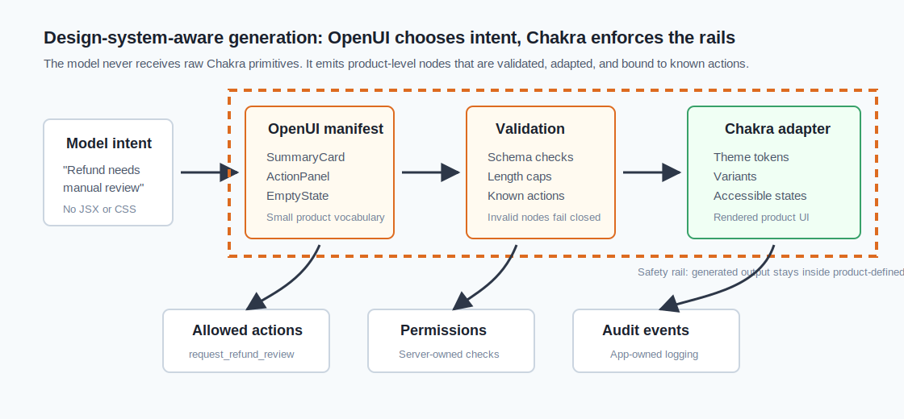

# Chakra UI Can Be the Safety Rail for OpenUI

Generated interfaces are only useful when they still feel like your product.

That is the quiet problem behind most "AI builds the UI" demos. The model can
produce a plausible card, table, or form, but the result often feels detached
from the rest of the application. Spacing is close but not quite right. Buttons
use the wrong emphasis. Error states are inconsistent. A generated table might
look fine in isolation and still be a bad citizen inside the product shell.

Chakra UI gives you a strong answer to that problem: do not let the model design
from scratch. Let the model choose from a small set of product-approved
components, and let Chakra enforce the design system at render time.

That framing changes the job of OpenUI. Instead of asking a model to invent HTML
or raw style props, you ask it to produce a structured interface plan. Your app
then renders that plan with Chakra components, theme tokens, variants, and
interaction handlers that you already trust.

The result is a generative UI surface that can adapt to a user's task without
escaping the visual and behavioral rules of the product.



## The Mistake: Giving the Model the Whole Design System

Chakra is intentionally flexible. A developer can compose `Box`, `Stack`,
`Button`, `Card`, `Table`, semantic tokens, responsive props, and component
variants into almost any layout.

That flexibility is great for humans. It is too much surface area for a model.

If you expose every Chakra primitive and every style prop directly to generated
output, the model has to make too many design decisions:

- Should this be a `Card`, `Box`, `Flex`, or `Stack`?
- Is this a primary action or a secondary action?
- Which color token communicates warning without looking like an error?
- How much spacing separates a filter bar from a result list?
- Should an empty state use an icon, a help link, or a retry action?

Those choices are not just aesthetics. They encode product behavior. A primary
button should mean the next safe action. A destructive action should look
dangerous and usually require confirmation. A warning should not reuse the same
tone as an error. A generated form should preserve accessibility labels and
validation feedback.

So the goal is not "let OpenUI use Chakra." The stronger goal is:

> Let OpenUI choose intent-level UI blocks, then render those blocks through a
> Chakra design-system adapter.

The model chooses the shape of the response. Chakra keeps the response inside
the product's rules.

## Use Chakra as the Renderer, Not the Playground

A good integration starts with a narrow vocabulary. Instead of exposing raw
Chakra components, define the UI blocks your product wants generated.

For an operations dashboard, that vocabulary might be:

- `SummaryCard`
- `MetricRow`
- `IncidentList`
- `ActionPanel`
- `Timeline`
- `EmptyState`
- `ConfirmAction`

For a customer support copilot, it might be:

- `CustomerSnapshot`
- `TicketTimeline`
- `SuggestedReply`
- `PolicyCallout`
- `EscalationForm`
- `RefundAction`

Those are not generic visual pieces. They are product concepts. Each one can be
implemented with Chakra, but the model never needs to know whether
`CustomerSnapshot` uses `Card`, `Grid`, `Badge`, or `HStack` internally.

Here is the shape of that boundary:

```tsx
type Tone = "neutral" | "success" | "warning" | "danger";

type GeneratedNode =
  | {
      type: "SummaryCard";
      props: {
        title: string;
        value: string;
        tone?: Tone;
        detail?: string;
      };
    }
  | {
      type: "ActionPanel";
      props: {
        title: string;
        body: string;
        actions: Array<{
          id: string;
          label: string;
          kind: "primary" | "secondary" | "danger";
        }>;
      };
    }
  | {
      type: "EmptyState";
      props: {
        title: string;
        body: string;
        actionId?: string;
      };
    };
```

The model can emit one of these nodes. It cannot emit arbitrary JSX. It cannot
invent `bg="neonPink.300"` or place a destructive action in a primary button.
It describes the user's task in a product-specific UI language.

The Chakra adapter owns the rendering details:

```tsx
import {
  Badge,
  Button,
  Card,
  CardBody,
  CardHeader,
  Heading,
  Stack,
  Text,
} from "@chakra-ui/react";

const toneColor: Record<Tone, string> = {
  neutral: "gray",
  success: "green",
  warning: "orange",
  danger: "red",
};

const actionVariant = {
  primary: "solid",
  secondary: "outline",
  danger: "solid",
} as const;

function GeneratedBlock({
  node,
  onAction,
}: {
  node: GeneratedNode;
  onAction: (id: string) => void;
}) {
  if (node.type === "SummaryCard") {
    const tone = node.props.tone ?? "neutral";

    return (
      <Card variant="outline">
        <CardHeader>
          <Stack direction="row" justify="space-between" align="center">
            <Heading size="sm">{node.props.title}</Heading>
            <Badge colorScheme={toneColor[tone]}>{tone}</Badge>
          </Stack>
        </CardHeader>
        <CardBody>
          <Text fontSize="2xl" fontWeight="semibold">
            {node.props.value}
          </Text>
          {node.props.detail ? (
            <Text color="fg.muted" mt="2">
              {node.props.detail}
            </Text>
          ) : null}
        </CardBody>
      </Card>
    );
  }

  if (node.type === "ActionPanel") {
    return (
      <Card variant="filled">
        <CardHeader>
          <Heading size="sm">{node.props.title}</Heading>
        </CardHeader>
        <CardBody>
          <Stack gap="4">
            <Text>{node.props.body}</Text>
            <Stack direction="row" wrap="wrap">
              {node.props.actions.map((action) => (
                <Button
                  key={action.id}
                  colorScheme={action.kind === "danger" ? "red" : "blue"}
                  variant={actionVariant[action.kind]}
                  onClick={() => onAction(action.id)}
                >
                  {action.label}
                </Button>
              ))}
            </Stack>
          </Stack>
        </CardBody>
      </Card>
    );
  }

  return (
    <Card variant="outline">
      <CardBody>
        <Stack gap="3">
          <Heading size="sm">{node.props.title}</Heading>
          <Text color="fg.muted">{node.props.body}</Text>
          {node.props.actionId ? (
            <Button onClick={() => onAction(node.props.actionId)}>
              Continue
            </Button>
          ) : null}
        </Stack>
      </CardBody>
    </Card>
  );
}
```

This adapter is intentionally boring. That is a feature. The model can decide
that a refund request needs a policy callout plus a confirmation action. Chakra
decides how those pieces look, how spacing works, and which interaction states
exist.

## Turn Tokens Into Semantics

The best Chakra themes do not treat colors as decoration. They name product
meaning.

For generative UI, semantic tokens are more useful than raw palette values
because the model should reason in product states, not hex codes.

```tsx
import { extendTheme } from "@chakra-ui/react";

export const theme = extendTheme({
  semanticTokens: {
    colors: {
      "surface.default": {
        default: "white",
        _dark: "gray.900",
      },
      "surface.subtle": {
        default: "gray.50",
        _dark: "gray.800",
      },
      "fg.muted": {
        default: "gray.600",
        _dark: "gray.400",
      },
      "status.success": {
        default: "green.600",
        _dark: "green.300",
      },
      "status.warning": {
        default: "orange.600",
        _dark: "orange.300",
      },
      "status.danger": {
        default: "red.600",
        _dark: "red.300",
      },
    },
  },
});
```

The model should not choose `orange.500`. It should choose `warning`. Your
adapter maps `warning` to the Chakra token and component variant that your
product already uses.

That makes generated UI more stable across redesigns. If the brand palette
changes, you update the Chakra theme and adapter. You do not need to retrain
every prompt or rewrite every generated response format.

## Make the Component Manifest Small and Explicit

The prompt context you give OpenUI should look closer to a component manifest
than a design file.

Bad manifest:

```txt
You can use Chakra UI. Build a nice responsive interface.
```

Better manifest:

```txt
You can produce these node types:

SummaryCard:
- title: short string
- value: short string
- tone: neutral | success | warning | danger
- detail: optional one-sentence explanation

ActionPanel:
- title: short string
- body: one short paragraph
- actions: 1-3 actions
- action.kind: primary | secondary | danger

EmptyState:
- title: short string
- body: one short paragraph
- actionId: optional action identifier from the allowed action list

Rules:
- Never emit raw CSS, arbitrary Chakra props, or HTML.
- Use danger only when the action can remove data, spend money, revoke access,
  or trigger an irreversible workflow.
- Prefer one primary action per panel.
- Keep labels short enough to fit in a button.
```

This is the point where OpenUI and Chakra meet cleanly. OpenUI can help produce
the structured UI response. Chakra turns that response into an interface that
inherits the product's theme, responsive behavior, color mode support, focus
styles, and component states.

## Bind Actions After Validation

A generated UI should not be allowed to execute arbitrary operations. The model
can request an action by ID. The application decides whether that action exists,
whether the user is allowed to perform it, and whether it needs confirmation.

```tsx
const allowedActions = {
  open_ticket: () => router.push("/tickets/current"),
  request_refund_review: () => openRefundReviewModal(),
  escalate_to_human: () => openEscalationFlow(),
};

function handleGeneratedAction(actionId: string) {
  const action = allowedActions[actionId as keyof typeof allowedActions];

  if (!action) {
    reportUnknownGeneratedAction(actionId);
    return;
  }

  action();
}
```

That lookup table is a security boundary. The model can recommend
`escalate_to_human`; it cannot invent `delete_all_customer_records`.

For high-risk workflows, keep confirmation outside the generated response. The
model can ask for a `ConfirmAction` node, but the application should own the
final modal, copy, permissions check, and audit event.

## Stream UI Without Letting Layout Jump Around

OpenUI becomes more interesting when output streams. The user should not wait
for a full response before seeing useful structure.

Chakra helps here because you can render stable shells early:

- A `Card` can appear with a skeleton body while text is still streaming.
- A `TableContainer` can reserve width before rows arrive.
- A `Stack` can keep spacing consistent as child nodes are appended.
- A `Badge` can remain hidden until the validated tone is known.

The important rule is to validate partial output before rendering it. If a node
is incomplete, render the nearest stable placeholder instead of guessing.

```tsx
function renderMaybeNode(node: Partial<GeneratedNode>) {
  if (!node.type) {
    return <Card minH="32" variant="outline" />;
  }

  if (node.type === "SummaryCard" && !("props" in node)) {
    return <Card minH="32" variant="outline" />;
  }

  return (
    <GeneratedBlock
      node={node as GeneratedNode}
      onAction={handleGeneratedAction}
    />
  );
}
```

In production you would validate with a schema library before this render step.
The pattern is the same: stream structure, validate structure, render only what
the design system can safely support.

## A Concrete Flow: Support Triage

Suppose a user asks:

> Is this customer eligible for a refund, and what should I do next?

A text-only assistant might produce a long explanation. A design-system-aware
generative UI can produce a tighter working surface:

```json
[
  {
    "type": "SummaryCard",
    "props": {
      "title": "Refund eligibility",
      "value": "Manual review required",
      "tone": "warning",
      "detail": "The order is in-window, but usage needs review."
    }
  },
  {
    "type": "ActionPanel",
    "props": {
      "title": "Recommended next step",
      "body": "Review usage before issuing a refund.",
      "actions": [
        {
          "id": "request_refund_review",
          "label": "Review refund",
          "kind": "primary"
        },
        {
          "id": "escalate_to_human",
          "label": "Escalate",
          "kind": "secondary"
        }
      ]
    }
  }
]
```

The generated response is adaptive, but every visible piece still comes from the
same Chakra primitives, theme tokens, variants, and action registry as the rest
of the app.

That is the design-system-aware part. The model decides that the refund case
needs warning tone and review action. It does not decide the shade of orange,
the card padding, the focus ring, or the actual refund workflow.

## Guardrails Worth Adding Early

The narrow component manifest does most of the work, but production systems need
a few more guardrails.

First, validate every generated node against a schema. Invalid nodes should fail
closed into an empty state or fallback explanation.

Second, cap text length per field. A button label should not become a sentence.
A card title should not become a paragraph. These limits protect the layout and
make generated responses easier to scan.

Third, sanitize links. If a generated node can include a URL, allow only trusted
domains or route names. Most product UIs do not need model-generated arbitrary
external links.

Fourth, keep data access separate from UI generation. The model can render the
customer's status only if the server already decided the model is allowed to see
that status.

Fifth, track unknown actions and invalid nodes. These are not just errors; they
are product feedback. They show where the component vocabulary is missing a
real user need.

## Why This Pattern Holds Up

Chakra is useful here because it already solves the parts of UI generation that
should not be improvised:

- color mode,
- focus states,
- responsive layout primitives,
- component variants,
- accessible labels and roles,
- semantic tokens,
- and consistent spacing.

OpenUI is useful because it gives the application a way to produce interfaces at
runtime instead of forcing every response into a chat bubble.

The combination works when each tool keeps its job:

- OpenUI helps generate the interface plan.
- Your manifest defines the allowed product vocabulary.
- Chakra renders that vocabulary through the design system.
- Your app validates data, binds actions, and enforces permissions.

That is a much stronger foundation than asking a model to "make a nice UI."

You get adaptive interfaces without turning every response into a tiny design
review. You get product consistency without hard-coding every possible screen.
And you get a system that can evolve: add a new generated block, map it to
Chakra once, and let the model use it wherever that product concept fits.

Generative UI should not replace a design system. It should make the design
system available at runtime.

Chakra can be the safety rail that makes that possible.
