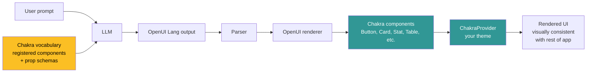

# Chakra UI + OpenUI: Building a Design-System-Aware Generative UI App

The first thing an engineer asks when they look at a generative UI demo is: *"Cool, but can I use it without throwing out my design system?"*

This is the right question. Most production apps are six months into a Chakra UI or shadcn/ui buildout. Throwing it away to adopt a new library — even a good one — is not on the table. The cost isn't the rewrite; it's the brand consistency, the accessibility work, the dark-mode plumbing, all of which already exist and need to keep existing.

The good news: OpenUI doesn't ask you to. The renderer's component vocabulary is configurable. You register your own components — Chakra ones, your custom design system, anything that exposes a typed React interface — and the model generates UI that uses *those* components instead of OpenUI's defaults.

This tutorial walks through wiring Chakra UI into an OpenUI app from scratch, with the registration pattern, prop schemas, and the editorial rules you'll want to teach the model so the generated UI feels like Chakra, not "OpenUI dressed up."

---

## Why this matters more than it sounds

When OpenUI ships with default components, generated UI looks like *OpenUI's design language* — clean, neutral, opinionated about spacing and typography. That's fine for a demo. It's a problem in production because your existing app uses Chakra, and the moment a user hits a generated panel, the visual context breaks. Buttons are different. Cards have different shadows. The radius is off by 2 pixels and your designer notices immediately.

Registering Chakra components into the vocabulary fixes this at the source. The model emits component names from your design system, the renderer mounts real Chakra components, and the generated UI is indistinguishable from the rest of the app.

The shift is conceptually small but practically large: you stop building 80 dashboard pages by hand and start exposing your existing design system to the model as a vocabulary.

---

## The architecture



Three pieces matter:

1. **The vocabulary registration** — telling OpenUI's renderer about Chakra components and their prop schemas
2. **The system prompt generation** — OpenUI auto-generates a prompt fragment that tells the model what components are available; you'll customize it to add Chakra's editorial conventions
3. **The ChakraProvider wrapping** — Chakra components need a `<ChakraProvider>` in the React tree; you'll wrap OpenUI's render output

Each piece is small. The combined effect is that the model generates UI that uses your real components and inherits your real theme.

---

## Step 1 — Project setup

This assumes a Next.js or Vite app that already uses Chakra. If you're starting fresh:

```bash
npx @openuidev/cli@latest create --name chakra-openui-app
cd chakra-openui-app
npm install @chakra-ui/react @emotion/react @emotion/styled framer-motion
```

The first command scaffolds an OpenUI app with the default vocabulary. The second installs Chakra's runtime dependencies. Next we'll replace the vocabulary.

If you're integrating into an existing Chakra app instead, skip the scaffolding and `npm install` the OpenUI runtime alongside what you already have:

```bash
npm install @openuidev/react @openuidev/parser
```

Then mount the OpenUI renderer wherever you want the generated UI to appear.

---

## Step 2 — Register your first Chakra component

The pattern: import the Chakra component, declare its prop schema, register it in the vocabulary by a name the model can use.

```tsx
// lib/openui-vocabulary.ts
import { Button, Card, CardBody, CardHeader, Stat, StatLabel,
         StatNumber, StatHelpText, Table, Thead, Tbody, Tr, Th, Td } from '@chakra-ui/react';
import { defineComponent, createVocabulary } from '@openuidev/react';

export const vocabulary = createVocabulary({
  Button: defineComponent({
    component: Button,
    props: {
      label: { type: 'string', required: true },
      variant: { type: 'enum', options: ['solid', 'outline', 'ghost', 'link'] },
      colorScheme: { type: 'enum', options: ['blue', 'green', 'red', 'gray'] },
      size: { type: 'enum', options: ['xs', 'sm', 'md', 'lg'] },
    },
    render: (props) => (
      <Button variant={props.variant ?? 'solid'}
              colorScheme={props.colorScheme ?? 'blue'}
              size={props.size ?? 'md'}>
        {props.label}
      </Button>
    ),
  }),

  MetricCard: defineComponent({
    component: Card,
    props: {
      label: { type: 'string', required: true },
      value: { type: 'string', required: true },
      helpText: { type: 'string' },
    },
    render: (props) => (
      <Card>
        <CardBody>
          <Stat>
            <StatLabel>{props.label}</StatLabel>
            <StatNumber>{props.value}</StatNumber>
            {props.helpText && <StatHelpText>{props.helpText}</StatHelpText>}
          </Stat>
        </CardBody>
      </Card>
    ),
  }),
});
```

Two things are happening:

- **Prop schema** tells the model what props exist and what values they take. Enums are particularly load-bearing — the model is much more reliable when it knows the exact valid values than when it's guessing free-form strings.
- **Render function** maps the schema to the actual Chakra component composition. `MetricCard` is a real example of where this gets useful: the model thinks in terms of one component called `MetricCard`, but you compose it from `Card`, `CardBody`, `Stat`, `StatLabel`, etc.

The renderer doesn't know or care that `MetricCard` is a composition. From its perspective it's a single registered component.

---

## Step 3 — Wire the vocabulary into the renderer

```tsx
// app/generative-panel.tsx
'use client';

import { ChakraProvider } from '@chakra-ui/react';
import { OpenUIRenderer, useStreamedGeneration } from '@openuidev/react';
import { vocabulary } from '@/lib/openui-vocabulary';
import { theme } from '@/lib/chakra-theme';

export function GenerativePanel({ prompt }: { prompt: string }) {
  const { tokens, status } = useStreamedGeneration({
    prompt,
    vocabulary,
    model: 'anthropic/claude-sonnet-4-6',
  });

  return (
    <ChakraProvider theme={theme}>
      <OpenUIRenderer
        tokens={tokens}
        vocabulary={vocabulary}
        fallback={<SkeletonPanel />}
      />
    </ChakraProvider>
  );
}
```

Two design choices worth noting:

1. **ChakraProvider wraps the renderer**, not the page. You can have generative panels living next to non-generative panels, both using the same theme.
2. **The vocabulary is passed to both** the generation hook and the renderer. The hook uses it to build the system prompt (telling the model what components are available); the renderer uses it to mount the right React components.

---

## Step 4 — Add editorial rules

The model will use components correctly if you let it. It'll use them *well* if you teach it your design conventions.

OpenUI's vocabulary builder accepts a `systemPromptExtension` that gets appended to the auto-generated prompt:

```tsx
export const vocabulary = createVocabulary({
  // ... components above
}, {
  systemPromptExtension: `
## Chakra editorial conventions

- Use \`MetricCard\` for any single numeric KPI. Combine multiple in a horizontal Stack with gap="md".
- Default colorScheme is "blue" for primary actions, "gray" for secondary, "red" for destructive.
- For tables, use \`size="sm"\` when displaying more than 10 rows; \`size="md"\` otherwise.
- Never use \`variant="ghost"\` on Buttons that are the primary action of a card.
- Default Card border radius and shadow are inherited from the theme — don't override.
`,
});
```

This is where you encode the design-system *judgment* the human team made over a year of iteration. The model can't pick "the right blue" by reading hex codes; it can pick "primary action = colorScheme blue" if you tell it the rule.

The cost of these rules is tokens in the system prompt. The benefit is that the generated UI consistently picks the right primitives. Worth it for any non-trivial design system.

---

## Step 5 — Run it

```tsx
// app/page.tsx
import { GenerativePanel } from './generative-panel';

export default function Page() {
  return (
    <GenerativePanel prompt="Show a metrics summary: 4 KPI cards for revenue, conversion rate, active users, and churn. Include 30-day trend indicators." />
  );
}
```

What renders is four `MetricCard`s laid out horizontally, each populated with a label, value, and trend indicator — and all of them using your Chakra theme: your typography, your radius, your shadow, your color palette.

The model didn't pick CSS values. It picked your *components*. The theming followed automatically.

---

## What you'll trip over

Three things I've seen go wrong:

**Prop schema too loose.** If you declare `colorScheme: { type: 'string' }` instead of an enum, the model will invent values like `"primary"` or `"navy"` that don't map to Chakra's named schemes. Always enumerate when you can.

**Forgetting the render function.** OpenUI lets you skip the `render` field and use the raw Chakra component — but that means props pass through unchanged. If you want `MetricCard` to actually be a composition of `Card` + `Stat`, you need the render function. The error mode is "model emits MetricCard, renderer mounts a bare Card." Always pair `defineComponent` with a deliberate render.

**Theme not propagating.** Chakra components inside the OpenUI renderer need a `ChakraProvider` *somewhere* in the React tree. If you forget, you get unstyled Chakra (yes, that's a thing — it falls back to browser defaults). Wrap the renderer, not the whole app, so non-generative parts of the page don't pay the theme-context cost.

---

## What this scales to

This pattern works for any React component library, not just Chakra. The same shape applies to:

- **shadcn/ui** — register each component with its variants
- **Material UI** — same registration, different prop names
- **Your custom design system** — the most valuable case, because the model now generates UI in your bespoke vocabulary

I've shipped this with a 40-component vocabulary in production. The model is reliably good at composing them. The art is in the editorial rules — telling the model *when* to use each primitive, not just that they exist.

---

## The takeaway

Generative UI without your design system is a demo. Generative UI with your design system is a product feature.

The integration cost is hours, not weeks. Register your components, write the editorial rules, wrap the renderer in your provider. The model then generates UI that's indistinguishable from what your designers ship by hand — because it *is* what your designers ship by hand, composed by the model.

The hardest part of adopting OpenUI in a Chakra app isn't the integration. It's deciding to stop hand-building views the model could compose for you.

---

**References:**
- [OpenUI repo](https://github.com/thesysdev/openui) — including the vocabulary API
- [OpenUI playground](https://www.openui.com/) — try the default vocabulary live
- [Chakra UI docs](https://chakra-ui.com/) — component API reference
- [OpenUI Creator Program](https://github.com/thesysdev/openui-creator-program) — where this article lives
