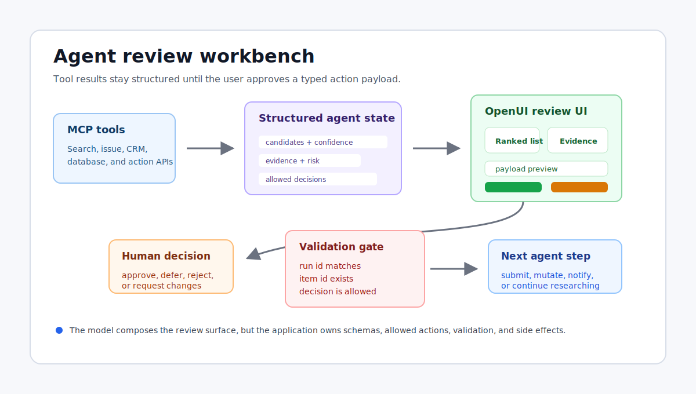

# Designing Agent Review Workbenches with OpenUI

How tool calls become reviewable, auditable interfaces.

Most agent workflows start with tools and end with prose. The agent calls a
search tool, a project-management tool, a database tool, or an MCP server. The
tool returns structured data. The agent ranks options, explains its reasoning,
and asks the user to approve the next step.

Then the product often throws all of that structure away and renders a chat
message.

That is the weak point. A user who needs to review twelve candidate actions,
compare evidence, inspect risk, approve one item, and keep an audit trail does
not need a paragraph. They need a review surface.

OpenUI is useful here because it can turn structured agent state into a
constrained interface without asking the model to invent a frontend from
scratch. The right mental model is not "agent chat with nicer cards." It is an
agent review workbench: a UI that exposes tool results, evidence, status, and
actions in a way a person can trust.



## Why Chat Breaks at the Review Step

Plain text works when the answer is short and low risk. It breaks down when the
output has state.

Consider an agent that helps triage engineering work. It may gather:

- candidate issues,
- estimated value,
- reproduction evidence,
- implementation risk,
- owner or reviewer availability,
- whether credentials or production access are required,
- and the next action it recommends.

Those fields are not just explanation material. They are the raw material for an
interface. A person reviewing this output wants to sort by value, scan risk
badges, open evidence links, compare alternatives, and approve or reject an
action. If the agent only returns prose, the user has to reconstruct that state
manually.

The result is slower and less reliable. The agent may have done useful work, but
the handoff is still fragile.

A review workbench keeps the handoff explicit:

- the tool output stays visible,
- the agent's ranking is inspectable,
- the possible actions are constrained,
- the approval payload is typed,
- and the next tool call only runs after validation.

That is where OpenUI fits naturally.

## The Workbench Pattern

A practical agent review workbench usually has five parts.

First, a ranked candidate list. This is the main surface where the user sees the
items the agent thinks are actionable. Each item should show enough information
to compare without opening a separate details view.

Second, an evidence panel. Agents should not ask for approval without showing
why an item was selected. Evidence can include source links, confidence scores,
recent activity, failing checks, or raw snippets from a tool result.

Third, a decision rail. The user should see the legal next actions: approve,
defer, request changes, reject, or inspect more. These should be commands, not
freeform guesses parsed from chat.

Fourth, a payload preview. Before the agent executes anything, show the exact
structured payload that will be sent back into the workflow. This is especially
important for actions that post externally, spend credits, open a PR, send a
message, or mutate customer data.

Fifth, a state timeline. Agent runs are often incremental. The UI should show
researching, filtering, verifying, ready for approval, submitted, and completed
states as first-class status, not as a stream of vague status text.

OpenUI can render this as a constrained component set. The model decides how to
compose the review state, but the application decides what components and
actions exist.

## Start With Tool Results, Not UI

The safest way to build this is to keep the tool result schema independent from
the UI. For example, an MCP-style tool may return candidate work items:

```ts
type CandidateAction = {
  id: string;
  source: "github" | "linear" | "slack" | "crm";
  title: string;
  url: string;
  estimatedValueUsd: number;
  confidence: number;
  risk: "low" | "medium" | "high";
  requiresCredential: boolean;
  evidence: Array<{
    label: string;
    href?: string;
    summary: string;
  }>;
};

type CandidateActionResult = {
  runId: string;
  generatedAt: string;
  actions: CandidateAction[];
};
```

This object is not an article, a chat message, or a component tree. It is agent
state. That separation matters because the same data may feed several surfaces:
a compact mobile list, a detailed desktop review view, a background audit log, or
a test fixture.

The next layer maps the tool result into review state.

```ts
type ReviewItem = {
  id: string;
  title: string;
  valueLabel: string;
  confidenceLabel: string;
  riskTone: "neutral" | "warning" | "danger";
  blocked: boolean;
  primaryEvidence: string;
  evidenceLinks: Array<{ label: string; href: string }>;
};

function toReviewItems(result: CandidateActionResult): ReviewItem[] {
  return result.actions.map((action) => ({
    id: action.id,
    title: action.title,
    valueLabel: `$${action.estimatedValueUsd}`,
    confidenceLabel: `${Math.round(action.confidence * 100)}%`,
    riskTone:
      action.risk === "high"
        ? "danger"
        : action.risk === "medium"
          ? "warning"
          : "neutral",
    blocked: action.requiresCredential,
    primaryEvidence: action.evidence[0]?.summary ?? "No evidence attached.",
    evidenceLinks: action.evidence
      .filter((entry) => entry.href)
      .map((entry) => ({ label: entry.label, href: entry.href! })),
  }));
}
```

This translation layer is intentionally boring. It gives the UI a stable shape
and keeps the model from having to infer basic display semantics every time.

## Give the Model a Small Interface Vocabulary

The OpenUI layer should not expose every component in your design system. For a
review workbench, the useful vocabulary may be small:

- `ReviewList` for ranked candidates,
- `EvidencePanel` for source material,
- `StatusTimeline` for run state,
- `PayloadPreview` for the approval object,
- `ActionBar` for allowed decisions,
- `RiskBadge` for visible safety signals.

The prompt can then ask the model to compose only those pieces around the
current review state. The application still owns the component implementations,
data loading, and action handlers.

```ts
type ReviewWorkbenchProps = {
  runId: string;
  phase: "researching" | "verifying" | "ready" | "submitted";
  items: ReviewItem[];
  selectedItemId?: string;
  allowedActions: Array<"approve" | "defer" | "reject" | "request_changes">;
};
```

The model does not need permission to invent a new destructive button. It only
chooses how to present state within the registered surface.

That is the biggest practical difference between generative UI and arbitrary UI
generation. The application still says what is possible.

## Make Approval a Payload, Not a Sentence

Approval should be a typed event. If the user clicks approve, the system should
not send "yes, that one" back into the agent and hope the model interprets it
correctly.

Use an explicit payload:

```ts
type ReviewDecision = {
  runId: string;
  itemId: string;
  decision: "approve" | "defer" | "reject" | "request_changes";
  note?: string;
  approvedAt: string;
  approvedBy: string;
};
```

Then validate it before execution:

```ts
function validateDecision(
  decision: ReviewDecision,
  current: ReviewWorkbenchProps,
) {
  if (decision.runId !== current.runId) {
    throw new Error("Decision does not match the active run.");
  }

  if (!current.items.some((item) => item.id === decision.itemId)) {
    throw new Error("Decision references an unknown item.");
  }

  if (!current.allowedActions.includes(decision.decision)) {
    throw new Error(`Action is not allowed: ${decision.decision}`);
  }
}
```

This is simple, but it changes the trust model. The user is not chatting with an
ambiguous agent. The user is operating a constrained review UI that returns
structured state to the agent.

## Show the State Machine

Agent workflows often look unreliable because the UI hides intermediate states.
A good workbench exposes them.

For example:

```ts
const timeline = [
  { phase: "researching", label: "Fetching candidate actions" },
  { phase: "verifying", label: "Checking evidence and risk" },
  { phase: "ready", label: "Waiting for human approval" },
  { phase: "submitted", label: "Approved action submitted" },
];
```

This gives the user a map of what is happening. It also gives engineering a
better debugging surface. If a run gets stuck in `verifying`, the issue is
different from a run that reaches `ready` but never receives approval.

In an OpenUI rendering flow, these phases can stream into the interface as the
agent progresses. The important part is that they remain structured states,
not loosely worded progress updates.

## Test the Contract, Not Just the Screenshot

Because this surface can lead to real actions, visual tests are not enough.

Useful tests for an agent review workbench include:

- the tool result maps into stable review items,
- high-risk items receive the right tone,
- credential-gated items cannot be approved automatically,
- the rendered action set only includes allowed decisions,
- the payload preview matches the eventual action payload,
- invalid item IDs are rejected,
- stale run IDs are rejected,
- and request-changes notes are preserved.

A tiny golden test can catch a lot:

```ts
it("builds an approval payload for the selected item", () => {
  const decision = buildDecision({
    runId: "run_123",
    itemId: "task_9",
    decision: "approve",
    approvedBy: "alex@example.com",
  });

  expect(decision).toMatchObject({
    runId: "run_123",
    itemId: "task_9",
    decision: "approve",
  });
});
```

The point is not to remove model flexibility. The point is to put hard edges
around the parts of the workflow that need hard edges.

## Where This Pattern Works Best

This pattern is strongest when the agent output is:

- ranked,
- evidence-backed,
- stateful,
- approval-oriented,
- or tied to an external side effect.

Examples include:

- support ticket triage,
- incident response suggestions,
- sales account enrichment,
- pull request review queues,
- deployment checklists,
- procurement approvals,
- compliance exceptions,
- data-quality cleanup tasks.

In each case, the user needs to inspect and decide. OpenUI gives the model a way
to arrange that review surface while the application keeps control of the action
contract.

## Where Plain Chat Is Still Fine

Do not turn every response into a workbench. If the answer is explanatory, short,
and low risk, a text response may be better.

The review workbench is worth the extra structure when at least one of these is
true:

- the user must compare multiple options,
- the action has consequences,
- the agent needs explicit approval,
- the output needs an audit trail,
- or the next step depends on a typed payload.

That is the practical decision rule.

## The Takeaway

Agents already produce structured intermediate state. MCP servers and tool calls
make that even more explicit. The product problem is that too much of that state
gets flattened into chat at the exact moment a person needs to review it.

OpenUI is a strong fit for the review layer because it lets teams expose
structured state as constrained, inspectable, interactive UI.

For agent products, the next step is not just better tool calling. It is better
handoff:

- clear candidates,
- visible evidence,
- typed approvals,
- validated actions,
- and a state timeline the user can understand.

When those pieces come together, the agent stops feeling like a black box that
occasionally asks for permission. It becomes a workflow the user can inspect,
guide, and trust.
