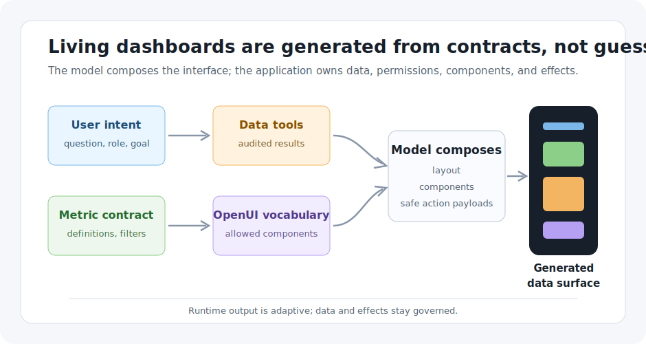

# From Static Dashboards to Living Interfaces

How AI is redefining the way we display data.

Static dashboards were built for a world where the important questions were
known before the meeting started.

That world still exists. Finance needs a month-end close dashboard. Support
needs a queue health dashboard. Engineering needs deploy health. These pages
work because the audience, metrics, layout, and decision cadence are stable.

The problem is everything around those stable dashboards. A product lead asks
why activation dropped for one segment. A success manager wants the same number
filtered by customer tier and renewal date. An executive wants the answer in two
charts and one risk table, not the twelve panels the BI team designed last
quarter.

Traditional dashboards are pages. Living interfaces are answers.

The shift is not that AI makes charts prettier. The shift is that AI can compose
the right data surface for the user's current intent, while the application keeps
control of the metrics, permissions, components, and actions. OpenUI matters in
that architecture because it gives the model a constrained interface language
instead of asking it to improvise prose, raw JSON, or arbitrary frontend code.

## The Static Dashboard Contract

A static dashboard is a contract between a builder and a future viewer:

- these are the metrics,
- this is the layout,
- these are the filters,
- these are the drilldowns,
- and these are the actions we expect you to take.

That contract is efficient when the future viewer is predictable. A revenue
dashboard can put bookings, churn, pipeline, and forecast on the same screen
because the business reviews those numbers every week. A latency dashboard can
show p95, p99, error rate, and deploy markers because the incident workflow is
well understood.

Static dashboards fail when the user is not trying to monitor a known state, but
to investigate a fresh question.

In that mode, the user usually does not need another dashboard. They need a
temporary workspace assembled around a specific question:

```txt
Why did new-team activation fall in the west region last week, and which
accounts should customer success contact first?
```

A fixed dashboard might contain every ingredient for that answer, but it makes
the user assemble the argument manually. They click through cohort filters, copy
numbers into a note, compare charts by memory, export a table, sort it, and then
write the action list somewhere else.

The data is present. The interface is not shaped around the job.

## What a Living Interface Changes

A living interface is generated around intent. It still uses real metrics and
real components, but its layout is assembled at runtime for the question in
front of the user.

For the activation question, one user might need an executive summary:

- current activation rate,
- delta versus baseline,
- top three affected segments,
- confidence level,
- recommended next action.

Another user might need an anomaly drilldown:

- cohort line chart,
- region and plan filters,
- event funnel comparison,
- suspicious step dropoff,
- link to the underlying query.

A customer success manager might need an action queue:

- impacted accounts,
- ARR tier,
- renewal date,
- owner,
- suggested outreach reason,
- button to create follow-up tasks.

These should not be three permanent dashboards if the business only asks this
exact question once. They should be three generated data surfaces over the same
metric contract.



The model should not invent the activation rate. It should not make up account
ARR, customer names, or a renewal risk score. Those still come from application
tools and governed data systems. The model's job is composition: choosing a
useful interface shape, arranging validated data, and exposing safe next actions.

That is the important boundary. A living interface is not "the model owns the
dashboard." It is "the model composes an allowed interface from trusted data."

## The Four-Part Runtime Contract

AI-generated dashboards need a stricter contract than a normal chat answer.
Without one, the model can produce a nice-looking but untrustworthy interface.

The useful contract has four parts.

First, the metric contract belongs to the application. Metric names, filters,
aggregation windows, permissions, and freshness rules should be defined outside
the model. If activation means `activated_accounts / new_accounts` with a
seven-day window, the model should receive that as a named metric, not rewrite
the formula from memory.

Second, the data comes from tools. The model can request `activation_summary`,
`funnel_breakdown`, or `at_risk_accounts`, but the application executes those
queries and returns structured results. This keeps the generated interface tied
to auditable data.

Third, the component vocabulary is constrained. The model can compose `Metric`,
`LineChart`, `SegmentTable`, `Alert`, `FilterBar`, and `ActionList` because the
application has registered those components. It cannot emit arbitrary React, add
unapproved controls, or invent a dangerous action.

Fourth, actions are validated. A generated "create outreach task" button should
send a typed payload back to the application. The application checks
permissions, required fields, idempotency, and audit logging before anything
happens.

That contract is where OpenUI fits. OpenUI gives the model a UI-native way to
describe the data surface while the app keeps ownership of data, components, and
effects.

## A Concrete Example

Imagine the user asks:

```txt
Show me why activation dropped for west-region self-serve teams last week.
```

A text-only assistant might answer:

```txt
Activation dropped from 42% to 34%. The biggest drop was in workspace invite
completion. West-region self-serve teams created fewer integrations, and 18
accounts with upcoming renewals were affected.
```

That is useful, but it collapses a workflow into a paragraph. The user still has
to ask follow-up questions, verify the numbers, and find the accounts.

A static dashboard might have the same information scattered across five panels.
The user has to know which filters to apply and which chart matters.

A living interface can render the answer as a small investigation workspace:

```txt
Dashboard(title:"Activation drop: west self-serve") {
  Metric(label:"Activation",value:"34%",delta:"-8 pts")
  LineChart(metric:"activation_rate",groupBy:"week",highlight:"last_7_days")
  Funnel(steps:["signup","invite","integration","first_report"],compare:"baseline")
  SegmentTable(source:"at_risk_accounts",columns:["account","arr","owner","renewal"])
  ActionList(actions:["create_success_tasks","open_query","save_view"])
}
```

This is not a complete OpenUI application. It is the shape of the contract:
known components, named metrics, explicit sources, and safe actions.

The interface can also adapt to role. For an executive, the same data may render
as a short risk memo with two charts. For a product manager, it may show funnel
steps and event definitions. For success, it may lead with accounts and task
creation.

The data does not change. The surface changes because the user's next action is
different.

## Why Chat-Over-Data Is Not Enough

Many teams already have natural-language analytics. A user asks a question, the
system writes SQL, returns a chart, and explains the result. That is useful, but
it often stops at a single answer.

Living interfaces go further in three ways.

They preserve state. If the user changes the segment from west to northeast, the
chart, table, summary, and action list should update together. A paragraph does
not have that kind of state boundary.

They expose affordances. A user can sort the account table, inspect the funnel
dropoff, save the view, or create follow-up tasks. They do not need to ask the
assistant for every tiny operation.

They make verification visible. A generated data surface can include query
links, metric definitions, freshness badges, and confidence warnings. That is
harder to communicate in prose without burying the user.

In other words, chat-over-data answers the question. A living interface supports
the work that follows the answer.

## The Implementation Pattern

A practical architecture can be simple:

1. The user asks a question in natural language.
2. The application classifies the intent and checks permissions.
3. Data tools return metric packets, segment tables, and allowed actions.
4. The model receives the packets plus a constrained component manifest.
5. The model emits OpenUI-style interface output.
6. The renderer displays the interface and sends user actions back to app code.

The critical move is step four. The model should not receive an unlimited design
system. It should receive a small vocabulary that matches the workflow.

For a data workspace, that might be:

- `Metric` for headline numbers,
- `LineChart` for time series,
- `Funnel` for step-by-step conversion paths,
- `SegmentTable` for accounts, users, or events,
- `Alert` for exception or risk flags,
- `FilterBar` for safe filters,
- `Definition` for metric explanations,
- `ActionList` for allowed next steps.

This keeps the generated UI predictable. It also makes the model's output easier
to validate. If the renderer sees a component outside the manifest, it rejects
it. If a table references a source that was not returned by the data layer, it
fails closed. If an action payload is missing required fields, the app does not
execute it.

The result is adaptive without being uncontrolled.

## What Developers Still Own

Living interfaces do not remove frontend engineering. They move it to a better
boundary.

Developers still own component quality. A generated chart is only useful if the
chart component handles empty states, loading states, accessibility, mobile
layouts, and dense labels.

Developers still own data correctness. The model should not be trusted to
calculate revenue, retention, or activation from raw guesses. It should arrange
results from metric services that already enforce definitions.

Developers still own permissions. A support manager and a contractor might ask
the same question, but the account table and available actions should differ.

Developers still own replay. If a generated interface drives a business decision,
the team should be able to replay the metric packets, model output, and action
payloads later. Otherwise the interface becomes impossible to audit.

Developers still own fallback behavior. When generation fails, the app should
show the underlying metric packet, a safe summary, or a saved dashboard. The
user should never be blocked by a malformed layout.

OpenUI helps with the composition layer, but it does not absolve the product of
these responsibilities. That is a good thing. Dynamic UI needs constraints to be
usable in real software.

## Where Static Dashboards Still Win

Static dashboards are not going away.

They are better when the business needs a canonical view. Board reporting,
compliance metrics, incident scorecards, SLA dashboards, and audit trails should
not be regenerated differently for every user. Stable views create shared
language.

They are also better when a team needs muscle memory. An on-call engineer should
not wonder where error rate moved today. A finance analyst should not relearn
the close dashboard every month.

The right split is not static versus AI. It is stable versus situational.

Stable questions deserve stable dashboards. Situational questions deserve
generated interfaces around intent.

## The Dashboard Becomes a Starting Point

The most realistic future is hybrid. A user starts from a dashboard, asks a
follow-up question, and the system generates a temporary interface next to the
canonical view.

The static dashboard provides trust and orientation. The living interface
provides adaptation and action.

For teams building AI products, that is the opportunity. Do not make the model
describe dashboards in prose. Do not make users hunt through a dashboard backlog
for every new question. Give the model a safe component vocabulary, connect it to
trusted data tools, and let it assemble the interface the moment requires.

Dashboards used to be destinations. In AI-driven products, they become raw
material for generated workspaces.
