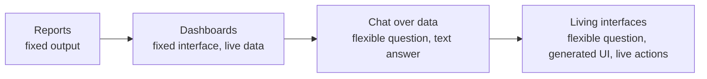

# From Static Dashboards to Living Interfaces

Dashboards were a major step forward because they moved business data out of scheduled reports and into software people could explore. Instead of waiting for a weekly PDF, a team could open a BI tool, filter by region, compare periods, and answer the next question on its own.

That was a real improvement. It also set a trap.

Most dashboards are still built around a fixed idea of what the user will need later. A team defines the metrics, someone designs the layout, an analyst wires up the queries, and the result becomes a shared surface for everyone. The dashboard may be interactive, but its shape is still predetermined.

AI changes that assumption. If the interface can be generated at the moment of need, the dashboard does not have to be a static destination. It can become a living interface: assembled for the user's question, connected to current data, and reshaped as the conversation moves.

OpenUI is one concrete technical path toward that shift. It lets an AI model generate structured UI from a component library your product controls, then lets the runtime render and execute that interface. The result is not just a chatbot with charts. It is a different way to think about how data products are assembled.



---

## The First Era: Reports

The earliest business intelligence workflow was report-first. Someone decided what mattered, wrote a query or exported a spreadsheet, and distributed the result.

Reports worked because they created a common record. They were easy to archive, easy to email, and easy to reference in meetings. But they were also brittle.

If the VP of Sales asked, "What happens if we exclude enterprise renewals?" the report could not answer. If a product lead wanted to see the same metric by acquisition channel instead of geography, someone had to rebuild it. The format was useful for distribution, not exploration.

The report era optimized for consistency. It did not optimize for the second question.

---

## The Second Era: Dashboards

Dashboards fixed part of that problem. They turned static outputs into interactive surfaces.

A dashboard could expose a date range filter, let the user click a segment, or show a table beneath a chart. This made data more self-serve and reduced the number of one-off analyst requests.

But dashboards still had an important limitation: every useful interaction had to be anticipated.

The dashboard designer had to choose:

- Which charts exist.
- Which filters are allowed.
- Which breakdowns are visible.
- Which drill-downs are supported.
- Which metrics deserve first-screen space.

That is fine for stable workflows. A finance dashboard can have a fixed monthly close view. An infra dashboard can have a fixed service health view. A support dashboard can have a standard queue view.

But many business questions are not stable. They are situational.

"Why did activation drop in Germany last week?"

"Which accounts created before the pricing change are most likely to churn?"

"Show me the deals where legal review is blocking expansion revenue."

"Compare mobile trial users who saw onboarding step three with those who skipped it."

You can build a dashboard for each of those questions, but you should not have to. Most teams end up with either a small number of overworked dashboards or a sprawling dashboard graveyard nobody fully understands.

The dashboard era optimized for repeatable exploration. It still struggled with intent.

---

## The Third Era: Chat Over Data

Natural language querying looked like the obvious next step. Instead of hunting through charts, a user could ask the system a question:

> Why did trial conversion fall this week?

The system could query data, summarize the result, and answer in plain English. This is useful. It lowers the activation energy for analysis, especially for users who do not know the schema or the BI tool.

But text is an incomplete interface for data.

A paragraph can summarize a trend, but it cannot let the user scrub across dates. A bullet list can rank segments, but it cannot preserve the density of a table. A sentence can say "conversion fell most in self-serve accounts with 20+ seats," but the user still needs to inspect the segment, compare the denominator, and decide whether the difference is meaningful.

Chat also tends to collapse evidence and conclusion into the same block of text. That may be acceptable for a quick answer, but it is not how teams make high-stakes decisions. People need to see the shape of the data, not just the model's interpretation of it.

The chat era optimized for access. It did not fully solve interaction.

---

## Living Interfaces

A living interface starts from the user's intent and generates the UI that fits that intent.

If the user asks about a metric trend, the response might include a line chart, a KPI row, and a segment table. If the next question is about outliers, the interface might add a scatter plot and a ranked list. If the user wants to take action, the same surface might expose an approval button, a follow-up form, or a mutation that updates a record.

This is different from dropping a chart into a chat message. A living interface has four properties:

1. It is generated for the current question.
2. It is composed from trusted product components.
3. It remains interactive after generation.
4. It can connect to tools and live data.

That combination matters. Without generation, the interface is just another dashboard. Without trusted components, the output is hard to productize. Without runtime interactivity, the user is back to asking the model for every change. Without live data, the interface becomes a pretty snapshot.

OpenUI's architecture maps neatly onto these requirements. Your application defines the component library. The system prompt tells the model what components and tools exist. The model responds in OpenUI Lang, a compact line-oriented format. The renderer parses the stream and maps it to React components. Queries, mutations, actions, and reactive variables let the interface keep working after the model has generated it.

That means the model can generate the wiring, while the runtime handles execution.

---

## A Simple Example

Suppose a product lead asks:

> Show activation for the last 30 days and explain what changed.

A traditional dashboard might already have a "Activation" page. If the right breakdown is available, the user can find the answer. If not, the user opens a ticket, asks an analyst, or exports the data.

A chat system might answer:

```text
Activation dropped from 42% to 36% over the last 30 days. The largest
decline came from teams with more than 20 seats, especially accounts
that skipped the integration step during onboarding.
```

That is a useful summary, but it is not enough. The product lead probably wants to inspect the trend, compare segments, and decide what to do next.

A living interface could generate something closer to this:

```openui
$range = "30d"
activation = Query("activation_metrics", {range: $range}, {kpis: [], series: [], segments: []})
range = Select("range", $range, [
  SelectItem("7d", "7 days"),
  SelectItem("30d", "30 days"),
  SelectItem("90d", "90 days")
])
kpis = KPIGrid(activation.kpis)
trend = LineChart(activation.series.date, [Series("Activation", activation.series.rate)])
segments = Table([
  Col("Segment", activation.segments.name),
  Col("Activation", activation.segments.rate),
  Col("Change", activation.segments.delta)
])
root = Stack([CardHeader("Activation analysis"), range, kpis, trend, segments])
```

The exact component names depend on the product's OpenUI library. The important part is the pattern: the generated answer includes controls, live query data, and a layout that matches the user's question.

If the user changes the range from 30 days to 90 days, the query can re-run. If they ask for enterprise only, the model can patch the existing interface rather than rebuilding the whole thing. If they want to create a follow-up task, the UI can expose an action instead of asking the user to copy text into another tool.

That is what makes the interface feel alive.

---

## Why Static Dashboards Break Down

Static dashboards fail in predictable ways.

First, they make teams choose between simplicity and coverage. A simple dashboard is easy to read but cannot answer many follow-up questions. A comprehensive dashboard can answer more questions but becomes dense, slow, and intimidating.

Second, they encode the organization chart. Marketing gets marketing dashboards. Sales gets sales dashboards. Support gets support dashboards. But the most interesting questions often cut across those boundaries.

Third, dashboards age quietly. A metric definition changes, a chart stops being used, a filter no longer maps to the current product, and the dashboard keeps existing because nobody wants to break a workflow that might still matter.

Fourth, dashboards separate explanation from action. A churn dashboard can show risk, but the next step usually happens somewhere else: CRM, email, ticketing, billing, or a customer success platform.

Living interfaces do not magically remove those problems, but they change the default. The UI can be narrower because it is generated for the current question. It can cross domains because it is driven by tools and intent, not a single prebuilt page. It can expose actions where the decision is made.

---

## What This Means For Product Teams

The product question is no longer, "Which dashboards should we build?"

It becomes, "Which components, data tools, and actions should the AI be allowed to compose?"

That is a healthier boundary. Product teams can define the trusted primitives:

- KPI cards.
- Tables.
- Charts.
- Filters.
- Forms.
- Approval controls.
- Account cards.
- Timeline views.
- Drill-down panels.

Engineering teams can define the tools:

- Query revenue.
- Fetch account health.
- List support tickets.
- Compare cohorts.
- Create a task.
- Trigger a workflow.

The model's job is to assemble those primitives for the user's request. The application's job is to keep the components safe, consistent, and connected to real systems.

This is why OpenUI's library-driven approach is important. The model is not being asked to generate arbitrary React code. It is being asked to compose from an allowed set of components and tool calls. That makes generative UI much closer to product infrastructure than to a demo trick.

For a product team, the migration path looks less like a dashboard redesign and more like defining an interface contract:

| Layer | Static dashboard question | Living interface question |
| --- | --- | --- |
| Components | Which chart should we place on this page? | Which trusted components can the model compose? |
| Data | Which query powers this tile? | Which tools can the generated UI call after render? |
| Interaction | Which filters do we expose? | Which state changes should update the UI without another prompt? |
| Action | Where does the user go next? | Which safe actions belong inside the generated surface? |

---

## What Does Not Go Away

Static dashboards will not disappear overnight, and they should not.

Some views should be stable. Executive scorecards, compliance reports, incident overview pages, and board metrics benefit from consistency. A generated interface is not always better than a known surface.

The shift is more specific: teams will stop treating static dashboards as the only serious way to display operational data.

Stable dashboards will remain the shared map. Living interfaces will handle the situational questions around the map:

- Why did this change?
- What should I inspect next?
- Which records need action?
- What happens if I change the segment?
- Can I turn this insight into a workflow?

That is where text-only AI and traditional BI both feel incomplete. Text understands intent but loses structure. Dashboards preserve structure but often ignore intent. Generative UI sits between them.

---

## The New Data Surface

The next generation of data products will not be a chat box bolted onto a dashboard. It will be a system where the interface itself is generated from the user's goal, rendered with trusted components, and connected to the tools that make the data useful.

That is a bigger shift than prettier charts.

It changes the unit of design from "dashboard page" to "composable data interaction." It changes the unit of engineering from "prebuild every view" to "expose safe components and tools." It changes the user experience from "find the dashboard that might answer this" to "ask for the interface this task needs."

Reports gave teams a record. Dashboards gave teams exploration. Chat gave teams access.

Living interfaces give teams something more direct: software that reshapes itself around the decision in front of them.

## Further Reading

- [OpenUI introduction](https://www.openui.com/docs/openui-lang)
- [OpenUI architecture](https://www.openui.com/docs/openui-lang/how-it-works)
- [Reactive state](https://www.openui.com/docs/openui-lang/reactive-state)
- [Queries and mutations](https://www.openui.com/docs/openui-lang/queries-mutations)
- [OpenUI benchmarks](https://www.openui.com/docs/openui-lang/benchmarks)
