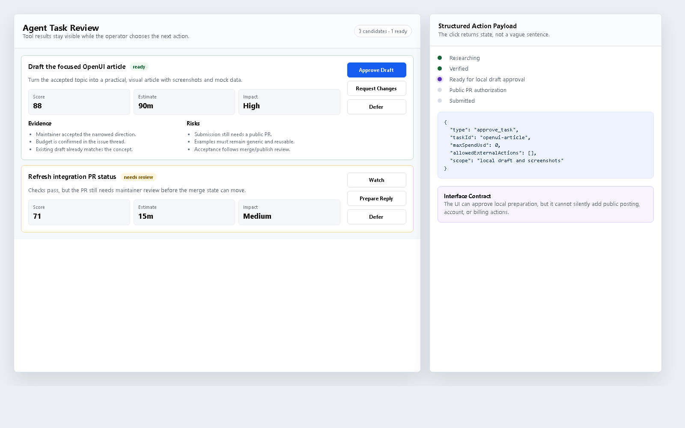
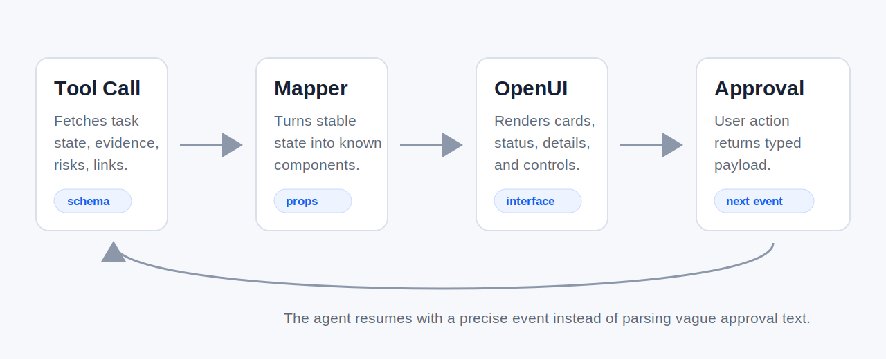

# From Tool Calls to Interfaces: OpenUI for MCP and Agent Workflows

Most agent demos still end in a chat transcript. The agent calls a tool, gets back a structured result, then compresses that result into a paragraph or a markdown table. That is fine for a proof of concept. It is a poor interface for real work.

The strange part is that the hard structure already exists before the answer becomes text. Tool calls return records, enums, scores, URLs, timestamps, validation errors, and action names. MCP servers expose resources and tools with schemas. Approval workflows have clear states: pending, accepted, rejected, blocked, submitted, done. Then we flatten all of that into prose and ask the user to read carefully.

OpenUI gives agent builders a better target. Instead of treating structured tool state as something to summarize away, you can render it as UI: cards, tables, status groups, forms, buttons, progress indicators, and review panels. The agent can still reason in language, but the operator does not have to operate inside language alone.

This article walks through that pattern with a small task-review example: take a tool result, map it to an OpenUI-ready interface, accept a structured human action, and feed that action back into the agent loop.



## The Interface Problem in Agent Workflows

Agent workflows tend to fail at the handoff points.

A coding agent can inspect a repository and produce five candidate tasks. A research agent can rank ten sources by credibility. A support agent can propose three policy-safe actions with different risks. An operations agent can identify opportunities and blockers. In every case, the output is not just "an answer." It is a decision surface.

Plain text makes that decision surface fragile:

- Important fields compete with narration.
- The user has to remember which item they are approving.
- Risk flags are easy to miss.
- Follow-up actions become ambiguous.
- The agent has to parse the user's free-form reply back into state.

A better interface keeps the state visible. The user should see the candidate tasks, compare scores, inspect evidence, approve one action, and send a structured decision back to the agent.

That is not a separate dashboard project. It is the natural UI layer for agent state.

## What Tool Calls Already Give You

Here is a simplified MCP-style tool result. It could come from a repository scanner, an issue triage service, a task router, or any internal agent tool.

```ts
type CandidateTask = {
  id: string;
  title: string;
  sourceUrl: string;
  status: "ready" | "blocked" | "needs_review";
  score: number;
  estimatedMinutes: number;
  impactEstimate?: "low" | "medium" | "high";
  evidence: string[];
  risks: string[];
  nextAction: string;
};

type TaskRouterResult = {
  generatedAt: string;
  runId: string;
  candidates: CandidateTask[];
};
```

There is nothing chat-specific about this. The result is already close to UI state:

- `title`, `sourceUrl`, and `evidence` want a card or details panel.
- `status` wants a badge.
- `score`, `estimatedMinutes`, and `impactEstimate` want sortable fields.
- `risks` want to be visually separate from positive evidence.
- `nextAction` wants an approval control.

If the agent turns this into text, it throws away useful affordances. If the agent renders this as UI, the user can act on the data without reverse-engineering the message.



## Mapping Agent State to OpenUI

OpenUI's model fits this pattern because OpenUI Lang is designed for model-generated, structured UI that can stream as it is produced. The React runtime lets you define a component library and render generated UI with that library.

The exact component library is up to your product. The important move is to define UI components that match your agent states, not generic "AI response" containers.

For example, a task review component might expose the fields the user actually needs:

```tsx
import { z } from "zod";
import { defineComponent, createLibrary } from "@openuidev/react-lang";

export const TaskCard = defineComponent({
  name: "TaskCard",
  description: "A candidate agent task with evidence, risks, and an approval action.",
  props: z.object({
    id: z.string(),
    title: z.string(),
    status: z.enum(["ready", "blocked", "needs_review"]),
    score: z.number(),
    estimatedMinutes: z.number(),
    impactEstimate: z.enum(["low", "medium", "high"]).optional(),
    sourceUrl: z.string().url(),
    evidence: z.array(z.string()),
    risks: z.array(z.string()),
    nextAction: z.string(),
  }),
  component: (props) => (
    <article className="task-card" data-status={props.status}>
      <header>
        <a href={props.sourceUrl}>{props.title}</a>
        <span>{props.status}</span>
      </header>
      <dl>
        <div>
          <dt>Score</dt>
          <dd>{props.score}</dd>
        </div>
        <div>
          <dt>Estimate</dt>
          <dd>{props.estimatedMinutes} min</dd>
        </div>
        {props.impactEstimate ? (
          <div>
            <dt>Impact</dt>
            <dd>{props.impactEstimate}</dd>
          </div>
        ) : null}
      </dl>
      <section>
        <h3>Evidence</h3>
        <ul>{props.evidence.map((item) => <li key={item}>{item}</li>)}</ul>
      </section>
      <section>
        <h3>Risks</h3>
        <ul>{props.risks.map((item) => <li key={item}>{item}</li>)}</ul>
      </section>
      <footer>{props.nextAction}</footer>
    </article>
  ),
});

export const agentWorkflowLibrary = createLibrary({
  name: "AgentWorkflow",
  components: [TaskCard],
});
```

The useful boundary here is the schema. The agent cannot render arbitrary UI actions. It can only produce props your library accepts. The user gets a richer interface, and your app still gets validation.

## The Translator Layer

You do not need to ask the model to invent every UI from scratch. A lot of agent UI can be deterministic.

One practical pattern is:

1. The agent calls a tool.
2. The tool returns structured state.
3. Your app maps that state into an OpenUI component tree.
4. The model adds explanation only where needed.

That translator can be a boring function:

```ts
function toTaskCards(result: TaskRouterResult) {
  return result.candidates.map((task) => ({
    component: "TaskCard",
    props: {
      id: task.id,
      title: task.title,
      status: task.status,
      score: task.score,
      estimatedMinutes: task.estimatedMinutes,
      impactEstimate: task.impactEstimate,
      sourceUrl: task.sourceUrl,
      evidence: task.evidence.slice(0, 5),
      risks: task.risks,
      nextAction: task.nextAction,
    },
  }));
}
```

This keeps the model away from facts it does not need to reconstruct. The agent can still decide which tool to call and how to rank the result, but the UI mapping is consistent. That consistency matters once a workflow becomes daily work instead of a demo.

For more flexible responses, you can give the model the component library prompt and let it generate OpenUI Lang directly. That is useful when the agent needs to choose between layouts or summarize unknown result shapes. For stable operational surfaces, deterministic mapping is often easier to test.

The split is simple:

- Use deterministic mapping for known state.
- Use model-generated OpenUI when the state is open-ended.
- Validate both before rendering.

## Human Approval as Structured Input

The most important UI element in an agent workflow is not a chart. It is an approval boundary.

Agents that can write files, open PRs, send emails, submit forms, or move money need crisp handoffs. A message like "Looks good, go ahead" is too vague. Which task? Which action? Which scope? Which budget? Which account?

Treat approval as a typed payload:

```ts
type AgentApproval =
  | {
      type: "approve_task";
      taskId: string;
      maxSpendUsd: 0;
      allowedExternalActions: string[];
    }
  | {
      type: "request_changes";
      taskId: string;
      notes: string;
    }
  | {
      type: "defer";
      taskId: string;
      reason: string;
      reviewAfter: string;
    };
```

The UI can render buttons for those actions. The backend receives a payload, not a sentence. The agent resumes with a precise event:

```ts
async function handleApproval(payload: AgentApproval) {
  if (payload.type === "approve_task") {
    await agent.continue({
      event: "human_approved_task",
      taskId: payload.taskId,
      maxSpendUsd: payload.maxSpendUsd,
      allowedExternalActions: payload.allowedExternalActions,
    });
  }
}
```

This is where generative UI becomes more than presentation. The interface becomes part of the control plane. It limits what the agent can do, records what the human approved, and removes ambiguity from the loop.

## Streaming State Changes

Agent workflows are rarely a single response. They move through states:

- researching
- verifying
- blocked
- ready
- waiting for approval
- submitted
- accepted
- complete

OpenUI is built for streaming UI, which makes these state transitions feel natural. Instead of waiting for a final report, the user can watch the interface update as evidence arrives.

A task might start as a small loading row:

```txt
TaskCard(
  id="T-104",
  title="Check failing CI job",
  status="needs_review",
  score=0,
  estimatedMinutes=15,
  sourceUrl="https://github.com/example/repo/actions/runs/123",
  evidence=[],
  risks=["CI logs not loaded yet"],
  nextAction="Wait for validation"
)
```

Then the agent calls tools and streams a richer version:

```txt
TaskCard(
  id="T-104",
  title="Fix failing TypeScript test in parser package",
  status="ready",
  score=84,
  estimatedMinutes=35,
  impactEstimate="high",
  sourceUrl="https://github.com/example/repo/issues/42",
  evidence=[
    "Failure reproduces locally",
    "No active overlapping PR",
    "Maintainer confirmed the issue is in scope",
    "Patch scope is one parser function plus tests"
  ],
  risks=[
    "Acceptance depends on review",
    "Maintainer review latency unknown"
  ],
  nextAction="Approve branch and PR creation"
)
```

The point is not that every state needs a flashy component. The point is that state should remain state. A streamed component tree lets the user see the work becoming more concrete without losing the ability to inspect and act.

## Testing the Interface Contract

The dangerous failure mode is letting generated UI become an untested output channel.

There are three layers worth testing.

First, structural validation. The generated component tree must use known components and valid props:

```ts
function validateTaskCard(input: unknown) {
  const parsed = TaskCard.props.safeParse(input);
  if (!parsed.success) {
    return { ok: false, reason: parsed.error.flatten() };
  }
  return { ok: true, value: parsed.data };
}
```

Second, action validation. If the user clicks approve, the payload still needs to pass policy:

```ts
function canApprove(payload: AgentApproval) {
  if (payload.type !== "approve_task") return true;
  if (payload.maxSpendUsd !== 0) return false;
  return payload.allowedExternalActions.every((action) =>
    ["create_branch", "open_pr", "post_comment"].includes(action)
  );
}
```

Third, regression testing. Keep a golden set of tool results and expected UI structure. Do not snapshot every character. Snapshot the stable contract: component names, required props, action types, and safety constraints.

```ts
expect(toTaskCards(routerFixture)).toMatchObject([
  {
    component: "TaskCard",
    props: {
      id: "T-104",
      status: "ready",
      nextAction: expect.stringContaining("Approve"),
    },
  },
]);
```

That gives you a testable UI contract without pretending model output will be identical forever.

## Where OpenUI Fits

OpenUI should not replace your agent framework. It should make the agent's state legible.

The agent still plans, calls tools, evaluates results, and decides what to do next. MCP still exposes capabilities. Your backend still enforces policy. OpenUI sits at the point where structured agent state becomes something a human can review and control.

That division is healthy:

- The agent owns reasoning.
- Tools own facts and side effects.
- The backend owns policy.
- OpenUI owns the review surface.

When those boundaries are clear, you get a workflow that is easier to trust. The user can see what the agent knows, what it wants to do, why it thinks the action is worthwhile, and what will happen if they approve.

## The Bigger Pattern

Agent products will not become reliable just by improving model quality. They also need interfaces that match the shape of agent work.

A chat box is a good start button. It is not always a good cockpit.

Tool results should become inspectable surfaces. Risk flags should stay visible. Approvals should be typed. State changes should stream. Tests should verify that generated UI cannot smuggle unsafe actions through a pretty component.

OpenUI is interesting here because it gives developers a language and runtime for that middle layer. You can let models generate interfaces when the shape is flexible, and you can deterministically map known tool state when the workflow needs consistency. Both approaches are better than flattening the whole thing back into markdown.

The next wave of agent UX is not just "agents that answer with UI." It is agents that work through UI: interfaces that expose state, collect approval, and keep the human in control of consequential actions.

That is the part worth building.
