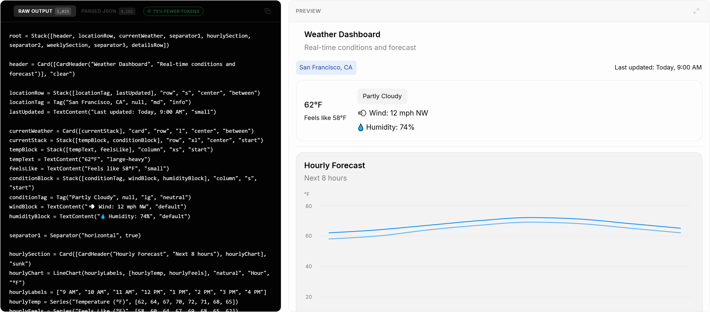
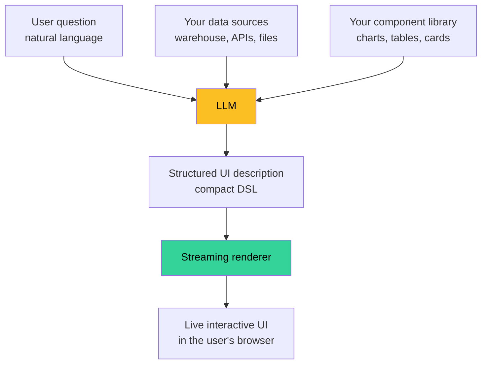

# From Static Dashboards to Living Interfaces: How AI Is Redefining the Way We Display Data

Every dashboard in your company is wrong.

Not in its numbers — in its *shape*. Someone, six months ago, decided which charts mattered. They picked the chart types, the filters, the time ranges. They published the dashboard. And then the business changed.

Now half the panels answer questions nobody asks anymore. The questions everyone *is* asking can't be answered by the panels that exist. So your team keeps a tab open to a SQL editor next to the dashboard, copies numbers out, and rebuilds the view they actually need in their head.

This is the static-dashboard problem. We've lived with it so long we forgot it was a problem. The interfaces we ship are frozen at the moment a designer published them; the questions our users ask aren't. The gap between the two is filled with screenshots in Slack and complaints in retros.

What's changing now is that the interface itself can be generated on demand — shaped by the question being asked, rendered with the data already in motion, interactive in ways the original designer never anticipated. This piece is about that shift and what it means for the next decade of data products.

---

## How we got here

The history of business dashboards is a story of trying to push the design boundary later in the request lifecycle.

**1990s — hardcoded reports.** Some analyst writes SQL. An engineer wires it to a `<table>`. The CEO reads it on Friday. Iteration cycle: weeks.

**2000s — BI platforms.** Tableau, Looker, Power BI. Designers compose dashboards from a fixed library of chart types. Business users can change filters but not the structure. Iteration cycle: days to weeks.

**2010s — drag-and-drop self-service.** Mode, Metabase, Hex. Anyone with SQL can publish a dashboard. The chart vocabulary is richer but still fixed at design time. Iteration cycle: hours to days.

**2020s — embedded analytics.** Every product ships its own dashboards inside the app. Same fundamental constraint: the analyst predicts the questions, builds the views, ships them, hopes.

Each generation moved design closer to the user, but the timing of design didn't change. The interface was still decided *before* the user showed up.

Generative UI is the first generation where that ordering inverts. The user shows up with a question, and the interface is composed to answer that specific question.

---

## What "generative" actually means here

Two words get conflated in this space and they shouldn't be.

**Personalization** is when a dashboard knows who you are and reorders the same components to suit you. Your CFO sees revenue first; your VP of Eng sees uptime first. The components are pre-built; the arrangement is the variable. This is what most "AI dashboards" on the market today actually do.

**Generation** is when the dashboard's *components* are decided at the moment of the question. The model picks whether the answer is a metric card, a chart, a table, or a stack of all three; what columns the table has; what axis the chart uses. The vocabulary is constrained (you didn't let it invent a new chart type), but the composition is novel.

Personalization is what made consumer apps feel smart in 2015. Generation is what's going to make business software feel smart in 2026.

The bar isn't "the model picks from three layouts." The bar is: the user types a question your dashboard team never anticipated, and the result is a usable interface — not a paragraph describing what the dashboard might look like.

---

## A concrete example

Here is what generation looks like when it works. The prompt is one line of natural language. The output is a real, interactive UI.

*Prompt: "Weather dashboard." That's it. The model produced four KPI cards, a temperature line chart with high/low series for seven days, and a precipitation bar chart — composed, laid out, populated with plausible sample data, in seconds.*

Now imagine that prompt isn't from a designer but from an end user — and the question isn't "weather dashboard" but "show me my March 2026 customer churn by acquisition channel." A traditional BI tool needs that view to be pre-built. A generative interface picks the chart types, the breakdowns, and the layout to answer the specific question, with the data already wired in.

That's the difference. The interface meets the question, not the other way around.

---

## What the architecture looks like

The good news for anyone shipping software today is that this isn't a rip-and-replace. The architecture sits on top of what you already have.

Three pieces are new:

1. **A constrained component vocabulary** — the chart, table, and layout primitives the model is allowed to use. This is what stops the model from inventing components that don't exist or styling them off-brand. Most teams already have this; it's just called "the design system."
2. **A structured output format** — a compact way for the model to describe a UI tree without burning a fortune in tokens on syntax. Standards are emerging here ([OpenUI Lang](https://github.com/thesysdev/openui) being one example); the wire format matters because verbose formats double or triple your inference bill at scale.
3. **A streaming renderer** — a runtime that mounts components progressively as the model's output arrives, instead of waiting for a complete response before painting anything.

What *doesn't* change: your data sources, your auth model, your access control, your design system. The generative layer slots between the user's question and the interface that answers it. Everything else stays.

---

## What this unlocks (and what it doesn't)

It unlocks:

**Long-tail questions.** The questions a BI team can't justify pre-building a dashboard for — questions a single user asks once a quarter — become first-class. The threshold to get a real interface for a real question goes from "open a ticket with the data team" to "type the question."

**Embedded experiences.** Every app that has a chatbot today should probably also have a generative UI layer. The chatbot tells you the answer; the UI lets you act on it. A support agent answering "where's my order" should be returning a tracker, not a sentence.

**Composability over configurability.** Stop building 47 dashboards for 47 personas. Build the components, expose the data, let the interface compose itself per question. The maintenance burden drops by an order of magnitude.

It doesn't unlock:

**Mission-critical reporting.** If a number has to be in a specific place at a specific time for a specific compliance reason, build the static dashboard. Generative UI is probabilistic; the regulator wants deterministic.

**Pixel-perfect editorial design.** If you're publishing the New York Times morning briefing, a designer should still lay it out. Generative UI is for *interfaces*, not *artifacts*.

**Data integrity.** Generation does not fix bad numbers. If your warehouse is wrong, your generated dashboard is wrong with prettier styling.

---

## What changes for teams that build this stuff

Three roles shift:

**Data analysts** stop being dashboard authors and become curators of the component vocabulary and the data interface. The work moves from "build the 23rd version of the revenue dashboard" to "ensure the model has clean access to the revenue tables and the right primitives to render any breakdown the user might ask for."

**Product designers** stop laying out individual views and start designing the component library and the editorial rules that govern when to use what. Less "where does the legend go on chart #14"; more "what's the right primitive for a year-over-year comparison."

**Frontend engineers** stop building one-off dashboards and start hardening the renderer, the streaming behavior, and the fallback paths. The frontend isn't smaller; it just stops being a parade of nearly-identical views.

Nobody gets cut out. The center of gravity shifts.

---

## The pushback, addressed

**"Users don't want to type questions."** Some don't. Most do, when typing produces something better than clicking through a menu. The five-year-old pattern of "click the right combination of filters from the dashboard chrome to construct the view you want" is already a kind of typing — worse typing, with fewer expressive options. Natural language is the simplification, not the imposition.

**"This is just chatbots with extra steps."** No: chatbots return text. The whole point of generative UI is that the result is something you can *interact with* — sort it, filter it, expand a row, attach a file. Text is a single-channel medium; UI is a multi-channel one. The interaction surface is the difference.

**"My model will hallucinate the data."** It can, if you let it. The correct architecture has the model pick the *shape* of the interface and the data comes from your warehouse via tool calls or direct binding. The model doesn't make up the numbers; it picks how to display the numbers your systems already produce. Hallucination becomes a UX bug, not a correctness bug.

**"My users will ask for things I can't render."** That's a vocabulary problem, not a paradigm problem. Build out the component set. Same as you did when adding a new chart type to your BI tool, except now the model figures out when to use it instead of a human composing it into a static layout.

---

## What to do this quarter

If you're building a data product, three concrete moves:

1. **Audit your dashboard ratio.** Count how many of your dashboards are viewed by more than ten unique users a month. The rest are candidates for replacement by generation. The maintenance cost on long-tail dashboards is usually invisible until you measure it.

2. **Inventory your component vocabulary.** If your design system has fewer than 20 data-display primitives (KPI card, line chart, bar chart, table with sorting/filtering, metric tile, sparkline, etc.), the gap between what your model could compose and what your users could ask is too big. Fill the gap.

3. **Pick one user surface to convert.** Don't rebuild the whole BI stack. Pick a place where users keep asking questions your dashboards can't quite answer — internal support tools, ops consoles, embedded customer-facing analytics — and prototype a generative layer behind it. The friction surface is small; the lesson is large.

---

## The bottom line

Static dashboards were the right tool when the cost of generating a fresh interface was prohibitive. That cost has collapsed. The interfaces we ship in 2026 should respond to the question at the moment it's asked, not the one that was pre-anticipated six months ago.

The technology to do this isn't speculative. The component vocabularies are in your design system. The data is in your warehouse. The models are commodity. The wire formats and streaming renderers exist as off-the-shelf libraries. What's left is the willingness to stop treating "the dashboard" as a noun and start treating it as a verb.

The next decade of data products won't be won by the team with the prettiest dashboards. It'll be won by the team whose interface answers the question the user actually has.

---

**Further reading:**
- [OpenUI repo](https://github.com/thesysdev/openui) — open-source reference implementation of the generative UI pattern
- [OpenUI playground](https://www.openui.com/) — try it without setting anything up (the dashboard above was generated here)
- [Thesys OpenUI launch post](https://www.thesys.dev/blogs/openui) — design rationale behind the wire format choice
- [Top AI Product coverage on OpenUI](https://topaiproduct.com/2026/03/20/openui-by-thesys-wants-to-replace-json-as-the-language-between-ai-and-your-interface/)
