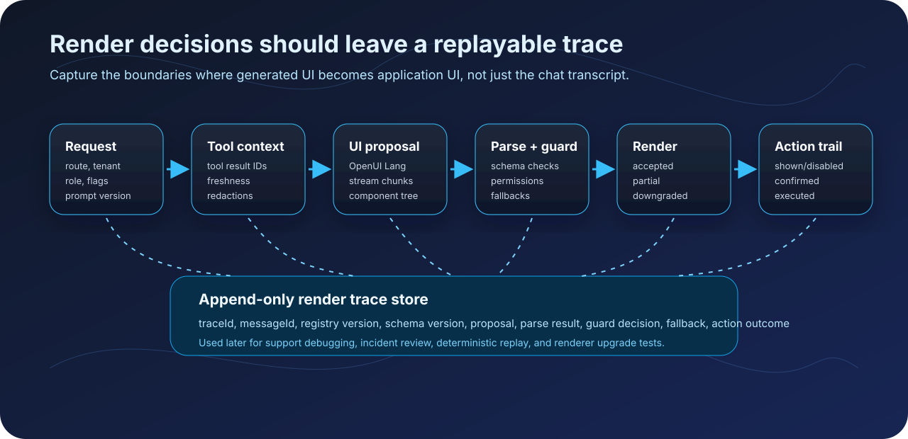

# Observability for Generative UI: Debugging Model-Rendered Interfaces in Production

When a normal frontend bug reaches support, the first useful question is simple: what code path rendered the broken screen?

Generated interfaces make that harder. The UI a user sees may come from a model response, a component-library prompt, tool results, schema validation, streamed partial output, client state, and action guards that make last-second safety decisions. A screenshot and chat transcript help, but they usually cannot explain why a specific card, form, chart, or action appeared.

That is the observability problem for generative UI.

A production team does not only need to know what the assistant said. It needs to know what interface the assistant proposed, what the renderer accepted, what it dropped, which tools were used, which state was present, and which actions were safe to expose. If those decisions are invisible, every incident becomes a guess about whether the model was wrong, the renderer was wrong, the data was stale, or the user clicked through a path nobody can replay.

OpenUI gives teams a useful boundary for this work. The model emits OpenUI Lang constrained by a component library, and the React renderer parses that response into application UI. That boundary between model output and rendered interface is where observability should live.

The goal is not to log everything forever. The goal is to capture enough structured evidence to answer one question later:

> Why did this generated interface appear, and was it safe?

## Chat logs are not enough

A text transcript can tell you that a user asked for a refund workflow and that the assistant returned a refund card. It usually cannot tell you the production details that matter:

- Which tool result supplied the refund amount?
- Was the tool result fresh or cached?
- Did the model reference a component outside the current component library?
- Did validation drop a field, chart series, or button?
- Did the renderer show a fallback because part of the tree failed?
- Did the user see an enabled action or a disabled action with an explanation?
- Did form state change after generation but before submit?

Those details live between the model response and the rendered UI.

OpenUI makes that middle layer explicit. A backend prompt tells the model which component vocabulary it can use. The model returns OpenUI Lang instead of arbitrary frontend code. The client renderer parses that response and maps valid statements to React components. The renderer also exposes hooks for parser results, errors, state updates, actions, and tool calls.

That gives teams a better observability target than raw prompt logging: record the render decision pipeline.

## Treat the generated UI as a proposal

A generated interface should be treated as a proposal until the application accepts it.

A practical pipeline looks like this:



1. **Request context** - user intent, route, tenant, feature flags, permissions, and stable IDs for prompt and tool context.
2. **Tool context** - tool names, arguments, result IDs, freshness, and redacted result summaries.
3. **UI proposal** - the OpenUI Lang response the model attempted to render.
4. **Parse result** - the statements that became renderable nodes, plus unresolved references or orphaned statements.
5. **Validation and runtime errors** - unknown components, missing props, query failures, renderer errors, and fallback decisions.
6. **Render decision** - accepted, partially accepted, repaired, retried, or downgraded.
7. **User action trail** - form state, action events, guard decisions, confirmations, and mutations.

The final UI is not the only artifact. The decision trail is the artifact.

Imagine a support agent asks:

> Show me the refund status for order 3821 and give me the safest next action.

The generated UI might include a refund amount, timeline, and approval button. If a user later reports that the button was wrong, a transcript only gives you the surface. A render trace should show that the model proposed an approval action, the tool result was 18 minutes old, the account permissions allowed read access but not approval, the action guard downgraded the button to `Request manager review`, and no mutation executed.

That is the difference between debugging a scary screenshot and debugging a system.

## A small event model

The trace model can start small. Use an append-only event envelope and keep payloads boring.

```ts
type RenderTraceEvent = {
  traceId: string;
  messageId: string;
  sessionId: string;
  tenantId: string;
  userRole: string;
  route: string;
  at: string;
  type:
    | "ui.proposal_updated"
    | "ui.parse_result"
    | "ui.render_error"
    | "ui.state_updated"
    | "ui.action_seen"
    | "ui.action_guarded"
    | "ui.action_executed"
    | "tool.called"
    | "tool.completed";
  payload: Record<string, unknown>;
};

type TraceSink = {
  write(event: RenderTraceEvent): void | Promise<void>;
};
```

The envelope carries the dimensions support and engineering will search by: tenant, session, message, role, route, and time. The payload changes by event type.

For a generated UI proposal, store the response format, component library version, schema version, streaming state, and either the redacted response text or a stable reference to it.

```ts
sink.write({
  traceId,
  messageId,
  sessionId,
  tenantId,
  userRole,
  route,
  at: new Date().toISOString(),
  type: "ui.proposal_updated",
  payload: {
    responseFormat: "openui-lang",
    componentLibrary: "support-console@2026-05-20",
    schemaVersion: "refund-ui-v3",
    isStreaming,
    responseText: redact(content),
  },
});
```

In production, you may not want to retain full response text forever. Keep full traces for recent high-risk sessions, then compact older records into hashes, component names, validation outcomes, and redacted summaries.

## Instrument the renderer boundary

The OpenUI renderer boundary is the best place to observe generated UI because it sees the proposal after the model emits it and before the user acts on it.

The React renderer accepts the raw `response`, the component `library`, streaming state through `isStreaming`, and callbacks such as `onParseResult`, `onError`, `onStateUpdate`, and `onAction`. Tool calls are handled through `toolProvider`. You can wrap those surfaces without changing the model prompt.

```tsx
import { Renderer } from "@openuidev/react-lang";
import { openuiLibrary } from "@openuidev/react-ui";

type ToolMap = Record<string, (args: Record<string, unknown>) => Promise<unknown>>;

function observeTools(tools: ToolMap, trace: Omit<RenderTraceEvent, "at" | "type" | "payload">, sink: TraceSink): ToolMap {
  return Object.fromEntries(
    Object.entries(tools).map(([name, fn]) => [
      name,
      async (args: Record<string, unknown>) => {
        await sink.write({ ...trace, at: new Date().toISOString(), type: "tool.called", payload: { name, args: redact(args) } });
        const result = await fn(args);
        await sink.write({ ...trace, at: new Date().toISOString(), type: "tool.completed", payload: { name, ok: true, resultSummary: redact(result) } });
        return result;
      },
    ]),
  );
}

export function ObservedAssistantMessage({ content, isStreaming, trace, tools, sink }: Props) {
  return (
    <Renderer
      library={openuiLibrary}
      response={content}
      isStreaming={isStreaming}
      toolProvider={observeTools(tools, trace, sink)}
      onParseResult={(result) => {
        void sink.write({ ...trace, at: new Date().toISOString(), type: "ui.parse_result", payload: { result: redact(result) } });
      }}
      onError={(errors) => {
        void sink.write({ ...trace, at: new Date().toISOString(), type: "ui.render_error", payload: { errors: redact(errors) } });
      }}
      onStateUpdate={(state) => {
        void sink.write({ ...trace, at: new Date().toISOString(), type: "ui.state_updated", payload: { state: redact(state) } });
      }}
      onAction={(event) => {
        void sink.write({ ...trace, at: new Date().toISOString(), type: "ui.action_seen", payload: { event: redact(event) } });
      }}
    />
  );
}
```

A production version should add batching, sampling, backpressure, error handling around failed trace writes, and a product-specific redaction layer. The core idea stays the same: the generated UI boundary should emit structured events.

## Log decisions, not only errors

Most teams start observability by logging failures. Generated UI needs more than failure logs because risky states can be technically successful renders.

A stale approval form might parse cleanly. A generated dashboard might render perfectly while using data from the wrong account scope. A destructive action might appear correctly but should have been disabled for the current role.

Capture decisions even when no exception is thrown:

| Decision | Useful fields |
| --- | --- |
| Component accepted | component name, statement ID, schema version, library version |
| Component dropped | reason, source statement, fallback component |
| Tool result used | tool name, result ID, freshness, tenant scope, redacted summary |
| Action exposed | action type, label, required permission, confirmation requirement |
| Action blocked | guard name, reason, user role, required role |
| State changed | form name, changed field keys, validation state |
| Replay started | trace ID, renderer version, frozen tool result IDs |

The trace should answer both halves of the production question: what appeared, and why was it allowed to appear?

## Redaction is part of the feature

Generative UI traces are valuable because they sit near sensitive context. That is also why redaction cannot be an afterthought.

Do not blindly store raw prompts, full tool results, access tokens, private documents, payment data, customer messages, or complete form state. In many products, you can debug most incidents with stable IDs and small summaries:

- `toolResultId` instead of the full response body
- `resultFreshnessSeconds` instead of every raw timestamp
- `componentNames` instead of the full UI tree after retention expires
- `fieldKeysChanged` instead of field values
- `permissionDecision: "blocked"` instead of the full policy input
- `payloadHash` for integrity checks when raw payloads are stored separately

A good test: support can understand the trace, engineering can replay the UI, and neither team sees secrets they do not need.

## Replay without re-running the model

The most useful debugging workflow is deterministic replay. If a support engineer has to re-run the model to reproduce the UI, the reproduction is already suspect. The model may choose a different layout, tools may return different data, and the component library may have changed.

A replayable trace stores the generated response and the versions needed to render it again:

```ts
type ReplayableRenderTrace = {
  traceId: string;
  messageId: string;
  responseFormat: "openui-lang";
  responseText: string;
  componentLibrary: string;
  rendererVersion: string;
  initialState: Record<string, unknown>;
  frozenToolResults: Record<string, unknown>;
};
```

Replay can then be a normal renderer pass with frozen tools and disabled mutations.

```tsx
function frozenToolProvider(results: Record<string, unknown>) {
  return Object.fromEntries(Object.entries(results).map(([name, result]) => [name, async () => result]));
}

export function ReplayGeneratedUI({ trace }: { trace: ReplayableRenderTrace }) {
  return (
    <Renderer
      library={openuiLibrary}
      response={trace.responseText}
      isStreaming={false}
      initialState={trace.initialState}
      toolProvider={frozenToolProvider(trace.frozenToolResults)}
    />
  );
}
```

The replay harness should not execute real mutations. It should render the captured proposal against frozen query results and simulated mutation handlers. That lets engineering inspect the UI without charging a customer, sending an email, updating a ticket, or approving a refund.

Replay also helps during renderer upgrades. Run old traces against a new component library in staging and ask: did the same proposal still render, did it degrade safely, or did a previously valid component disappear?

## Streaming needs its own trace

Streaming makes generated interfaces feel fast, but it creates intermediate states that can confuse users and developers.

Track the difference between:

- a partial tree while the model is still streaming,
- an invalid statement that is later corrected,
- a forward reference that resolves after more lines arrive,
- a component that is dropped permanently,
- and a final render that succeeds.

For high-risk flows, consider delaying action buttons until the final parse has completed and all guards have run. The UI can still stream read-only structure while keeping mutations behind a stable final-state boundary.

## Action guards are UI observability

Generated interfaces often include actions: submit a form, create a ticket, send a message, update a record, approve a workflow. Those actions should be observable separately from rendering.

A button appearing on screen is not the same as a mutation being safe to run.

Treat actions as a second decision pipeline:

1. The model proposes an action.
2. The renderer exposes the action event.
3. The application checks permissions, scope, freshness, and confirmation rules.
4. The user confirms or cancels.
5. The mutation executes or is blocked.
6. The result is reflected back into the generated UI.

A blocked action trace might look like this:

```ts
sink.write({
  ...trace,
  at: new Date().toISOString(),
  type: "ui.action_guarded",
  payload: {
    actionType: "refund.approve",
    visibleLabel: "Approve refund",
    decision: "blocked",
    guard: "refund.requires_manager_role",
    userRole: "support_agent",
    requiredRole: "support_manager",
  },
});
```

If a user says, "the assistant tried to approve a refund," the trace can distinguish between four outcomes: validation dropped the action, the action appeared disabled, the user clicked and a guard blocked it, or the mutation actually executed.

Those differences matter operationally and legally.

## Give support a timeline, not raw JSON

Not everyone needs raw traces. A useful internal view can translate render events into a timeline:

```text
10:14:03  User asked for refund status on order 3821
10:14:05  Tool order.lookup completed, result age 24s
10:14:06  UI proposed RefundSummaryCard + RefundTimeline + ManagerReviewAction
10:14:06  Renderer dropped CustomerEmailBadge: component not in library
10:14:07  Action "Approve refund" blocked: support_manager required
10:14:08  User clicked "Request manager review"
10:14:09  Mutation refund.review_request created ticket RF-8812
```

That timeline is easier to use than raw JSON and safer than exposing complete prompts. It also helps product teams spot patterns: which generated components fail most often, which actions are commonly blocked, which tool results are stale, and where users abandon generated workflows.

## Rollout checklist

Start with one generated surface that has real operational risk: support workflows, admin actions, payments, approvals, or customer data dashboards.

Then add this checklist:

- Trace every generated message with `traceId`, `messageId`, route, role, and tenant.
- Record response format, component library version, and renderer version.
- Capture parser results and renderer errors at the OpenUI renderer boundary.
- Wrap tool providers to record tool name, redacted args, result IDs, freshness, and failure state.
- Capture form state changes by field key, not raw sensitive values.
- Treat every generated action as a guarded decision, not just a click handler.
- Store replayable traces for recent high-risk sessions.
- Build a replay view that uses frozen query results and disabled mutations.
- Define retention and redaction before broad rollout.
- Give support a readable timeline, not a raw prompt dump.

Observability for generative UI is not about collecting more logs. It is about making generated interfaces accountable. The model can propose. The renderer can parse. The component library can constrain. The tool layer can fetch live data. The app can guard actions. But when all of those pieces combine into one screen, the team still needs a durable answer to why that screen existed.

For OpenUI apps, the renderer boundary is the natural place to start. It already sits between model output and React UI, and it already exposes the hooks needed to observe parsing, errors, tool calls, state updates, and actions. With a small trace model around that boundary, teams can debug incidents without guessing, replay generated interfaces without re-running the model, and prove that risky actions were guarded even when the UI itself was generated.

That is the standard mature generative UI systems should aim for: not just generated screens, but explainable generated screens.
