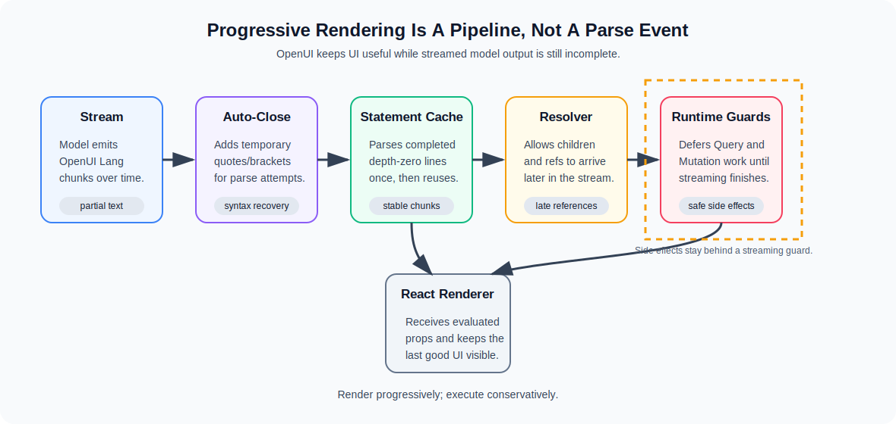

# OpenUI Progressive Rendering: The Parser/Renderer Contract

Most AI interfaces stream text but still render UI as if the response were a finished document.

That is the awkward middle ground: tokens appear in the chat bubble, but the actual interface waits until the model has finished, the JSON parses, the component tree validates, and React receives a complete object. The user sees motion, but not much usable state.

OpenUI's progressive rendering model is different. The parser and renderer are designed around incomplete model output. They do not need the model to finish every bracket before the app can start showing useful UI.

The interesting part is not "streaming" by itself. The interesting part is the contract between:

- an incremental parser that can turn partial OpenUI Lang into the best available component tree
- a runtime that waits to execute unsafe side effects until streaming is done
- a renderer that keeps the last good UI visible if a transient partial state fails

That contract is what lets generated UI feel live without making the browser fragile.



The key idea is that streaming UI is not one step. Syntax recovery, statement caching, reference resolution, side-effect gating, and last-good rendering each protect a different boundary.

## Why Plain Streaming Is Not Enough

A normal streaming chat app is simple:

```text
chunk 1 -> append text
chunk 2 -> append text
chunk 3 -> append text
```

That works because plain text is useful even when incomplete. A half-written sentence may be ugly, but it is still a string.

UI is less forgiving. A component tree has structure:

```ts
{
  type: "Card",
  props: {
    title: "Renewal risk",
    children: [
      { type: "Metric", props: { label: "ARR", value: "$84k" } }
    ]
  }
}
```

If that arrives as JSON, the browser cannot parse the object until the closing brackets arrive. You can stream the JSON characters, but the interface still has to wait for a complete payload.

OpenUI Lang is statement-oriented instead:

```txt
root = Card([header, metric])
header = CardHeader("Renewal risk")
metric = Metric("ARR", "$84k")
```

That gives the runtime much better checkpoints. A completed statement can be parsed and cached while the model is still writing later statements. A pending statement can be auto-closed just long enough to produce a provisional tree.

## The Six-Stage Parser Pipeline

The OpenUI engineering blog describes the parser pipeline as:

```text
autocloser -> lexer -> splitter -> parser -> resolver -> mapper -> ParseResult
```

That matters because each step has a clear job.

The autocloser makes partial text syntactically usable. If the model has emitted an opening quote or bracket but not the matching close yet, the parser can append the minimal closing character for the current parse attempt.

The lexer turns characters into tokens. The splitter groups tokens into `id = expression` statements. The parser builds expression ASTs. The resolver handles references between statements. The mapper produces the public `ParseResult` shape consumed by the React runtime.

The outcome is not just "did parsing succeed?" It is a result with metadata: incomplete state, unresolved references, statement count, errors, and the resolved root element when one is available.

That metadata is important for streaming because "partial" is not the same as "broken."

## Auto-Close Is A Streaming Primitive

OpenUI's `autoClose()` helper is deliberately small. It scans the input, tracks whether it is inside a string, tracks bracket depth, and appends missing closing quotes or brackets when needed.

That means this partial model output:

```txt
root = Card([
  TextContent("Revenue is up
```

can be treated as temporarily parseable:

```txt
root = Card([
  TextContent("Revenue is up")
])
```

The app should not pretend that final text is complete. The parse metadata can still mark the result as incomplete. But the renderer gets a usable approximation instead of a hard syntax failure.

This is the difference between progressive UI and blank-screen streaming.

## Statement-Level Caching

The expensive mistake in many streaming parsers is re-parsing the full accumulated output on every chunk:

```text
parse first 20 chars
parse first 40 chars
parse first 60 chars
parse first 80 chars
```

That becomes quadratic work as the output grows.

OpenUI's streaming parser keeps a buffer and a completed-statement cache. It scans from the last processed offset until it finds a depth-zero newline. At that point, the statement is complete enough to parse and store.

The pending trailing statement is the only part that needs to be re-parsed on each chunk.

Conceptually:

```text
completed statements: parsed once and cached
pending statement: auto-close, parse, merge with cache
```

This is why OpenUI Lang's statement shape matters. A newline at bracket depth zero is a real boundary. Once a statement is complete, the model is not expected to mutate it later during ordinary generation.

The parser still has to handle replacement cases. If the host calls `set(fullText)` with text that is shorter than the previous buffer, or no longer starts with the old buffer, OpenUI resets the stream parser and rebuilds from scratch. That keeps edit/retry flows sane.

## References Can Resolve Later

Progressive rendering does not require every reference to exist immediately.

The model can start with:

```txt
root = Stack([summary, table])
summary = CardHeader("Pipeline health")
```

At that point, `table` may be unresolved. The parser can still keep useful state: it knows the root shape, the summary statement, and the missing reference.

When the model later emits:

```txt
table = Table([...])
```

the same root can resolve into a fuller component tree.

This is more natural than requiring the model to emit bottom-up data first. Humans often describe the container before filling in every child. OpenUI's parser lets model output follow that pattern.

## React Only Receives Evaluated Props

The React renderer is intentionally boring at the component boundary.

By the time a component renders, props are already evaluated into concrete values. The component does not need to know about AST nodes, references, or parser internals.

In `@openuidev/react-lang`, `Renderer` passes raw response text, the component library, streaming state, action callbacks, initial state, and an optional tool provider into `useOpenUIState()`. That hook owns parsing, store setup, query management, action handling, and prop evaluation. The renderer then recursively renders the resolved root element.

That division is healthy:

- parser/runtime code handles language concerns
- React components handle display concerns
- app code owns the approved component library and tool provider

Generated UI stays dynamic without asking every component to become a mini interpreter.

## Queries And Mutations Wait For Streaming To Finish

The most important production detail is easy to miss: OpenUI does not eagerly fire query and mutation work while the model is still streaming.

In `useOpenUIState()`, query evaluation and mutation registration are skipped when `isStreaming` is true. That protects the app from half-formed tool calls.

Imagine this partial output:

```txt
orders = Query("getOrders", { customerId:
```

The parser can auto-close the expression enough to keep the UI alive, but the app should not call `getOrders` yet. The argument object is not stable. The user should not pay latency or side-effect costs for a tool call the model has not finished specifying.

The rendering layer can be progressive. Side effects should be conservative.

That split is one of the central lessons for generative UI systems.

## Last-Good UI Beats Blank UI

Partial generated UI will occasionally produce transient render errors. A component prop may be temporarily the wrong shape. A referenced child may not be ready. The model may emit a malformed intermediate expression and repair it in the next chunk.

OpenUI's React renderer uses an error boundary around each element and intentionally keeps the last successfully rendered children when a render error occurs. When new valid children arrive, the boundary attempts to recover.

That behavior is subtle but important.

Without it, a single bad intermediate chunk can blank the whole generated interface. With last-good rendering, the user keeps seeing the most recent valid UI while the stream continues.

This matches how people experience streaming. A partial state should degrade gracefully. It should not punish the user for the model being mid-sentence.

## What Progressive Rendering Is Not

It is worth being precise with the word "hydration."

OpenUI progressive rendering is not the same thing as React server-side hydration. React SSR hydration attaches event handlers to HTML that already exists. OpenUI progressive rendering builds an increasingly complete component tree from streamed model output.

The useful comparison is not "server HTML becomes interactive." It is:

```text
partial generated program -> best available component tree -> evaluated props -> React render
```

That distinction helps avoid the wrong mental model. The browser is not hydrating static markup. It is rendering a live program that becomes more complete over time.

## How To Design Components For This Model

If you are building a component library for OpenUI, design for partial props.

Good generated-UI components should:

- tolerate missing optional props
- show skeleton or empty states for incomplete arrays
- validate action payloads before enabling buttons
- avoid throwing on unknown enum-like values
- keep layout stable while content fills in
- expose clear required props in the component schema

Bad generated-UI components assume every prop is present and final. They work in demos where the whole payload arrives at once, then fail during real streaming.

The component schema is part of the parser contract. The looser and more ambiguous it is, the more correction work the model and runtime have to do.

## A Useful Debug Checklist

When progressive rendering feels flaky, do not start by blaming the model. Check the contract:

1. Does the model emit stable statement boundaries?
2. Does the root reference children that may appear later?
3. Are query and mutation calls gated until streaming completes?
4. Do components tolerate missing optional props?
5. Does the renderer preserve last-good state on transient failures?
6. Are parser errors surfaced in a form the model can repair?
7. Does the app distinguish incomplete output from invalid output?

Most production bugs sit in those boundaries.

## The Payoff

OpenUI's renderer feels responsive because the parser/runtime stack treats streaming as a first-class constraint.

It can auto-close incomplete syntax, cache completed statements, resolve references as more output arrives, defer side effects until the stream is stable, and keep the last good UI visible when an intermediate render fails.

That is the real design lesson. Generative UI is not just a model emitting components. It is a protocol between uncertain text generation and deterministic application code.

OpenUI works when that protocol is explicit.
