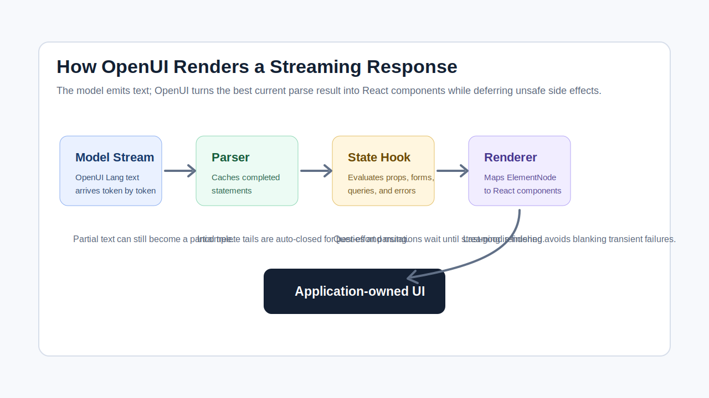

# OpenUI's React Renderer Explained: Progressive Rendering with Streamed Model Output

Streaming text is easy to display. Streaming an interface is harder.

If an assistant returns a paragraph, a chat app can append tokens to the last
message. If an assistant returns UI, the app has to answer different questions:

- Is the current output syntactically usable yet?
- Which parts of the component tree are complete enough to render?
- What happens if the model is halfway through a nested component?
- Should data-fetching queries run before the stream is finished?
- If one component crashes while props are still changing, should the whole UI go
  blank?

OpenUI's React renderer is interesting because it does not treat model output as
an opaque blob that becomes useful only after the final token arrives. The
runtime keeps trying to turn the best available OpenUI Lang into a component
tree, lets React reconcile that tree as more text arrives, and delays the parts
that are unsafe to run while the stream is still moving.

One clarification before getting into the code: "progressive hydration" is a
useful product phrase, but the current React implementation is not browser SSR
hydration in the React technical sense. There is no server-rendered HTML tree
being hydrated by `hydrateRoot`. What OpenUI does today is closer to progressive
parsing, evaluation, and rendering of streamed model output.

## The Pipeline

The React path has four main pieces:

1. The model emits OpenUI Lang as plain text.
2. `createStreamingParser` turns that growing text into a `ParseResult`.
3. `useOpenUIState` evaluates the parsed tree, manages state, and exposes a
   rendering context.
4. `Renderer` recursively maps the evaluated `ElementNode` tree to React
   components from the supplied library.

In application code, this shows up as a small API:

```tsx
<Renderer
  response={assistantText}
  library={library}
  isStreaming={isStreaming}
  onAction={handleAction}
  onStateUpdate={persistState}
  onError={handleOpenUIErrors}
/>
```

That compact API hides most of the hard work. The `response` prop is just a
string, but the renderer treats it as a stream-friendly program, not markdown or
JSON.

Relevant source files in the current OpenUI repository:

- `packages/react-lang/src/Renderer.tsx`
- `packages/react-lang/src/hooks/useOpenUIState.ts`
- `packages/lang-core/src/parser/parser.ts`
- `packages/lang-core/src/parser/statements.ts`
- `packages/lang-core/src/parser/materialize.ts`



## Why OpenUI Lang Is Easier to Stream Than a UI JSON Blob

A generic JSON representation usually wants the whole object before it is
comfortable:

```json
{
  "type": "Card",
  "props": {
    "title": "Revenue",
    "children": [
      { "type": "Metric", "props": { "value": "$42k" } }
    ]
  }
}
```

That can be streamed as bytes, but the application still needs a tolerant parser
or it has to wait until the braces close. Worse, the model may place the most
important root-level structure late in the object.

OpenUI Lang uses statement-shaped output:

```txt
root = Card(
  title: "Revenue",
  children: [
    Metric(label: "ARR", value: "$42k")
  ]
)
```

The important design choice is not the exact syntax. It is that the parser can
reason about completed statements and the current pending statement. When the
stream crosses a depth-zero newline, the streaming parser can cache that
completed statement instead of reparsing or risking it on every new token.

In `createStreamParser`, the implementation keeps:

- an internal text buffer,
- a `completedEnd` watermark,
- a map of completed statements,
- the first statement id,
- and a count of completed statements.

As new text is appended, `scanNewCompleted()` walks the buffer while tracking
string state, bracket depth, and ternary depth. A newline at depth zero marks a
statement boundary. That is the point where a statement becomes stable enough to
cache.

The pending tail is handled differently. `currentResult()` strips comments and
fences, auto-closes the incomplete statement, parses that pending statement, and
merges it with the completed statement map. That gives React a best-effort tree
without corrupting statements that were already completed earlier in the stream.

## Auto-Closing Is What Makes Partial UI Useful

The helper that makes incomplete text parseable is `autoClose()` in
`parser/statements.ts`.

It scans the input, tracks quoted strings and bracket nesting, then appends the
missing quote or closing bracket when the current stream is incomplete. That
does not mean the model's output is "correct" yet. It means the parser can
evaluate a syntactically closed approximation of the current text.

For example, halfway through a stream, the model may have produced:

```txt
root = Card(
  title: "Invoice review",
  children: [
    TextContent(text: "Checking invoice
```

The parser cannot treat that as complete model output, but it can close the
string, array, and function call long enough to build the current best tree. The
metadata still records that the result is incomplete, so the host can avoid
treating it as final.

This is a practical compromise. It is better to show a partial card that keeps
improving than to hold an empty assistant message until the model finishes every
character.

## How the Renderer Receives the Tree

The public `Renderer` component is intentionally small. It injects a loading
style, normalizes the tool provider, calls `useOpenUIState`, and renders the
result's root node when one exists.

The important call is:

```tsx
const { result, parseResult, contextValue, isQueryLoading } = useOpenUIState(
  {
    response,
    library,
    isStreaming,
    onAction,
    onStateUpdate,
    initialState,
    toolProvider: resolvedToolProvider,
    onError,
  },
  renderDeep,
);
```

`parseResult` is the raw parser output. `result` is the evaluated result used by
the renderer. That split matters. Host applications may want parser-level
metadata, unresolved symbols, or validation errors, but React components should
receive concrete evaluated props when possible.

`Renderer` returns `null` until there is a root element:

```tsx
if (!result?.root) {
  return null;
}
```

Once the root exists, the output is rendered inside `OpenUIContext.Provider`.
That context carries the library, form state helpers, action handling, stream
state, evaluation context, and render-error reporting.

## Recursive Rendering Is Simple on Purpose

The renderer does not execute arbitrary JSX from the model. It looks up a
component by name in the application-provided library:

```tsx
const Comp = library.components[node.typeName]?.component;
```

If the component is not in the library, it renders nothing for that node. If it
is found, `RenderNodeInner` calls the component renderer with:

- `props`,
- `renderNode`,
- and `statementId`.

The model controls composition inside the vocabulary it was given. The
application still owns the actual React components, their styling, their event
surfaces, and their side effects.

That is the central safety boundary for OpenUI-style rendering. The model does
not get to import packages, attach arbitrary event handlers, or run browser
code. It can request `Card`, `Table`, `Form`, or whatever components the library
exposes.

## State and Forms Survive the Stream

`useOpenUIState` creates a store with `createStore()`. The store holds:

- top-level `$bindings`,
- form state grouped by form name,
- field values wrapped with component metadata,
- and initialized state declarations from parsed OpenUI Lang.

The hook exposes `getFieldValue` and `setFieldValue` through context. That lets
generated form components behave like real controlled UI instead of static
assistant output.

The subtle part is initialization. The hook builds an initialization key from
parsed state declarations and `initialState`, then avoids reinitializing the
store if that key has not changed. That prevents form state from being wiped out
by unrelated React re-renders.

For streamed UI, that distinction matters. The model may still be appending
siblings or labels while the user-visible form surface is taking shape. The
renderer needs state handling that is separate from the parser's latest text
snapshot.

## Queries Wait Until Streaming Stops

OpenUI supports `Query()` and `Mutation()` statements, but `useOpenUIState`
intentionally defers their runtime work while the model is still streaming.

The query effect starts with:

```tsx
if (isStreaming) return;
```

The mutation registration effect does the same thing.

That is the right tradeoff. While the model is still generating, the query
statement may be incomplete, the arguments may still be changing, or a
dependency may not have stabilized. Running tools or network requests against a
half-built statement would create noisy failures and unnecessary side effects.

Once streaming is false, the hook evaluates query statements, computes their
state dependencies, and hands them to `QueryManager`. The UI can show the
default query loader while query results are loading, and the rendered root fades
slightly by changing opacity.

This is one of the places where "progressive" has a boundary. Structural UI can
render progressively. Tool execution waits until the structure is stable enough
to run.

## Errors Prefer Last Good UI Over Blank UI

Streaming interfaces fail in transient ways. A component may receive a prop that
is valid two tokens later but invalid right now. A nested element may be
temporarily unresolved. A custom renderer may throw while the model is still
filling in data.

OpenUI's React renderer wraps each element in `ElementErrorBoundary`. The
boundary stores the last successfully rendered children. If a render error
occurs, it shows the last good children instead of blanking the whole tree. When
new children arrive, it resets the error state and tries again.

That behavior is a better default for streamed UI than "all or nothing." The
assistant response may be changing several times per second. A transient render
failure should not erase everything that was already useful.

There is also an important reporting distinction. Render errors are skipped
while `isStreaming` is true, because they are often temporary. After streaming
stops, parser, validation, runtime, render, and query errors are collected and
sent through `onError` as structured `OpenUIError` objects. That makes the error
signal more useful for correction loops.

## What React Is Actually Reconciling

React is not hydrating server markup here. It is reconciling a changing tree of
OpenUI element nodes.

Each time `response` changes, `useOpenUIState` calls `sp.set(response)`. The
streaming parser computes the new `ParseResult`, the hook evaluates props, and
the renderer maps the evaluated root node back into React components.

From React's point of view, this is familiar: props and children changed, so
reconcile the tree. From the application user's point of view, it feels like the
interface is being hydrated progressively because a static text stream becomes
cards, forms, tables, and actions as it arrives.

That distinction is worth keeping. The product behavior is progressive UI. The
implementation mechanism is parser-driven tree updates plus normal React
rendering.

## Practical Tradeoffs

This architecture gives developers a strong pattern, but it is not magic.

__Component vocabulary matters.__ If the library exposes low-level layout
primitives, the model can create awkward surfaces. If the library exposes
product-level components, the generated UI is easier to constrain and review.

__Partial rendering needs conservative side effects.__ OpenUI already defers
queries and mutations during streaming. Application components should follow the
same principle: render structure early, but avoid irreversible side effects
until user action or stream completion.

__Error recovery is not validation.__ Last-good rendering protects the user
experience from transient failures. It does not prove the final output is valid.
Hosts should still inspect `onError`, parser metadata, and action payloads.

__State needs ownership.__ The model can describe a form, but the application
must decide how form state is persisted, restored, and submitted.

__"Progressive hydration" should be explained carefully.__ If your team uses
that phrase, define it as progressive rendering of streamed model output. Do not
confuse it with React's SSR hydration model.

## Conclusion

The OpenUI React renderer works because it separates responsibilities cleanly.
The parser turns a growing string into the best available structured result.
The state hook evaluates that result, manages forms, defers unsafe runtime work,
and reports useful errors. The renderer maps trusted component names to
application-owned React components. React handles the actual reconciliation.

That combination is what makes streamed model output feel like a live interface
instead of a text blob with a loading spinner. The model can generate structure
incrementally, the parser can tolerate incomplete syntax, and the UI can keep
the last good state on screen while the next state arrives.

For developers building AI products, the lesson is not "let the model render
anything." It is the opposite: give the model a compact language, a constrained
component library, and a renderer that knows how to survive partial output.

## Source References

- React renderer:
  `packages/react-lang/src/Renderer.tsx` in
  [`thesysdev/openui`](https://github.com/thesysdev/openui/blob/e38bfb5652ffdd5b86dd864a8e4de16e00037079/packages/react-lang/src/Renderer.tsx)
- React state hook:
  `packages/react-lang/src/hooks/useOpenUIState.ts` in
  [`thesysdev/openui`](https://github.com/thesysdev/openui/blob/e38bfb5652ffdd5b86dd864a8e4de16e00037079/packages/react-lang/src/hooks/useOpenUIState.ts)
- Streaming parser:
  `packages/lang-core/src/parser/parser.ts` in
  [`thesysdev/openui`](https://github.com/thesysdev/openui/blob/e38bfb5652ffdd5b86dd864a8e4de16e00037079/packages/lang-core/src/parser/parser.ts)
- Statement auto-close and splitting:
  `packages/lang-core/src/parser/statements.ts` in
  [`thesysdev/openui`](https://github.com/thesysdev/openui/blob/e38bfb5652ffdd5b86dd864a8e4de16e00037079/packages/lang-core/src/parser/statements.ts)
