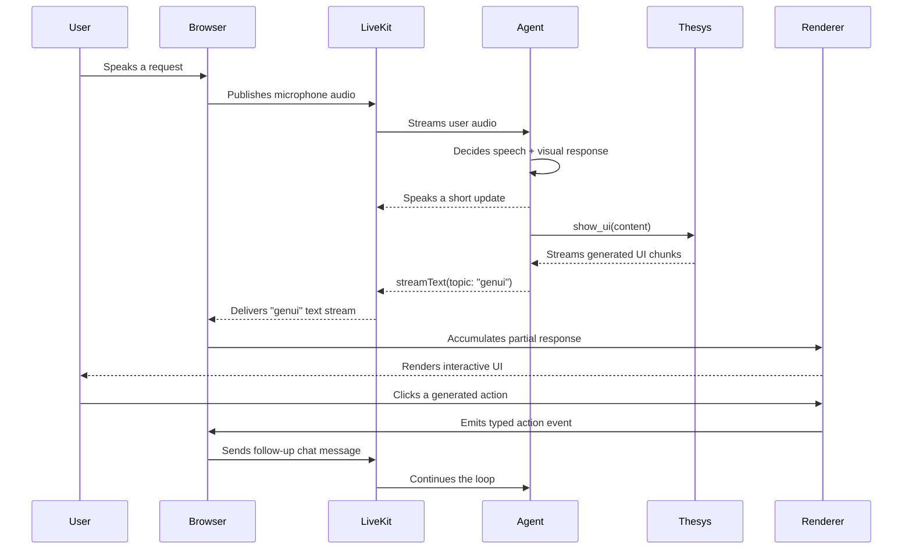

# OpenUI for Voice Agents: Event-Driven Visual Feedback with LiveKit

Voice agents are usually designed as if audio were the whole product. The user asks a question, the model speaks back, and anything that does not fit comfortably into a sentence gets compressed into a spoken summary.

That works for greetings, quick answers, and simple commands. It breaks down the moment the user asks for anything dense: compare these options, explain this chart, show me the cheapest route, collect these preferences, track this workflow, summarize these search results.

Audio is temporal. The user hears one word after another, and once a detail passes, it is gone unless they ask again. Interfaces are spatial. They let users scan, compare, pause, click, filter, and return to context later.

The best voice-agent experiences use both. Voice handles the conversational thread. Generated UI handles state, structure, and action.

The reference implementation in [thesysdev/voice-agent-generativeui](https://github.com/thesysdev/voice-agent-generativeui) shows a practical version of that pattern with LiveKit and Thesys GenUI. The agent speaks to the user through LiveKit while a separate visual stream sends generated UI to the browser, where it is rendered by `C1Component`.

This article walks through that architecture, why the split matters, and what to watch when you build the same pattern in production.

## The Core Pattern

A voice-plus-UI agent is not a chatbot with a bigger message bubble. It is a two-channel system:

```text
User voice
  -> LiveKit room
  -> voice agent
  -> tools and model reasoning
  -> spoken reply over audio
  -> generated UI over a LiveKit text stream
  -> browser renders UI progressively
  -> UI actions can send messages back to the agent
```

As a sequence, the useful part looks like this:



The important design decision is that speech and UI are not the same output serialized two different ways. They serve different jobs.

The spoken response should stay short:

```text
I found three strong options. I am putting the comparison on screen now.
```

The visual response can carry the work:

```text
Comparison cards, prices, tradeoffs, images, filters, and a confirmation action.
```

That split is what makes the experience feel usable instead of exhausting.

## What LiveKit Provides

LiveKit gives the voice agent the realtime room, participant identity, audio transport, and agent lifecycle. In the reference app, the Next.js frontend creates a participant token in `src/app/api/connection-details/route.ts` and attaches a room configuration:

```ts
at.roomConfig = new RoomConfiguration({
  agents: [{ agentName: "voice-genui-agent" }],
  metadata: mode,
})
```

That `metadata` value selects the agent mode. The agent entrypoint reads it:

```ts
const roomMeta = ctx.job.room?.metadata ?? ""
const mode: AgentMode = roomMeta === "pipeline" ? "pipeline" : "realtime"
```

The app supports two voice modes:

- Pipeline mode: separate STT, LLM, and TTS components. It is more modular, so you can swap transcription, reasoning, or voice providers independently.
- Realtime mode: one multimodal realtime model consumes and produces audio directly. It reduces latency and can feel more natural, but it gives you less provider-level modularity.

Both modes share the same `VoiceAgent` class and the same tools. That matters because the visual channel should not depend on the audio implementation. Whether the agent is pipeline-based or realtime, the UI contract stays the same.

## What OpenUI Adds

LiveKit can move audio and text streams around. It does not decide what visual interface should be shown when the user asks, "Which of these plans should I choose?"

That is where OpenUI-style generative UI belongs. The voice model decides when a visual surface would help, then calls a tool with structured content. A UI-generation model turns that content into a renderable component response, and the frontend renders it inside the product's visual system.

In the reference app, the tool is `show_ui`.

The prompt tells the voice model to use it whenever the answer has structure:

```text
You should use show_ui aggressively - any time information would be better seen than heard, put it on screen and give a brief spoken summary.
```

The tool itself is defined in `livekit-agent/src/tools/show-ui.ts`. It accepts one string field:

```ts
parameters: z.object({
  content: z
    .string()
    .describe("The full structured content to display visually. Be detailed and specific."),
})
```

That `content` is not the final UI. It is the agent's visual brief. The tool forwards it to the Thesys API and streams the generated UI back to the browser.

## The `show_ui` Tool Loop

The most interesting part of the implementation is that `show_ui` does not block the voice model until the visual stream finishes.

It starts a background task:

```ts
(async () => {
  const writer = await this.room.localParticipant.streamText({
    topic: "genui",
  })

  const stream = await this.thesysClient.chat.completions.create(
    {
      model: THESYS_MODEL,
      messages: [
        { role: "system", content: THESYS_SYSTEM_PROMPT },
        { role: "user", content },
      ],
      stream: true,
    },
    { signal },
  )

  for await (const chunk of stream) {
    const delta = chunk.choices[0]?.delta?.content
    if (delta) await writer.write(delta)
  }

  await writer.close()
})()
```

Then it returns immediately:

```ts
return "UI is loading on screen. Tell the user in 1-2 natural sentences what you are showing them."
```

This is the right behavior for a voice experience. The user should not sit in silence while a visual component is generated. The agent can say a short sentence while the screen begins to update.

The implementation also cancels the previous visual stream when a new one starts:

```ts
this.abortController?.abort()
this.abortController = new AbortController()
```

That is a small detail with a big UX payoff. Voice conversations change direction quickly. If the user interrupts "compare these phones" with "actually, make that laptops," the previous UI stream should not keep writing stale cards into the room.

## Receiving the UI Stream

On the browser side, the frontend listens for the same `genui` topic in `src/lib/components/VoiceUI.tsx`:

```ts
room.registerTextStreamHandler("genui", handleGenUI)
```

The handler accumulates chunks:

```ts
const handleGenUI = (reader: AsyncIterable<string>) => {
  setIsStreaming(true)
  setGenUIContent("")
  let acc = ""

  ;(async () => {
    try {
      for await (const chunk of reader) {
        acc += chunk
        setGenUIContent(acc)
      }
    } finally {
      setIsStreaming(false)
    }
  })()
}
```

That accumulated response is passed into `C1Component`:

```tsx
<C1Component
  c1Response={content}
  isStreaming={isStreaming}
  onAction={onAction}
/>
```

This keeps the generated visual layer separate from the transcript. The transcript remains a voice history. The GenUI panel becomes the current visual workspace.

That separation is worth preserving in your own app. If you collapse everything into a chat log, the generated UI becomes just another message. If you treat it as a workspace, the user can keep acting on it while the conversation continues.

## Actions Close the Loop

Generated UI becomes much more useful when it can do something.

The reference app's `GenUIPanel` passes an `onAction` callback into `C1Component`. The parent handles two broad classes of action:

```ts
switch (event.type) {
  case "open_url":
    window.open(url, "_blank", "noopener,noreferrer")
    break
  case "continue_conversation":
  default:
    if (message) sendChatMessage(message)
    break
}
```

That gives the UI a path back into the agent loop. A button click can become a conversational event, not just a local UI event.

For example:

- The user asks, "Find me three laptops under $1,200."
- The agent shows comparison cards.
- The user clicks "Compare battery life."
- The UI sends a friendly message back to the agent.
- The agent can search, reason, speak briefly, and update the visual surface.

This is where voice plus generated UI starts to feel like an application, not just a demo. The agent is no longer limited to telling the user what to type next. It can render an affordance and react when the user uses it.

## When to Show UI

The easiest mistake is to show UI for everything. The second easiest mistake is to wait too long.

The rule I use is simple: if the user must remember more than two facts, compare more than two options, or provide more than two inputs, show UI.

Good candidates:

- Comparisons: products, plans, venues, schedules, routes, candidates.
- Data: metrics, trends, search results, status, account information.
- Forms: travel preferences, support intake, filters, checkout steps.
- Progress: multi-step workflows, diagnostics, setup status, approvals.
- Confirmation: "Here is what will happen if you proceed."

Poor candidates:

- Tiny facts: "What time is it?"
- Acknowledgements: "Done."
- Emotionally sensitive replies where a screen would feel distracting.
- High-risk actions before you have a reliable confirmation surface.

In voice products, UI should reduce cognitive load. It should not become confetti for every sentence.

## Prompting the Agent

A multimodal voice agent needs rules for both channels. The reference prompt includes several that are worth copying:

- Spoken responses should be concise and conversational.
- Do not read long lists aloud.
- Use `show_ui` for structured answers.
- Use image search before visual product or place cards.
- Do not repeat sensitive or structured form values aloud after the user submits them.

That last rule is easy to miss. Voice assistants often read back everything because it sounds helpful in demos. In real use, reading back a user's form data can be annoying, slow, or inappropriate. A generated confirmation panel can show the details silently while the voice says:

```text
Got it. I will use those preferences for the next search.
```

The system prompt should also tell the model what the UI layer is for. The model is deciding what to show, not hand-coding React. That distinction keeps the tool call focused on content and intent:

```text
You are the brain that decides WHAT to show; Thesys decides HOW to render it.
```

## Production Issues to Handle

The reference app gives you a clean starting point, but production voice-plus-UI systems need a few extra guardrails.

First, define stream ownership. If a second `show_ui` call starts, should it cancel the previous stream, queue behind it, or update a named panel? The reference implementation cancels the previous stream, which is the right default for one active workspace.

Second, preserve the last good UI. A transient generation error should not blank the screen unless the new UI has started rendering successfully. Users trust visual continuity.

Third, make action payloads explicit. A generated button should not send arbitrary text into privileged tools. Treat generated UI actions like any other user input: validate type, params, and permissions.

Fourth, account for interruption. Voice users interrupt constantly. If the audio session handles barge-in but the visual stream does not, the screen and voice will drift out of sync.

Fifth, design an empty state. Before the first visual stream, the UI should explain what the agent can show without forcing the voice assistant to say a long onboarding script.

## A Minimal Implementation Checklist

To build this pattern in your own app, you need five contracts.

| Contract | Question it answers | Reference implementation |
| --- | --- | --- |
| Voice session | How does the browser join a room and start the agent? | `src/app/api/connection-details/route.ts` creates a LiveKit token and attaches room metadata. |
| Visual stream | How does the agent send generated UI without blocking speech? | `ShowUITool` writes chunks with `room.localParticipant.streamText({ topic: "genui" })`. |
| Renderer | How does the browser turn partial output into UI? | `VoiceUI` accumulates `genui` chunks and `GenUIPanel` passes them to `C1Component`. |
| Action | How does a generated button re-enter the agent loop? | `handleAction` validates event type and sends a friendly message through LiveKit chat. |
| Cancellation | What happens when the user changes direction mid-stream? | `ShowUITool` aborts the previous visual stream before starting a new one. |

If you prefer a checklist, the same contracts look like this:

1. A voice session contract:

The frontend can start a LiveKit room, pass mode or session metadata, and receive agent audio.

2. A visual stream contract:

The agent can stream generated UI text on a named topic such as `genui`.

3. A renderer contract:

The browser accumulates chunks and passes the response into a renderer such as `C1Component` with an `isStreaming` flag.

4. An action contract:

Generated UI can emit validated events back to the application, and safe events can re-enter the agent loop.

5. A cancellation contract:

New visual work can cancel or supersede old visual work so the screen follows the conversation.

Those contracts are more important than the exact file layout. Once they are clear, you can swap the STT provider, voice model, UI model, or design system without changing the product behavior.

## What This Unlocks

Voice agents become much more useful when they can leave useful artifacts behind.

A travel agent can speak naturally while showing itinerary cards, flight options, map context, and a date-change form.

A sales assistant can summarize the call out loud while rendering account health, open opportunities, renewal risk, and next-step buttons.

A support agent can talk the user through a fix while showing diagnostics, progress, logs, and escalation options.

A research agent can answer conversationally while maintaining a persistent evidence board with source cards and filters.

In all of those examples, voice is not replaced by UI. Voice becomes the fast interaction layer, and UI becomes the durable state layer.

That is the real reason to pair LiveKit with OpenUI. You are not making voice agents prettier. You are giving them a second channel for the parts of work that speech is bad at.

## Resources

- [OpenUI GitHub](https://github.com/thesysdev/openui)
- [OpenUI docs](https://www.openui.com/)
- [Thesys Voice Agent + OpenUI demo](https://github.com/thesysdev/voice-agent-generativeui)
- [LiveKit docs](https://docs.livekit.io/)
- [LiveKit Agents framework](https://docs.livekit.io/agents/)
