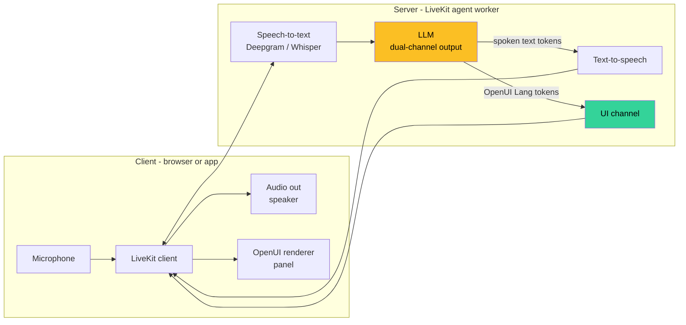

# OpenUI for Voice Agents: Pairing LiveKit with Generative UI for Real-Time Visual Feedback

Voice agents are the AI feature that demos better than it ships.

The demo is magical: the user speaks, the agent thinks, the agent talks back. The shipped product is often frustrating: the agent answers a question that needed a table, you can't scan what it said, you can't act on what it told you. A confirmation dialog the user could just *tap* requires saying "yes, confirm, the right one, the second one, no the one after that" over a noisy connection.

Voice is a great input channel. It's a terrible output channel for anything that isn't a sentence. The fix isn't more eloquent agents. The fix is to stop treating voice as the only output.

This tutorial pairs **LiveKit** (real-time voice infrastructure) with **OpenUI** (generative UI) to build agents that speak *and* render — voice for the conversational beats, live UI for everything that benefits from being visual, interactive, or referable. Both outputs are generated in parallel from the same model call.

---

## What you'll build

A voice agent that can answer "compare these three flights" or "show me my pending support tickets" with a spoken summary *and* a rendered comparison table or task list, in the same response. The user can keep talking; the UI persists; they can also tap, sort, or filter the rendered output.

The reference implementation lives at [thesysdev/voice-agent-generativeui](https://github.com/thesysdev/voice-agent-generativeui) — this article explains the architecture, what the pieces do, and the decisions that matter.

---

## The loop

The standard voice-agent loop is: audio in → speech-to-text → LLM → text-to-speech → audio out. Adding generative UI means the LLM emits two channels of output: speech (for TTS) and structured UI (for OpenUI's renderer). Both stream in parallel.



Three things to notice:

1. **The LLM has two output channels.** One produces the words the agent will speak; the other produces the UI tree the agent will display. Both stream simultaneously from the same generation.
2. **LiveKit moves bytes both ways.** It's not just for audio — it's a generic real-time data plane, so the same connection that ships audio frames can ship structured-UI tokens.
3. **The client splits the streams.** Audio frames go to the speaker, UI tokens go to the OpenUI renderer. The user sees and hears in parallel.

The unlocked behavior: "show me my March expenses by category" produces both *"Here's your March spending — groceries were highest at $640, followed by..."* (spoken) and a pie chart with category breakdowns (rendered). The user can listen to the summary while looking at the visual. They can interrupt with "now sort by store" and the UI updates.

---

## Why the channels are separate

You could put the rendered UI inside the spoken output ("here's a comparison: column one says…"). It would be a bad design. Two reasons:

**Voice is sequential. UI is spatial.** A spoken description of a table is a serialization of a 2D thing into 1D. The user has to reconstruct the table in their head. The whole point of having a screen is to skip that step.

**Voice is throughput-bound. UI is glanceable.** A spoken response takes as long to deliver as it takes to deliver. A rendered table is consumed in whatever order the user wants, at whatever speed they want, with arbitrary back-and-forth scanning.

Keeping the channels separate lets each do what it's good at: voice handles the rapport, the natural-language reasoning, the transitions. UI handles the data density, the affordances, the interactivity.

---

## Step 1 — LiveKit agent setup

Start from LiveKit's agent framework. You're building a Python or Node agent that joins a LiveKit room as a participant.

```python
# agent.py
from livekit.agents import Agent, JobContext, JobProcess
from livekit.plugins import deepgram, openai, silero

async def entrypoint(ctx: JobContext):
    vad = silero.VAD.load()
    stt = deepgram.STT()
    llm = openai.LLM(model="gpt-4o")
    tts = openai.TTS()

    agent = Agent(
        vad=vad,
        stt=stt,
        llm=llm,
        tts=tts,
        chat_ctx=initial_chat_context(),
        before_llm_cb=before_llm,
        after_llm_cb=after_llm,
    )

    agent.start(ctx.room)
```

This is plain LiveKit. The interesting part is the `before_llm_cb` and `after_llm_cb` hooks — that's where we'll inject OpenUI's vocabulary and intercept the dual output.

(For the JS equivalent, LiveKit's Agents SDK exposes the same hook shape under different names. Same pattern.)

---

## Step 2 — Two-channel system prompt

The LLM needs to know it can produce two kinds of output. The system prompt teaches it:

```
You are a voice assistant with a generative UI surface.

For every user message, produce:
1. A spoken response, naturally phrased. This is what the user will hear.
2. (Optional) A structured UI description in OpenUI Lang. This will be rendered on screen.

Emit the spoken response first as plain text.
Then emit a UI fence block: <ui> ... </ui>
The UI block, when present, should contain OpenUI Lang describing components from this vocabulary:
- Card([children], "variant")
- Table([columns])
- MetricCard(label, value)
- LineChart(xs, ys, "label")
- ...
[Auto-generated from the OpenUI vocabulary registration]

Use UI when the answer benefits from being visual, interactive, or referable.
Use speech alone when the answer is conversational or a brief acknowledgement.
Never describe the UI in speech ("here is a table showing..."). The user can see it.
```

That last rule is important. The most common failure mode for dual-channel agents is the speech narrating the UI ("as you can see in the table, the third column shows..."). Tell the model to stop. The voice talks to the user; the UI shows the data; the two should not echo each other.

---

## Step 3 — Splitting the model output

The agent's `after_llm_cb` hook intercepts the streaming LLM output and splits it into two streams:

```python
async def after_llm(agent, llm_stream):
    speech_buf = []
    ui_buf = []
    in_ui_block = False

    async for token in llm_stream:
        if "<ui>" in token:
            in_ui_block = True
            continue
        if "</ui>" in token:
            in_ui_block = False
            continue
        if in_ui_block:
            ui_buf.append(token)
            await ctx.room.local_participant.publish_data(
                payload=token.encode(),
                topic="openui",
            )
        else:
            speech_buf.append(token)
            yield token  # back to TTS
```

The pattern is straightforward: a fence (`<ui>...</ui>`) marks the boundary. Tokens inside the fence go to LiveKit's data channel on a topic called `openui`. Tokens outside go to the TTS pipeline like normal.

LiveKit's `publish_data` ships those tokens to every client in the room. The browser-side handler picks them up by topic and feeds them to OpenUI's streaming renderer.

---

## Step 4 — Client-side rendering

In the browser, the OpenUI renderer subscribes to the `openui` data topic and treats the incoming bytes as a token stream:

```tsx
'use client';

import { Room, RoomEvent } from 'livekit-client';
import { useState, useEffect } from 'react';
import { OpenUIRenderer, useStreamingTokens } from '@openuidev/react';
import { vocabulary } from '@/lib/openui-vocabulary';

export function VoiceAgentPanel({ room }: { room: Room }) {
  const { tokens, push, reset } = useStreamingTokens();

  useEffect(() => {
    const onData = (payload: Uint8Array, _, __, topic?: string) => {
      if (topic !== 'openui') return;
      push(new TextDecoder().decode(payload));
    };
    room.on(RoomEvent.DataReceived, onData);
    return () => { room.off(RoomEvent.DataReceived, onData); };
  }, [room]);

  return (
    <OpenUIRenderer
      tokens={tokens}
      vocabulary={vocabulary}
      onResponseStart={reset}
    />
  );
}
```

`useStreamingTokens` is a small hook that buffers tokens and exposes them to the renderer. `onResponseStart` resets the buffer when a new agent response begins — otherwise the next UI gets appended to the previous one.

Audio is unchanged. LiveKit's standard audio handling plays the TTS output through the user's speaker. The OpenUI panel is just another UI element in the page, sitting next to whatever else the voice interface exposes.

---

## What you'll trip over

Three things that bit me when building this:

**The model is allowed to skip the UI.** Make sure the system prompt explicitly says the UI block is *optional*. Otherwise the model will emit empty fences for conversational responses ("Hello! How can I help you?" should not render an empty card).

**Latency budget between voice and UI.** Voice has a strict latency budget — sub-200ms time-to-first-byte for TTS is what feels natural. UI has more slack (the user is also listening). If you serialize the two — speech first, then UI — the UI lags noticeably. The model should produce them in parallel; the agent loop just routes them to different channels.

**Interruption handling.** When the user speaks over the agent (barge-in), LiveKit cancels the in-flight TTS. Your UI rendering needs to cancel too — otherwise the screen finishes rendering a UI for an answer the agent never finished saying. Hook the room's `AgentInterrupted` event and call the renderer's reset.

---

## What this unlocks

Three concrete agent patterns become viable that weren't before:

**Comparison agents.** "Compare these three flights." The voice says "Flight 2 has the best price-to-stops ratio for your dates." The UI renders a sortable comparison table. The user listens to the recommendation, then taps to drill into Flight 3 anyway because they have a hub preference.

**Data-pull agents.** "Show me my pending tickets." Voice acknowledges and contextualizes ("you have 12 open, 3 are flagged high priority"). UI renders the actual list, sorted by priority, with severity badges. The user can mark one resolved by tapping; the agent responds verbally to the action.

**Process agents.** "Walk me through the refund flow." Voice guides through each step. UI renders the structured form for the current step. The user fills the form via speech ("amount is forty dollars") or directly tapping. The agent advances when the form is complete.

In all three, voice does what voice is good at (rapport, prioritization, transitions) and UI does what UI is good at (density, affordances, persistence).

---

## The takeaway

A voice-only agent is half a product. The other half is everything the user wants to look at, scan, sort, or tap.

LiveKit gives you the real-time data plane. OpenUI gives you the generative UI vocabulary. Connecting them is mostly plumbing — split the model output into two channels, route audio one way and UI tokens the other, render both in parallel. The architectural framing is the harder part: deciding that voice and UI are equal-status outputs, not voice with screenshots.

If you're building a voice agent for anything more complex than weather lookups, you should be planning the UI surface before you ship the voice. The two channels working together is the experience worth shipping.

---

**References:**
- [Thesys voice-agent-generativeui repo](https://github.com/thesysdev/voice-agent-generativeui) — reference implementation
- [LiveKit Agents Framework docs](https://docs.livekit.io/agents/) — Python/Node agent SDK
- [LiveKit Data Messages docs](https://docs.livekit.io/home/client/data/) — how data channels work
- [OpenUI repo](https://github.com/thesysdev/openui) — renderer + vocabulary API
- [OpenUI Creator Program](https://github.com/thesysdev/openui-creator-program) — where this article lives
