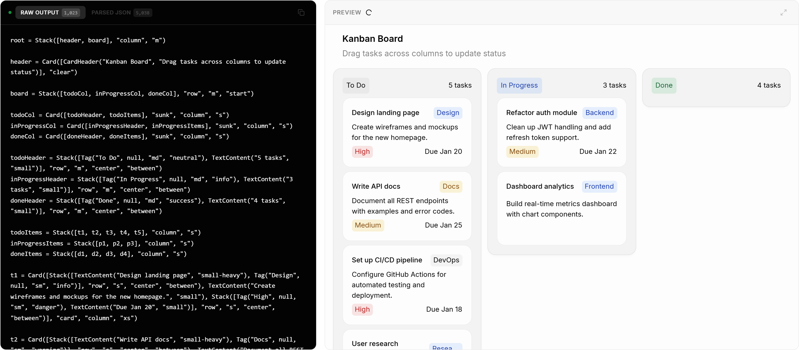
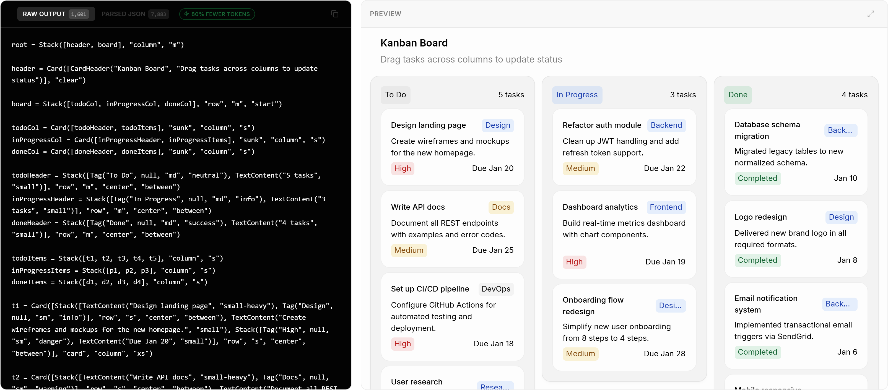
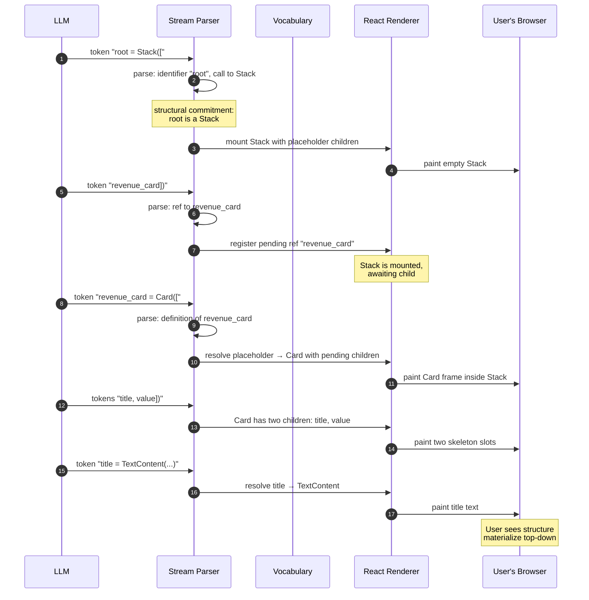

# OpenUI's React Renderer Explained: How Progressive Hydration Works with Streamed Model Output

If you've shipped an AI feature that returns structured output, you've hit this wall: the model takes four seconds to generate a useful response, and the user spends those four seconds staring at a spinner because your renderer is waiting for the closing brace of a JSON object.

That spinner is a choice, not a constraint. The model is emitting useful information from the very first token. The reason your renderer can't show anything until the response is complete is that the wire format you picked makes partial output unusable.

OpenUI solves this with a specific technical combination: a wire format that's parseable while incomplete, a tolerant parser, and a React renderer that mounts components progressively as their definitions arrive. This article walks through how the pieces fit together and what they buy you in practice.

Targeting: developers evaluating OpenUI against rolling their own structured-output renderer, and engineers who want to know what's happening under the hood before building on top.

---

## The problem in two sentences

Language models stream tokens one at a time. UIs that wait for the complete response throw away most of the value of streaming.

That's the whole framing. Everything below is mechanism.

---

## What this looks like in practice

Two captures of the same Kanban generation in the OpenUI playground, ~5 seconds apart:



*Mid-stream, ~5s in. The structure is already mounted — columns, the first cards, the column headers. The rest is still arriving but the user isn't looking at a blank screen.*



*Generation complete. The cards filled in progressively over the streaming window — each card mounted as soon as its definition arrived, rather than waiting for the whole board.*

The user sees the UI materialize. They never see a spinner. That's progressive hydration — and the rest of this article is how it works.

---

## Why JSON breaks for streaming UI

Try to render this partial output:

```json
{
  "type": "Stack",
  "children": [
    { "type": "Card", "props": { "title": "Revenue", "value":
```

That's not a valid JSON document. A JSON parser will throw — the object has unterminated children, an incomplete number, no closing braces. To render anything you'd need:

1. A tolerant parser that knows JSON well enough to fill in the missing braces, or
2. An incremental parser that emits parse events as tokens arrive, or
3. A delimiter-based protocol on top of JSON ("emit a newline after each complete child").

All three are real engineering. Most teams build option 3 badly, ship a renderer that flickers when a child object is partially streamed, and then patch it for the next year. The root cause: JSON wasn't designed for streaming and structural recovery has to be retrofitted at every nesting level.

---

## How OpenUI Lang sidesteps the problem

Same UI, OpenUI Lang:

```
root = Stack([revenue_card])
revenue_card = Card([title, value])
title = TextContent("Revenue", "large-heavy")
value = TextContent("$
```

Now look at the partial-output question differently. Each *line* is a complete declaration. By the time you finish reading line 1, you know the root is a `Stack` containing one child named `revenue_card`. You can mount the Stack immediately, with `revenue_card` as a placeholder. When line 2 arrives, `revenue_card` resolves to a `Card` with two children. Each child gets a placeholder. When line 3 arrives, `title` resolves to a complete `TextContent`. Mount it. The value is still streaming on line 4 — show the partial string in a skeleton state until the closing quote arrives.

The format isn't doing anything magic. It's just that the unit of structural commitment is a single line, not a balanced bracket pair. The parser commits incrementally because the grammar lets it.

---

## The progressive-hydration loop

The pieces of OpenUI's renderer fit together like this:



Three pieces are load-bearing:

1. **Stream Parser.** Reads tokens, emits structural events (`open_component`, `set_prop`, `complete`) as they become unambiguous. Tolerant by design — partial expressions are kept in a pending state instead of throwing.

2. **Vocabulary.** The component registry. When the parser emits `Stack(...)`, the renderer looks up `Stack` in the vocabulary to find the React component and its prop schema.

3. **React Renderer with placeholder mounting.** Mounts components as soon as their *identity* is known (not their full state). A component with a pending prop renders in a skeleton state; the prop snaps to its final value when the parser commits it.

The result is that the user sees the page *structure* before they see all the *content* — exactly the opposite of the JSON path, where you see all-or-nothing.

---

## What this looks like in React terms

Conceptually, the renderer maintains a tree of nodes, each in one of three states:

```typescript
type NodeState =
  | { status: "pending"; reason: "waiting-for-definition" | "waiting-for-props" }
  | { status: "ready"; props: Record<string, unknown>; children: NodeId[] }
  | { status: "complete" };

type Node = {
  id: NodeId;
  componentName: string | null;  // null until parser resolves the identifier
  state: NodeState;
};
```

When the parser commits a structural fact, the renderer updates the corresponding node and React re-renders the affected subtree. Because React's reconciler is happy to swap a `<Skeleton />` for a `<Card />` mid-flight, the visual update is incremental, not a full repaint.

A simplified host component might look like:

```tsx
function RenderNode({ id }: { id: NodeId }) {
  const node = useNode(id);

  if (node.componentName === null) {
    return <Skeleton variant="frame" />;
  }

  const Component = vocabulary[node.componentName];

  if (node.state.status === "pending") {
    return (
      <Component {...node.placeholderProps}>
        {node.placeholderChildren.map((cid) => (
          <Skeleton key={cid} variant="block" />
        ))}
      </Component>
    );
  }

  return (
    <Component {...node.state.props}>
      {node.state.children.map((cid) => (
        <RenderNode key={cid} id={cid} />
      ))}
    </Component>
  );
}
```

(Real implementation is more involved — error boundaries, memoization, ref forwarding — but this is the shape.)

The two key React-specific decisions:

- **Keys are stable identifiers**, not array indices. The parser assigns each node a deterministic ID when it's first observed, so when later props arrive, React knows it's the same node and preserves DOM state (focus, scroll position, animations).
- **State updates are batched per parse-event**, not per token. The parser may emit multiple structural events from a single token (a closing bracket can complete several nested components), so the renderer batches them into one React state update to avoid render thrash.

---

## What happens when the model makes a mistake

LLMs are not perfect parsers of their own format. Three failure modes the renderer has to handle:

**Unresolved reference.** The model emits `root = Stack([revenue_card])` and then never defines `revenue_card`. The renderer keeps the placeholder for a configurable timeout, then either renders a fallback (an error tile) or omits the child entirely, depending on policy.

**Invalid component name.** The model invents a component that isn't in the vocabulary — say, `BarChart3D` when only `BarChart` is registered. The parser tags the node as invalid; the renderer either substitutes the closest match (with a warning), renders an inline error, or skips the node, depending on configuration.

**Malformed props.** The model produces a prop value of the wrong type — a string where a number was expected. The renderer can coerce, drop the prop, or fall back to a default. The component's prop schema (declared when registering it with the vocabulary) drives this behavior.

The principle is *graceful degradation*: a partial bad output should still render a partial good UI. Compare with the JSON path, where a single malformed token usually means a blank screen.

---

## Performance: what the streaming actually costs

Two costs worth knowing:

**Parser overhead per token.** Roughly a few microseconds — negligible compared to network latency. The parser doesn't re-parse from scratch; it maintains state across tokens.

**React reconciliation per parse event.** This is where naive implementations get slow. If the renderer re-runs the full component tree on every token, you get jank. OpenUI's renderer avoids this with three patterns:

1. **Subtree memoization.** Components whose props haven't changed don't re-render. React's `memo` covers most of this; the renderer adds prop-equality checks for nested objects.
2. **Stable refs.** Heavy components (charts, code blocks) cache their internal state behind refs, so they don't recompute layout when a sibling updates.
3. **Pending-prop batching.** When a prop is still streaming (e.g., a long text content building character by character), the renderer updates the DOM directly via a ref instead of going through React's setState path, then commits the final state once the prop completes.

The combined effect: visually smooth streaming even for component trees with hundreds of nodes.

---

## How this composes with React Server Components

Worth a separate note because it's where most evaluations get confused.

OpenUI's renderer is a client-side library. It runs in the browser, takes tokens from a stream, and emits React elements. It does not require React Server Components.

That said, the two patterns *compose* well:

- The server can be where the LLM call originates. Stream the model's tokens to the client over SSE or a streaming HTTP response.
- The client uses OpenUI's renderer to convert those tokens into mounted components.
- RSC is orthogonal — you can use it for the rest of your app's routing and rendering without it affecting how the streaming UI layer works.

If you're already on Next.js with RSC, the integration is straightforward: a server action streams tokens, an `'use client'` component holds OpenUI's renderer. If you're on Remix, Vite, or a non-React framework that supports React via a portal, the renderer still works because it doesn't depend on RSC primitives.

---

## What to do if you're building on top

Three practical notes if you're integrating OpenUI's renderer into an existing app:

**Register your design system, not OpenUI's.** The default vocabulary is fine for prototyping. For production, replace it with your real component library so generated UI looks like the rest of your product. The renderer doesn't care which components are in the vocabulary as long as their prop schemas are declared.

**Define your skeleton states explicitly.** The renderer ships with sensible defaults, but progressive hydration is dramatically better when each component has an opinionated loading state. A line chart's skeleton should look like an empty axis, not a generic gray rectangle.

**Handle the error boundary at the right level.** Wrap each top-level generated subtree in an error boundary that can fall back to a "regenerate" button. A failed parse for a single child shouldn't take down the entire response.

---

## The takeaway

Progressive hydration isn't a single trick — it's the combined effect of three design choices:

1. A wire format whose structural unit is small enough to commit incrementally
2. A parser that emits structural events instead of throwing on partial input
3. A renderer that mounts components in placeholder states and resolves them as parse events arrive

Each piece is doable independently. The win is in how they compose: the user gets a UI that materializes top-down in real time, with no blank-screen-then-pop phase.

You can build this yourself. You'll spend a quarter doing it. The reason to use OpenUI's renderer isn't novelty — it's that the streaming-and-recovery edge cases are the kind of work that takes ten times as long to harden as it does to prototype, and someone has already done the hardening.

---

**References:**
- [OpenUI repo](https://github.com/thesysdev/openui) — full source for the renderer and parser
- [OpenUI playground](https://www.openui.com/playground) — try the streaming behavior live
- [Thesys OpenUI launch post](https://www.thesys.dev/blogs/openui) — design rationale for the wire format
- [Hacker News discussion on the TypeScript parser rewrite](https://news.ycombinator.com/item?id=47461094) — the engineering team on tradeoffs they made
