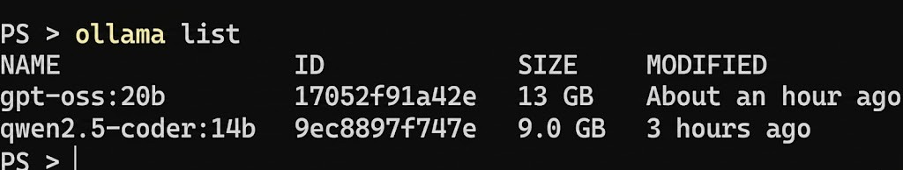
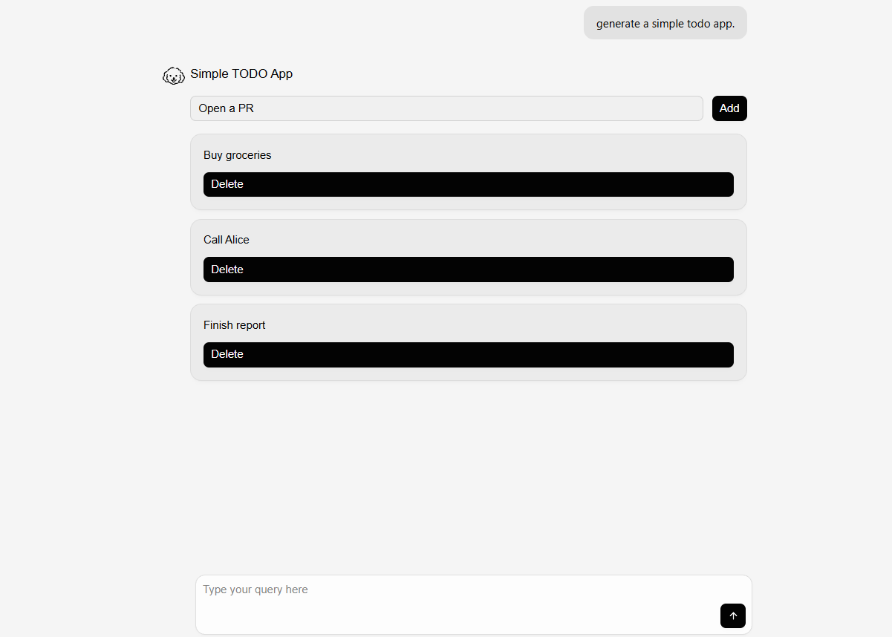

# Setting Up OpenUI with Ollama: Local-First Setup with Cloud Model Fallback

This guide walks you through setting up OpenUI with Ollama on your local machine, step by step, with notes from real setup attempts and common fixes.

This setup keeps the Ollama runtime local while using a cloud-hosted model for more reliable OpenUI generation.

This guide is beginner-friendly. Even if you've never worked with Docker or terminal commands, I'll walk you through every step. Let's get started.

## Companion repo

[OpenUI + Ollama Local Setup Repo](https://github.com/shogun444/openui-ollama-localsetup)

---

## What You'll Need

Before we start, make sure you have these installed:

- **Node.js** - Download from [nodejs.org](https://nodejs.org/en/download)
- **Ollama** - Download from [ollama.com](https://ollama.com/download)
- **Git** - Download from [git-scm.com](https://git-scm.com/downloads)

**System Requirements:**

- 16GB RAM minimum (32GB recommended)
- 30GB free disk space
- Windows 10+, macOS 10.15+, or Linux

---

## Installing Ollama

Ollama is the tool that lets us run AI models locally. Here's how to set it up:

### Step 1: Download Ollama using Windows

1. Go to [ollama.com/download](https://ollama.com/download)
2. Click the download button for your OS (Windows, Mac, or Linux)


3. After the setup is downloaded open it and press Install.


4. When it's done, you should see the Ollama icon in your system tray. It means it has installed successfully.


You can also check by opening your terminal (Command Prompt on Windows, Terminal on Mac) and type:

```bash
ollama
```

You should see a list of available commands. This confirms Ollama installed correctly.

That's it for Ollama setup.

---

## The Honest Truth About Local Models

I tested multiple local Ollama models while working with OpenUI and noticed a clear pattern: smaller local models (especially in the 3B–8B range) often struggled with `openui-lang` generation.

Common issues included:
- partial UI generation,
- broken syntax,
- malformed component trees,
- and inconsistent rendering inside OpenUI.

Larger local models such as `qwen2.5-coder:14b` and `gpt-oss:20b` performed significantly better during testing.

The `qwen2.5-coder:14b` model was usable for local UI generation after increasing the context length, while `gpt-oss:20b` produced more stable and coherent layouts with fewer syntax issues, although inference was noticeably slower on a 16GB system.

In general, larger and more capable models produced more reliable OpenUI output because generative UI requires strong structured-output and long-context capabilities.

Cloud-hosted models still produced the most consistent results overall, although some providers may require subscriptions or gated access depending on the model.

## Models Tested with OpenUI

During testing, different models behaved very differently when generating `openui-lang` output.

### Local Models

| Model | Result | Notes |
|---|---|---|
| `gpt-oss:20b` | Strong results | Produced significantly more stable layouts and fewer syntax issues, but inference was much slower on 16GB hardware. |
| `qwen2.5-coder:14b` | Mostly usable | Good local balance between quality and performance. Occasionally produced malformed or incomplete UI output. |
| `ministral-3:3b` | Unstable | Frequently generated incomplete or broken UI structures. |
| `phi4-mini:3.8b` | Unstable | Struggled with consistent structured generation. |
| `gemma4:e2b` | Partial success | Better reasoning than some smaller models but still inconsistent for larger UI layouts. |

### Cloud Models

Cloud-hosted models generally produced the most reliable OpenUI output during testing.

Models such as:
- `nemotron-3-super:cloud`
- `qwen3-next:80b-cloud`
- `gemma4:31b-cloud`

generated significantly more stable component trees and dashboard layouts compared to smaller local models.

> Note:
> Some cloud-hosted Ollama models may require subscriptions or gated access depending on provider policies and account availability.
>
> During testing, models such as `kimi-k2.5:cloud`, `minimax-m2.7:cloud`, and `glm-5.1:cloud` returned `403 subscription required` errors on some setups.

### 💡 Pro-Tip

You can find more models and details at the official [Ollama Search](https://ollama.com/search).

### Running OpenUI with Ollama Models

### Step 0: Pull an Model from Ollama

Before running OpenUI, pull a local Ollama model.

Example:

```bash
ollama run gpt-oss:20b
```

This downloads the model locally and starts the Ollama runtime.

You can verify installed models using:

```bash
ollama list
```



### Step 1:  Cloning OpenUI

Now let's get the OpenUI code onto your machine.

Open your terminal and run:

```bash
git clone https://github.com/thesysdev/openui
cd openui
code .
```

Or open the folder in whatever editor you prefer.

I prefer VS Code.

### Step 2: Create and Run an OpenUI App

Run the official OpenUI CLI:

```bash
npx @openuidev/cli@latest create --name genui-chat-app
cd genui-chat-app
```

This scaffolds a complete OpenUI chat application with:
- OpenUI Lang support,
- streaming UI generation,
- built-in components,
- and a ready-to-run Next.js setup.

### Create the `.env` File

On Windows PowerShell:

```powershell
New-Item .env -ItemType File
```

Then add your configuration inside `.env`:

```env
OPENAI_BASE_URL=http://localhost:11434/v1
OPENAI_API_KEY=ollama
MODEL=gpt-oss:20b
```

You can replace the `MODEL` value with any Ollama local or cloud-hosted model.

### Step 3: Update the MODEL variable

The model is hardcoded in route.ts, so we need to update it to accept Docker environment variables.

To change it:

Navigate to the file:

`genui-chat-app` -> `src` -> `app` -> `api` -> `chat` -> `route.ts`

<div style="display: flex; gap: 10px;">
  
</div>

Find the MODEL constant (Ctrl + F) and apply this change:


```diff
-const model = "gpt-5.4";
+const model = process.env.MODEL || "gpt-5.4";
```

Explanation:

- `process.env.MODEL`: This allows us to inject the model name via Env.
- `|| "gpt-5.4"`: This is a fallback in case no variable is provided.

### Step 4: Start the Development Server

```bash
npm run dev
```

Open:

```txt
http://localhost:3000
```

If everything is configured correctly, you should see the OpenUI chat interface running locally.

What this setup does:

- `OPENAI_BASE_URL` — Connects OpenUI to your local Ollama instance
- `MODEL` — Selects the Ollama model used for UI generation
- `npm run dev` — Starts the local Next.js development server

### Step 6: Test It

Open your browser to

```bash
http://localhost:3000
```

You should see the OpenUI chat interface


Click any prompt shown on the screen.
If you get a response in the frontend, the setup is complete.


Try this prompt:
Create a contact form with name, email, and message fields
If a form appears, you're all set!

My Results:




## Common Issues and Fixes

 ### `touch .env`  Not Working on Windows

**Problem:**

PowerShell does not recognize the `touch` command.

**Fix:**

Create the `.env` file manually or run:

```powershell
New-Item .env -ItemType File
```

---

### `404 model not found`

**Problem:**

The configured model does not exist in your Ollama installation.

**Fix:**

Check installed models:

```bash
ollama list
```

Then update the `MODEL` value inside `.env` with a valid installed model.

Example:

```env
MODEL=gpt-oss:20b 
```

---

### `403 subscription required`

**Problem:**

Some Ollama cloud-hosted models require subscriptions or gated access.

**Fix:**

Try another available cloud model or switch to a local model.

Examples tested during setup:

- `qwen2.5-coder:14b`
- `gpt-oss:20b`
- `nemotron-3-super:cloud`
- `gemma4:31b-cloud`
---

### `memory layout cannot be allocated`

**Problem:**

The selected model requires more RAM than your system can provide.

This commonly happens with larger models such as:
- `gemma4:26b`
- `glm-4.7-flash`

on lower-memory systems.

**Fix:**

- Use a smaller model
- Reduce context length
- Close other memory-heavy applications
- Use cloud-hosted models instead

---

### Blank Screen or Broken UI

**Problem:**

The model generated malformed `openui-lang` output.

This is more common with smaller local models.

**Fix:**

- Increase the Ollama context length
- Use a stronger model
- Retry the generation
- Prefer larger models for complex dashboards and layouts

---

### React Rendering Errors

Example:

```txt
Objects are not valid as a React child
```

**Problem:**

The model generated an invalid component tree or malformed structured output.

**Fix:**

- Retry generation
- Use a stronger model
- Increase context length
- Avoid extremely small local models for complex UI generation