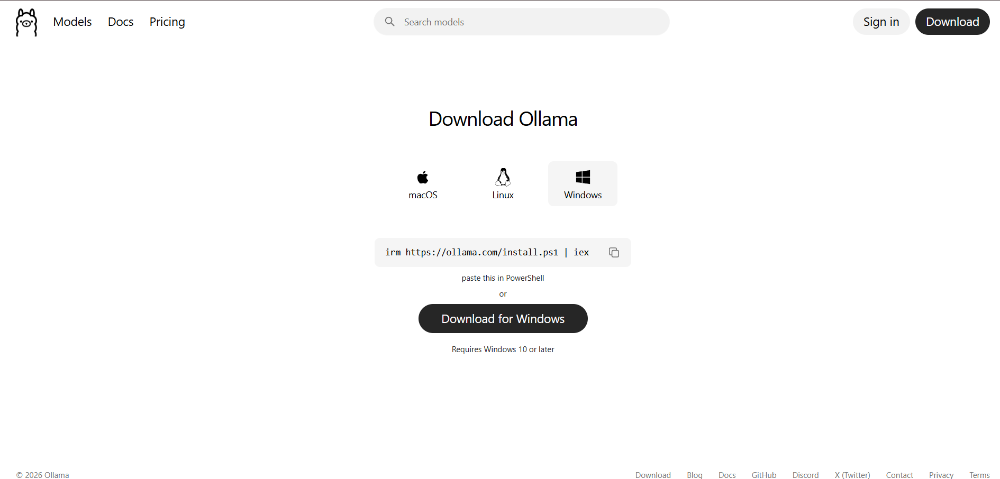
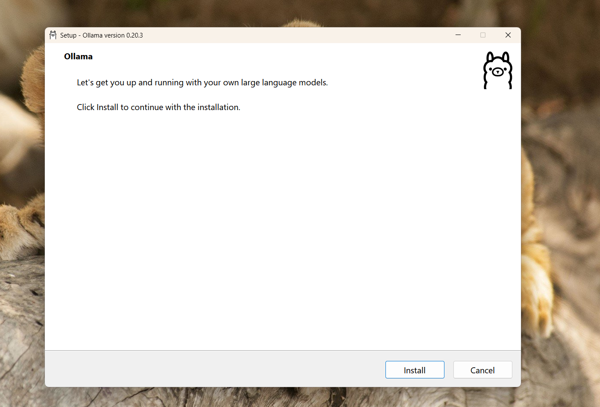
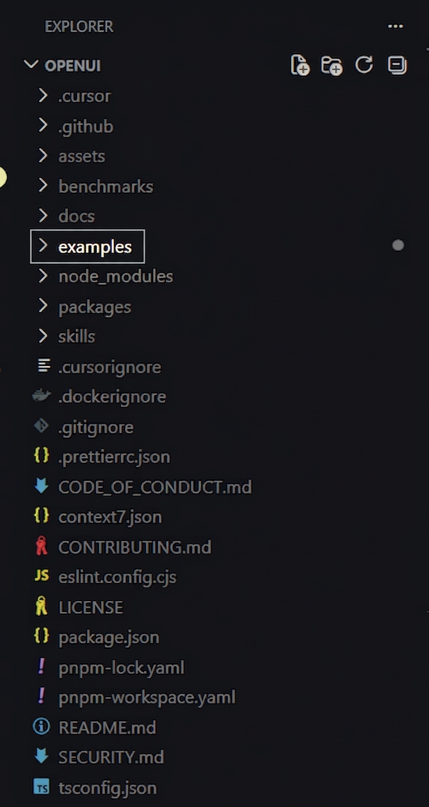
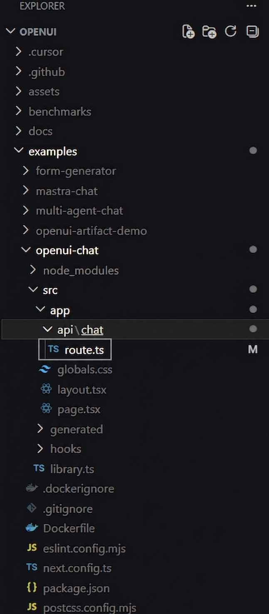
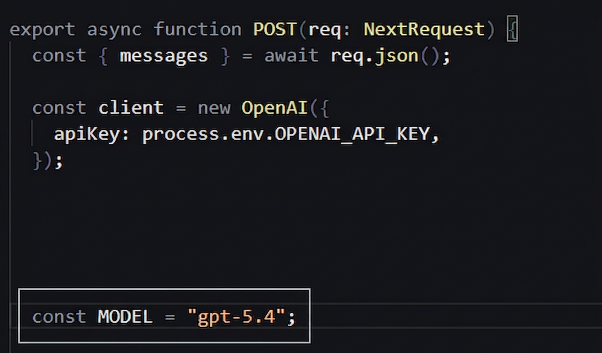
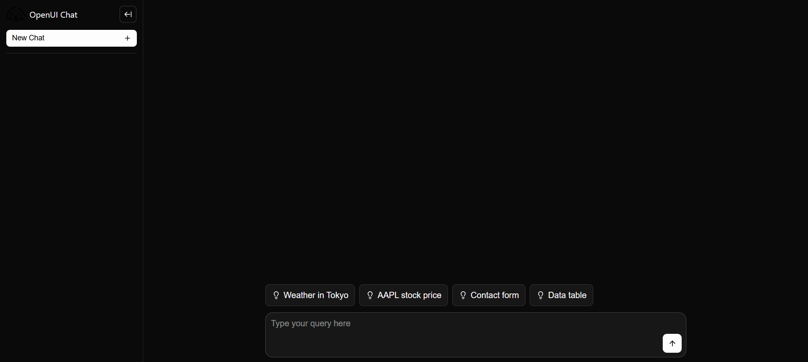
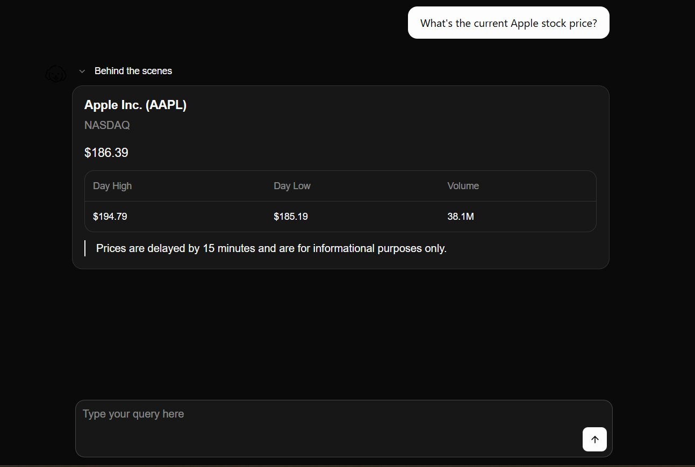
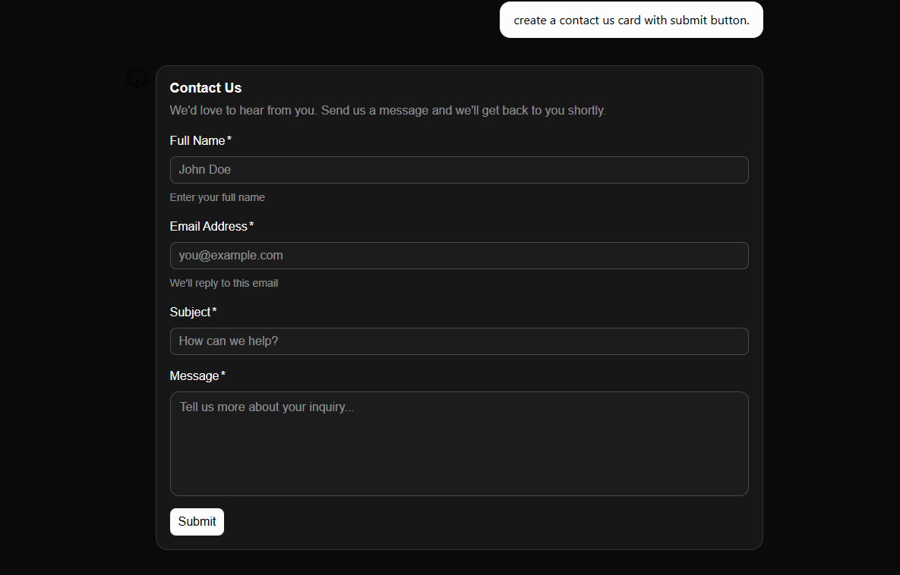
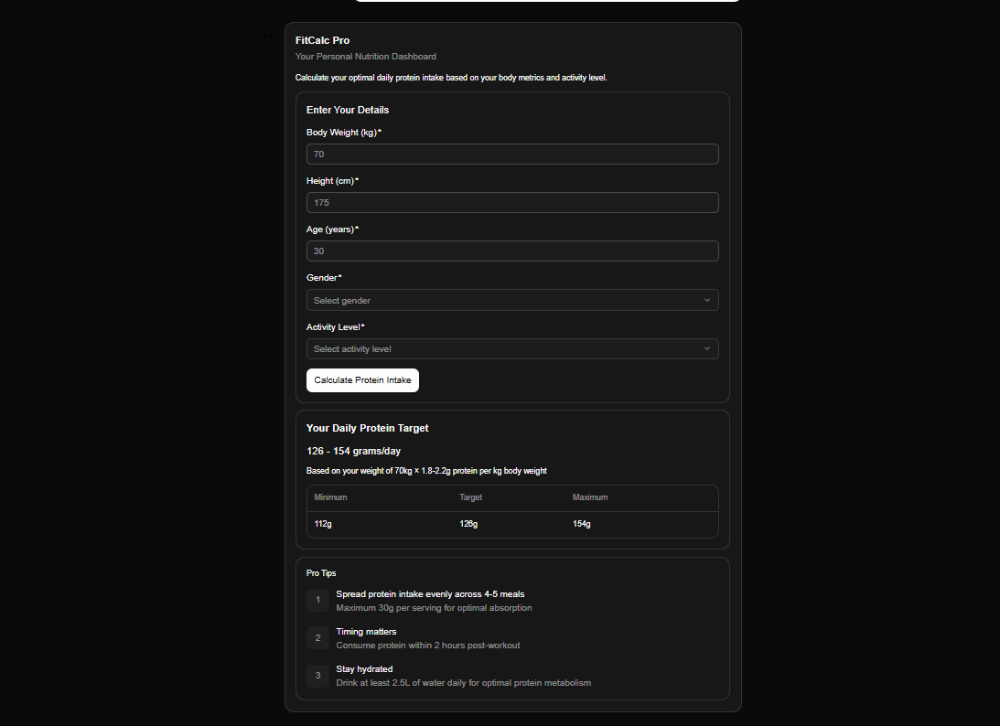

# Setting Up OpenUI with Ollama: Local-First Setup with Cloud Model Fallback

This guide walks you through setting up OpenUI with Ollama on your local machine, step by step, with notes from real setup attempts and common fixes.

This setup keeps the Ollama runtime local while using a cloud-hosted model for more reliable OpenUI generation.

This guide is beginner-friendly. Even if you've never worked with Docker or terminal commands, I'll walk you through every step. Let's get started.

## Companion repo

[OpenUI + Ollama Local Setup Repo](https://github.com/shogun444/openui-ollama-localsetup)

---

## What You'll Need

Before we start, make sure you have these installed:

- **Node.js** - Download from [nodejs.org](https://nodejs.org/en/download)
- **Docker Desktop** - Download from [docker.com](https://www.docker.com/products/docker-desktop/)
- **Git** - Download from [git-scm.com](https://git-scm.com/downloads)

**System Requirements:**

- 8GB RAM minimum (16GB recommended)
- 10GB free disk space
- Windows 10+, macOS 10.15+, or Linux

---

## Installing Ollama

Ollama is the tool that lets us run AI models locally. Here's how to set it up:

### Step 1: Download Ollama using Windows

1. Go to [ollama.com/download](https://ollama.com/download)
2. Click the download button for your OS (Windows, Mac, or Linux)



3. After the setup is downloaded open it and press Install.



4. When it's done, you should see the Ollama icon in your system tray. It means it has installed successfully.


You can also check by opening your terminal (Command Prompt on Windows, Terminal on Mac) and type:

```bash
ollama
```

You should see a list of available commands. This confirms Ollama installed correctly.

That's it for Ollama setup.

---

## The Honest Truth About Local Models

I tested a lot of small local models before writing this guide. I want to be straight with you because I wasted days on this.

Small local models don't work well for OpenUI. Models like ministral-3:3b, phi4-mini:3.8b, qwen2.5:3b, or gemma4:e2b variants will:

1. Generate partial UI (just a title, missing the form fields)
2. Show weird values like "0" instead of actual data
3. Break syntax mid-generation
4. Fail even with custom Modelfiles, Temperature 0, strict prompts, and extended context windows.

What actually works: Cloud-hosted models with bigger context windows. The minimax-m2.7:cloud model works great with OpenUI. You access it through Ollama, and the Ollama runtime itself stays local while the model runs on cloud hardware for reliability.

## Recommended Models for OpenUI

These models are accessible through [Ollama](https://ollama.com/search) and provide the best stability for openui-lang generation.

### Performance Tier List

| Model Name             | Category      | Best For                                        | Recommendation     |
| ---------------------- | ------------- | ----------------------------------------------- | ------------------ |
| minimax-m2.7:cloud     | All-Rounder   | High-speed, stable UI generation                | ⭐ **Recommended** |
| qwen3-coder-next:cloud | Developer Pro | Complex logic and deep coding tasks             |                    |
| qwen3-next:80b-cloud   | Heavyweight   | Maximum reasoning for complex dashboard layouts |                    |
| gemma4:31b-cloud       | Balanced      | Great middle-ground for creative UI prompts     |                    |
| kimi-k2.5:cloud        | Context King  | Excellent for long-form UI descriptions         |                    |
| glm-5.1:cloud          | Multi-purpose | Solid alternative for standard form generation  |                    |
| nemotron-3-super:cloud | Performance   | Optimized for fast responses and clean syntax   |                    |

### 💡 Pro-Tip

You can find more models and details at the official [Ollama Search](https://ollama.com/search).

### How to Switch Models

To swap your engine, update the `MODEL` variable. Use this command to automate the deployment with the recommended **minimax-m2.7:cloud** model:

```bash
docker run --rm -p 3000:3000 -e OPENAI_BASE_URL=http://host.docker.internal:11434/v1 -e OPENAI_API_KEY=ollama -e MODEL=minimax-m2.7:cloud openui-chat
```

### Cloning OpenUI

Now let's get the OpenUI code onto your machine.

### Step 2: Clone the Repository

Open your terminal and run:

```bash
git clone https://github.com/thesysdev/openui
cd openui
code .
```

Or open the folder in whatever editor you prefer.

I prefer VS Code.

### Building and Running OpenUI

### Step 3: Update the MODEL variable

The model is hardcoded in route.ts, so we need to update it to accept Docker environment variables.

To change it:

Navigate to the file:

`examples` -> `openui-chat` -> `src` -> `app` -> `api` -> `chat` -> `route.ts`

<div style="display: flex; gap: 10px;">
  
  
</div>

Find the MODEL constant (Ctrl + F) and apply this change:



```diff
-const MODEL = "gpt-5.4";
+const MODEL = process.env.MODEL || "gpt-5.4";
```

Explanation:

- `process.env.MODEL`: This allows us to inject the model name via Docker.
- `|| "gpt-5.4"`: This is a fallback in case no variable is provided.

### Step 4: Start Docker Engine locally, then build the Docker image

If you're in the root folder:

```bash
docker build -f examples/openui-chat/Dockerfile -t openui-chat .
```

Wait for the build to complete. It might take a few minutes.

### Step 5: Run OpenUI with Ollama

Now for the magic command. Make sure Ollama is running (check your system tray), then:

```bash
docker run --rm -p 3000:3000 -e OPENAI_BASE_URL=http://host.docker.internal:11434/v1  -e OPENAI_API_KEY=ollama -e MODEL=minimax-m2.7:cloud openui-chat
```

What this does:

- `-p 3000:3000` — Opens port 3000 on your machine
- `OPENAI_BASE_URL` — Points to your local Ollama instance
- `MODEL` — I used the minimax cloud model (you can swap this for others)

### Step 6: Test It

Open your browser to

```bash
http://localhost:3000
```

You should see the OpenUI chat interface


Click any prompt shown on the screen.
If you get a response in the frontend, the setup is complete.



Try this prompt:
Create a contact form with name, email, and message fields
If a form appears, you're all set!

My Results:




## Common Issues and Fixes

### Connection Refused Error

**Problem:**  
Ollama isn't accessible from Docker.

**Fix:**

- Make sure Ollama is running
- Check your system tray for the Ollama icon
- If it's not running, start it manually:

```bash
ollama serve
```

---

### Model Not Found

**Problem:**  
The model name is incorrect or not installed.

**Fix:**

- Double-check the model name
- Ensure the model is available in your Ollama setup
- Some models may require API keys or authentication

---

### Blank Screen or Partial UI

**Problem:**  
The model generated broken `openui-lang` code.

**Fix:**

- This usually happens with smaller local models
- Switch to a more reliable model like `minimax-m2.7:cloud`
- Use cloud models for better and faster outputs

---

### Docker Build Fails

**Problem:**  
Docker image fails to build due to dependency or configuration issues.

**Fix:**

- Make sure Docker Desktop is running
- Check the terminal logs for the exact error
- Rebuild the image without cache

- Make sure you're running the command from the project root directory:

```bash
docker rmi openui-chat
```

Then rebuild:

```bash
docker build --no-cache -f examples/openui-chat/Dockerfile -t openui-chat .
```

or

- Retry running the container

---

## What You Can Build

With this setup, you can generate:

- Contact forms
- Data tables
- Charts and graphs
- Dashboard layouts
- Interactive cards

Just describe what you want in plain English and OpenUI will generate the UI.

---

## The Catch

This setup works well for UI generation, but **tool calling is limited**.

Features like:

- Weather
- Stock data
- Calculators

require external APIs (e.g. OpenAI) to function properly.

For pure UI generation:  
No expensive API bills or token costs; the Ollama runtime stays local while the model is cloud-hosted for stability.

---

## Wrapping Up

You now have a local-first generative UI setup with a cloud model fallback for reliability.

- No expensive API bills or token costs
- No API key management

Try different prompts, inspect the generated UI, and iterate.

If something breaks, it's usually the model—not OpenUI.

**Happy building.**
