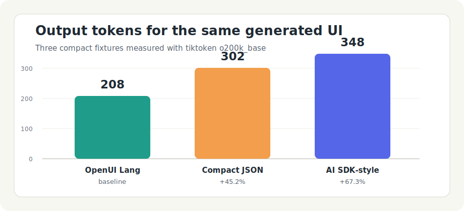

# The Token Cost of Beautiful AI: OpenUI Lang vs AI SDK vs JSON

Beautiful AI output is not only a rendering problem. It is also an economics
problem.

If a model needs 900 tokens to describe a dashboard, 600 tokens to call a tool
that renders the same dashboard, or 350 tokens to emit a compact UI language,
that difference repeats on every request. At prototype scale, it is easy to miss.
At product scale, it becomes latency, context-window pressure, and real spend.

This article compares three ways to ask an LLM for the same interface:

- OpenUI Lang: a UI-native component language.
- JSON UI payloads: generic component objects with `type`, `props`, and
  nested children.
- AI SDK-style tool-call envelopes: a model response that calls a render tool
  with structured arguments.

The goal is not to claim that one representation wins every time. The goal is
to show what you are paying for when a model has to describe UI.

## Methodology

I built three small fixtures that represent common generative UI responses:

1. A KPI card with one metric, a bar chart, and an action.
2. A pricing comparison table with three rows and one action.
3. A lead intake form with two fields and an informational callout.

Each fixture carries the same user-visible information in all three formats.
The payloads were compacted before counting. For JSON and AI SDK-style examples,
I used minified JSON rather than pretty-printed JSON, because pretty JSON would
inflate the baseline unfairly.

Token counts were measured with `tiktoken` `o200k_base`. That is a tokenizer
choice, not a universal law. Different models tokenize slightly differently, so
the exact numbers will move. The relative pattern is what matters.

The AI SDK-style payload is not measuring Vercel's runtime. It measures the
structured tool-call shape a model commonly has to emit when a chat framework
uses tool calls to hand UI data to application code. The AI SDK docs expose tool
calls as named tools with structured inputs, which is the envelope modeled here.

OpenUI source references for the UI-native path, pinned to the upstream
`thesysdev/openui` repository at commit `af14af1adedc4de1e76766655baabb4ca5f283d4`:

- [`packages/lang-core/src/parser/parser.ts`](https://github.com/thesysdev/openui/blob/af14af1adedc4de1e76766655baabb4ca5f283d4/packages/lang-core/src/parser/parser.ts)
- [`packages/lang-core/src/parser/statements.ts`](https://github.com/thesysdev/openui/blob/af14af1adedc4de1e76766655baabb4ca5f283d4/packages/lang-core/src/parser/statements.ts)
- [`packages/react-lang/src/Renderer.tsx`](https://github.com/thesysdev/openui/blob/af14af1adedc4de1e76766655baabb4ca5f283d4/packages/react-lang/src/Renderer.tsx)
- [`packages/react-lang/src/hooks/useOpenUIState.ts`](https://github.com/thesysdev/openui/blob/af14af1adedc4de1e76766655baabb4ca5f283d4/packages/react-lang/src/hooks/useOpenUIState.ts)

## Benchmark Results

| Scenario | OpenUI Lang | JSON UI payload | AI SDK-style tool call |
| --- | ---: | ---: | ---: |
| KPI card | 69 | 102 | 115 |
| Comparison table | 68 | 105 | 123 |
| Intake form | 71 | 95 | 110 |
| Total | 208 | 302 | 348 |

Compared with OpenUI Lang, the compact JSON payload used 45.2 percent more
tokens across the three fixtures. The AI SDK-style tool-call envelope used 67.3
percent more.



The first surprise is that compact JSON is not automatically terrible. For very
small payloads, minified JSON can be close to a UI language. In the KPI card,
JSON was 102 tokens versus 69 for OpenUI Lang. That is still material, but it is
not a cartoonishly bad result.

The second surprise is where the overhead appears. It is not just braces. It is
repeated structural vocabulary:

```json
{"type":"TextInput","props":{"name":"email","label":"Work email"}}
```

Every nested element repeats the same scaffolding. `type`, `props`, `children`,
`toolCallId`, `toolName`, `args`, and field names are all useful to software,
but they are tokens the model has to produce before the user sees anything.

The OpenUI version carries more of the shape in syntax:

```txt
TextInput(name:"email",label:"Work email",required:true)
```

That is not magic. It is just less envelope.

## What The Numbers Mean In Dollars

Do not attach this analysis to one model price. Model prices change, cached
tokens complicate the math, and input prompts matter too. A better way is to use
a simple formula:

```txt
monthly_ui_cost = requests * output_tokens_per_ui * output_price_per_token
```

At 1 million generated UI responses, these three fixtures would produce:

| Format | Output tokens | Cost at $10 per million output tokens |
| --- | ---: | ---: |
| OpenUI Lang | 208 million | $2,080 |
| JSON UI payload | 302 million | $3,020 |
| AI SDK-style tool call | 348 million | $3,480 |

That example uses a round hypothetical price of $10 per million output tokens.
Swap in your actual model price and traffic. The spread remains the important
part: the more often you generate UI, the more the representation matters.

If an application produces one or two generated interfaces per user session,
the difference may be noise. If an operations dashboard, support console, or
shopping assistant generates structured UI on every turn, the difference is
budget.

## Why JSON Pays A Structural Tax

JSON is excellent for APIs because it is explicit, well-supported, and easy to
validate. Those same properties make it expensive as model output for UI.

A component tree in generic JSON usually needs at least:

- a component discriminator,
- a props object,
- a children field or equivalent,
- nested objects for every child component,
- and repeated field names for tabular data if rows are objects.

For a table, the row representation matters a lot. This is compact:

```txt
rows:[["Starter","$29","solo teams","5 projects"]]
```

This is more self-describing, but costs more:

```json
{"Plan":"Starter","Price":"$29","Best for":"solo teams","Limit":"5 projects"}
```

JSON's extra words can be worth it when the receiver is a generic API or when
the payload must be validated outside a UI runtime. But if the receiver is a UI
renderer with a known component vocabulary, the model does not need to restate
the entire object protocol on every node.

## Why Tool Calls Add Another Envelope

Tool calls solve a different problem. They let the model choose a capability and
pass structured inputs to code that the application owns. That is useful when
the model should not emit the whole interface directly.

The cost is that a UI payload becomes an argument inside a larger message:

```json
{
  "type": "tool-call",
  "toolCallId": "call_form_1",
  "toolName": "renderLeadForm",
  "args": {
    "name": "lead",
    "submitLabel": "Book demo"
  }
}
```

The tool-call wrapper is not waste. It gives the host application routing,
approval, logging, and execution boundaries. If those controls are the product
requirement, paying the token overhead can be the right call.

For pure UI generation, though, the tool-call wrapper can become an expensive
middle layer. The model is no longer just describing the interface. It is also
describing how the chat framework should route the description.

## Streaming Changes The Tradeoff

Token count is only one axis. The other is when the interface becomes useful.

OpenUI's current React implementation treats the model response as a stream of
OpenUI Lang, not as an opaque JSON blob. The language-core parser can work with
completed statements and a pending tail; the React renderer can keep trying to
render the best available tree as text arrives.

That matters because a UI response is not valuable only when it is complete. A
partially rendered card, skeleton, or first table rows can help the user before
the model has finished every child component.

JSON can be streamed too, but the application needs a tolerant partial parser or
must wait until enough braces close. Tool calls often push the useful work even
later: the model emits the call, the framework parses the call, the host handles
the call, and then the UI appears.

If the interface is small, this may not matter. If the assistant is building a
dashboard, comparison flow, or investigation workspace, time to first meaningful
render becomes part of the cost model.

## What OpenUI Does Not Make Free

OpenUI Lang reduces output overhead, but it does not remove every cost.

The application still needs to provide the model with component vocabulary. That
component library description lives in the prompt or context somewhere. A narrow
library with `Card`, `Metric`, `DataTable`, `Form`, and `Button` is cheap. A
large design system with dozens of components, props, variants, examples, and
rules can dominate the savings if it is sent on every request.

The renderer also needs a real component library. OpenUI keeps a strong
boundary: the model requests components by name, and the application decides
what those names mean. That is safer than executing arbitrary JSX, but it is
still engineering work.

Finally, compact output can be harder to inspect manually. A short UI language
is efficient, but debugging sometimes benefits from explicit structure. Teams
should invest in devtools, traces, and render previews rather than expecting raw
model output to be the only debugging surface.

## When Each Approach Wins

Use JSON when the output is primarily data, not UI. If another service consumes
the payload, if schema validation is the main concern, or if the UI is rendered
by conventional application code later, JSON is boring in the best way.

Use an AI SDK-style tool call when the model is choosing among capabilities. If
the application needs approval steps, server-side execution, tool results, or
agent orchestration, the envelope is buying real control.

Use OpenUI Lang when the model is directly generating a visual interface from a
known component vocabulary. That is where the compact syntax, streaming parser,
and renderer boundary line up with the task.

The practical decision is simple:

- If the user should see it, a UI-native representation is worth considering.
- If another system should process it, JSON is usually the safer default.
- If code should execute before anything is shown, use a tool call.

## The Real Cost

The real cost of generative UI is not only tokens. It is:

- output tokens,
- component-library prompt tokens,
- latency before the first useful render,
- parser and renderer complexity,
- debugging workflow,
- and the cost of mistakes when the model emits invalid structure.

OpenUI's strongest advantage is that it compresses the part of the problem that
repeats most often: the model's UI response. It does that without asking the
model to emit arbitrary React code and without forcing every interface through a
generic JSON object tree.

That does not make OpenUI the universal answer. It makes it a strong answer when
the product needs the model to speak in interface, not just in text or data.
