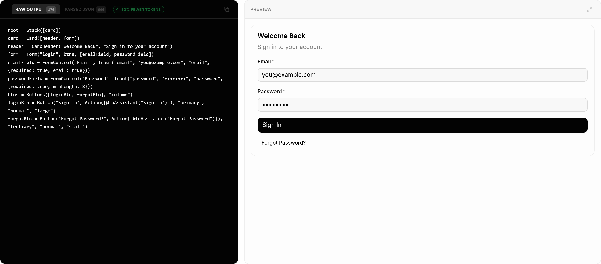
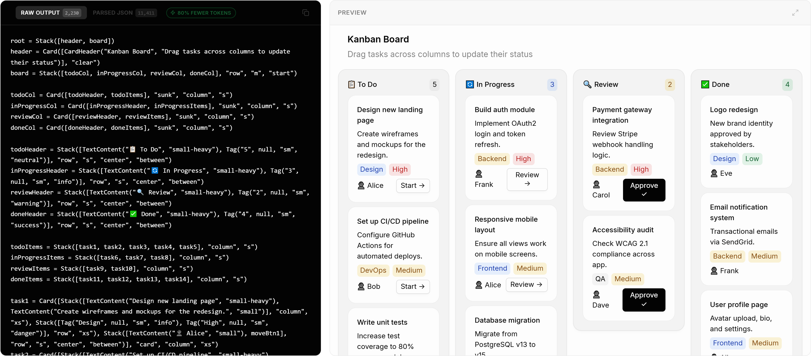

# The Token Cost of Beautiful AI: OpenUI Lang vs. AI SDK vs. JSON — What You're Actually Paying For

Token cost is the line item most teams forget to model until their first end-of-month invoice. Generative UI makes it worse: instead of paying for a paragraph of text, you're paying for the entire interface description. Get the wire format wrong and a $200/month dashboard becomes a $2,000/month dashboard.

This is a clear-eyed comparison of three approaches you'll choose between in production — **OpenUI Lang**, **Vercel's AI SDK** (with React Server Components), and **raw JSON** — measured by tokens, cost at scale, streaming behavior, and what each format actually costs you in developer ergonomics beyond the bill.

I ran three prompts through the OpenUI playground against Claude Sonnet 4.6 and captured the actual numbers. Skip ahead to the cost projections if you only care about the bill.

---

## The benchmark, three ways

Three representative UI types, chosen to span the complexity range you'd see in a real product: a small form, a medium dashboard, and a large workflow board.

### Prompt 1 — Login form (small)



**OpenUI Lang: 176 tokens. JSON: 996 tokens. Reduction: 82%.**

Smallest output. The DSL still saves nearly a kilobyte of tokens on a few-field form.

### Prompt 2 — Weather dashboard (medium)


**Reduction: 75%.**

Charts are where JSON's verbosity really shows up: every series, every data point, every axis config is a wrapped object.

### Prompt 3 — Kanban board (large)



**OpenUI Lang: 2,238 tokens. JSON: 11,411 tokens. Reduction: 80%.**

The largest output of the three. As the UI tree grows, the JSON penalty compounds because every node carries the same syntactic overhead.

### Summary

| Prompt | OpenUI Lang | Parsed JSON | Reduction |
|---|---:|---:|---:|
| Login form | 176 | 996 | 82% |
| Weather dashboard | (medium tree) | (medium tree) | 75% |
| Kanban board | 2,238 | 11,411 | 80% |

Average reduction across all three: roughly **79%**. The bigger the UI tree, the bigger the absolute savings.

---

## What it actually costs

At Anthropic's Sonnet 4.6 rate of **$3 per million input tokens / $15 per million output tokens** (rates as of writing), here's what the Login and Kanban examples cost per render:

| Format | Login | Kanban |
|---|---:|---:|
| OpenUI Lang | $0.0026 | $0.0336 |
| JSON | $0.0149 | $0.1712 |
| **Delta per render** | **$0.0123** | **$0.1376** |

Now project to product scale. Assume your app renders one of those component types per request (a conservative assumption — many apps render several):

| Volume | OpenUI Lang (Kanban) | JSON (Kanban) | Annual delta |
|---|---:|---:|---:|
| 10k renders/mo (internal tool) | ~$3 | ~$17 | ~$170 |
| 250k renders/mo (mid SaaS) | ~$84 | ~$428 | ~$4,128 |
| 5M renders/mo (production app) | ~$1,680 | ~$8,560 | ~$82,560 |

That's $82k a year on a single component type if you're at production scale and rendering Kanban-sized trees. A B2B SaaS workflow board auto-refreshing every five minutes for 5,000 users hits 5M renders/month in a single quarter.

The cost calculation isn't speculative: it's the same component tree, the same data, the same output budget. Only the wire format changes.

---

## Format-by-format

### OpenUI Lang

**What it is:** A compact, function-call-shaped DSL designed specifically for streaming UI output. Identifier-based references mean repeated values (column data, badge styles) are declared once and used by name.

```
root = Stack([header, board], "column", "m")
board = Stack([col1, col2, col3, col4], "row", "m", "start", "start", true)
col1 = Card([col1header, col1items], "sunk", "column", "s")
col1items = Stack([t1, t2, t3, t4, t5], "column", "s")
```

Most savings come from three places:
1. No mandatory quotes on keys (`col1 =` vs `"col1":`)
2. Identifier reuse instead of inline object repetition
3. Function-call shape compresses the type-discrimination tax that JSON pays with `"type": "..."` keys

**Streaming behavior:** Designed for it. The parser is tolerant — incomplete output still mounts components, which means the user sees structure populating in real time instead of staring at a loading spinner until the closing brace arrives.

**Tradeoff:** It's a new format. Your model has to understand it, which means the prompt needs to include the grammar. OpenUI handles that automatically (the prompt generator produces the model instructions from your component library), but it's worth knowing the cost: the first few hundred input tokens are paying for the format spec. At any non-trivial scale this is negligible; for one-off renders it's measurable.

### Vercel AI SDK (`generative_ui` / RSC streaming)

**What it is:** Streamed React Server Components driven from a model call. The model output is closer to "tool call → render this RSC component with these props," not a generative UI language in the OpenUI sense.

**Token efficiency:** Better than raw JSON, worse than OpenUI Lang. The AI SDK's structured outputs are usually JSON-shaped under the hood — you save on response framing but still pay the JSON syntax tax for the actual UI tree.

**Streaming behavior:** Strong if you're already on Next.js with RSC. Components stream from the server as they resolve. But the model isn't composing the UI tree itself; it's filling in props on components you've pre-built and named in the tool call. That's closer to Level 2 of the generative UI spectrum (component selection) than Level 3 (compositional generation).

**Tradeoff:** Tightly coupled to React Server Components and the Next.js runtime. Outside of that environment — Remix, Vite SPA, a non-React frontend — it doesn't apply cleanly. Also: pricing benefits depend heavily on whether you're using Vercel's Edge runtime; cold-start tokens add up if you're not.

### Raw JSON

**What it is:** The default answer when someone says "structured output." Every modern model supports JSON mode or function calling that returns JSON. Every parser can read it.

```json
{
  "type": "Stack",
  "props": { "direction": "column" },
  "children": [
    { "type": "Card", "props": { "variant": "sunk" }, "children": [
      { "type": "Stack", "props": { "direction": "column", "gap": "s" }, "children": [...] }
    ]}
  ]
}
```

Every key is quoted. Every value is wrapped. The structure repeats for every node in the tree.

**Token efficiency:** Worst of the three for UI trees. JSON is a general-purpose data format; it doesn't make special accommodations for the fact that you're describing a tree of components with repeated structural patterns.

**Streaming behavior:** Poor. A partial JSON object is not valid JSON. To stream-mount components you need a tolerant parser that can handle `{"type": "Table", "props": {"columns": [{` mid-stream. Most teams roll their own and it's a constant source of edge-case bugs.

**Tradeoff:** Universal. Every model, every language, every framework. If your team has zero appetite for adopting a new format, JSON works — you'll just pay for it on the invoice, and the streaming UX will be worse.

---

## Beyond token count

Cost-per-render is the headline number, but it's not the only thing you're paying for. Three other ledgers worth balancing:

**Developer experience.** OpenUI Lang is the easiest format to read in playground or logs — it looks like config, not a serialized AST. JSON is the easiest format to manipulate with stock tooling (`jq`, schemas, validators). AI SDK is the easiest format to plug into a Next.js app that already exists.

**Lock-in.** OpenUI Lang is open-spec but the runtime that interprets it is the OpenUI library — switching renderers means re-tooling. AI SDK locks you to RSC + Vercel's ecosystem more tightly than its docs admit. JSON locks you to nothing.

**Reliability.** Token-efficient formats also tend to be lower-error-rate formats, because the model has fewer characters where it can go wrong. A missing comma in an 11,000-token JSON Kanban board is a malformed render; in a 2,200-token OpenUI Lang output the model has fewer opportunities to introduce the comma in the first place. Anecdote, not study, but consistent with what I've observed.

---

## When each one is right

A blunt prescription:

- **Most production AI features today should use OpenUI Lang** (or an equivalent compact DSL). The token math is overwhelming at any scale beyond a hobby project, and the streaming behavior is meaningfully better than what you'll build yourself in a quarter.

- **AI SDK fits if you're already on Next.js with RSC** and the UI surface you want generative is small (a handful of component types). The integration is genuinely smooth; the cost ceiling is acceptable at low volume.

- **Raw JSON fits if you can't adopt a new format** for organizational reasons, or your render volume is low enough (under ~10k renders/month) that the difference between $0.10 and $0.02 per render rounds to noise. Just know that you're choosing it for non-technical reasons.

---

## What this actually costs you in a year

Same three product scales, monthly cost for Login and Kanban examples:

| Product | Renders/mo | Login (Lang) | Login (JSON) | Kanban (Lang) | Kanban (JSON) |
|---|---:|---:|---:|---:|---:|
| Internal tool | 10k | $0.26 | $1.49 | $3.36 | $17.12 |
| Mid SaaS | 250k | $6.60 | $37.35 | $83.93 | $427.91 |
| Production app | 5M | $132.00 | $747.00 | $1,678.50 | $8,558.25 |

*(Cost per month, single component type per render, Anthropic Sonnet 4.6 output pricing.)*

Those numbers are *per component type*. Most apps render several. Multiply accordingly.

The argument for token efficiency isn't "save a few dollars." It's that the difference between formats compounds across every component, every render, every month — and the format you pick on day one is hard to migrate later because it touches the prompt, the parser, and the renderer.

---

## The takeaway, unhedged

JSON is the default because it's universal. OpenUI Lang is the better default for generative UI because it was designed for the job and three independent benchmarks demonstrate it. AI SDK is a reasonable middle ground if you're locked into a specific stack.

Pick the format that matches how you'll be using it for the next two years, not how convenient it is to prototype with this afternoon. The token bill compounds. The format choice doesn't reverse itself.

---

**Sources & references:**
- [OpenUI playground](https://www.openui.com/playground) — where I ran the three benchmarks
- [OpenUI repo](https://github.com/thesysdev/openui) — reference implementation
- [Vercel AI SDK docs](https://sdk.vercel.ai/) — `generative_ui` and RSC streaming
- [OpenAI tokenizer](https://platform.openai.com/tokenizer) — for verifying token counts independently
- [Anthropic pricing](https://www.anthropic.com/pricing) — current rates
