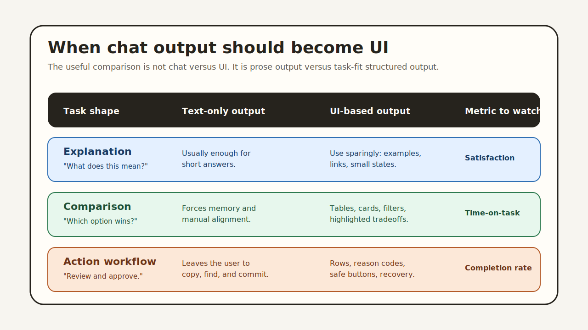

# UI-Based Chatbots vs. Text-Based Chatbots: A Metrics-First Comparison

The first wave of AI product design treated chat as the whole interface.

That made sense at the time. Large language models are good at language, and chat
is the lowest-friction way to expose them. A user can ask for anything. The model
can answer in paragraphs, bullets, or markdown. The product can ship without
designing a new screen for every possible task.

But once teams measure real product work, the limits show up quickly.

A text-only chatbot can explain a refund policy. It struggles to help a user
compare five refund cases, approve two, reject one, and request evidence for the
remaining two. It can summarize a sales pipeline. It struggles to let a manager
sort risky deals, filter by region, inspect reasons, and assign follow-up actions.

The question is not whether chat is useful. It is. The better question is:

> When does a chatbot answer need to become an interface?



Task completion rate, time-on-task, and user satisfaction give us a better way
to answer that than taste or hype.

## The Wrong Comparison

The common comparison is "chat versus UI." That framing is too broad.

Chat is an input pattern. UI is an output and interaction pattern. They are not
opposites.

The more useful comparison is:

- text-only chatbot output,
- versus chatbot output that can render structured, interactive UI.

In both cases, the user may start with natural language. The difference is what
happens after the model understands the task.

If the task is explanatory, text is often enough. If the task is operational,
the answer usually needs structure: cards, tables, charts, forms, filters,
buttons, warnings, and state.

That is where UI-based chatbots start to outperform text-only chatbots. Not
because visuals are prettier, but because the output better matches the work.

## Task Completion Rate: Can the User Finish?

Task completion rate is the bluntest and often most useful metric. Did the user
finish the task correctly?

Text-only chatbots can reduce task completion when the user has to translate
the answer into action. The model may say exactly what to do, but the product
still leaves the user with memory burden and manual transfer.

For example, imagine a customer support lead asks:

> Which refund requests should I approve today?

A text chatbot might respond:

```txt
Approve requests RF-1029 and RF-1031. RF-1033 needs proof of purchase.
Reject RF-1034 because it is outside the return window.
```

That answer is understandable, but the user still has to move elsewhere, find
the records, avoid transposing IDs, and take the actions manually.

A UI-based response can turn the same reasoning into a review surface:

- one row per request,
- recommendation per row,
- reason and confidence,
- approve, reject, and request-info buttons,
- disabled controls where policy blocks an action.

The user is less likely to drop a step because the answer and action live in
the same place.

This aligns with a broader finding in user-interface research: users perform
better when interface structure matches the task structure. A study comparing
text-based and graphical interfaces for medical order tasks found that interface
type affected novice users' task performance time and steps. The exact domain
is old, but the lesson still matters: when users need to choose, compare, and
act, the representation changes performance.

For AI products, the same principle applies. If the model returns a structured
decision but the product renders it as prose, the product throws away some of
the structure the model just created.

## Time-on-Task: How Much Work Does the Interface Push Back to the User?

Time-on-task is where text-only chatbots often look good in demos and weaker in
real workflows.

The first answer may arrive quickly. The full task may still take longer.

A text answer can hide downstream work:

- scanning a paragraph for the relevant value,
- comparing values that are not aligned in a table,
- copying an ID,
- opening another page,
- confirming that the right record is selected,
- asking the model to reformat the answer,
- recovering from missing context.

Those seconds are part of the task even if they happen after the model's first
response.

UI-based chatbots reduce time-on-task when they remove translation steps. A
generated table is faster to scan than a paragraph containing five comparable
items. A chart is faster for trend detection than a written list of daily
values. A form with validated fields is faster than instructions for filling
out a form somewhere else.

The empirical literature around chatbots and menu-based interfaces points in
the same direction. Nguyen, Sidorova, and Torres studied chatbot interfaces
against menu-based interfaces and focused on perceived autonomy, competence,
cognitive effort, and satisfaction. Their findings are useful because they push
against the simplistic assumption that natural language is always easier. A
conversational interface can feel less controllable when users cannot see the
available actions or the current state of the task.

That is the time-on-task trap in many AI features: the user can say anything,
but the product does not always show what can be done next.

UI gives the user handles. It makes state visible. It shortens the path from
answer to action.

## User Satisfaction: Control Matters as Much as Intelligence

User satisfaction is not only about answer quality. It is also about control.

A text-only chatbot can be correct and still feel tiring. Users have to trust
that the model understood the task, remember its recommendation, and infer what
actions are available. If the answer is wrong or incomplete, recovery often
means another conversational turn.

UI-based responses give users more direct control:

- they can inspect the exact data used,
- sort or filter results,
- edit a parameter,
- compare alternatives,
- undo or cancel before committing,
- and see which actions are safe or blocked.

That control changes how the model feels. The chatbot is no longer a black box
that emits an answer. It becomes a collaborator that prepares a working surface.

Nielsen Norman Group's guidance on chatbots repeatedly emphasizes that users
need clarity about what a chatbot can do and how to recover when it fails. A
generated interface helps because it can expose affordances instead of burying
them in language. Buttons, fields, disabled states, validation errors, and
summaries all tell the user where they are in the task.

This does not mean every chatbot response should be a dashboard. Too much UI
can be as bad as too much prose. Satisfaction improves when the product chooses
the right representation for the job.

## Three Tasks, Three Different Outputs

The best way to see the difference is to compare task shapes.

### Task 1: Explanation

User: "What does this error mean?"

Best output: mostly text.

The user needs a clear explanation, likely with a short example and a suggested
fix. Rendering a complex UI would slow the experience down.

### Task 2: Comparison

User: "Which of these plans should I choose?"

Best output: structured UI plus text.

The answer should include a recommendation, but the user also needs a comparison
table, highlighted tradeoffs, price differences, and maybe toggles for usage
assumptions. Text alone makes the user hold too much in memory.

### Task 3: Approval Workflow

User: "Review today's flagged transactions."

Best output: interactive UI.

The model can summarize patterns, but the real job is inspection and action.
The user needs rows, filters, reason codes, risk labels, detail views, and
approve/reject/escalate controls.

These are not cosmetic differences. They affect completion, speed, and trust.

## What a UI-Based Chatbot Actually Returns

A UI-based chatbot does not need to generate arbitrary frontend code.

In a production system, the model should compose approved components. The host
application defines the component library, validates the generated output, and
owns all actions.

A response to "show risky renewals" might use:

- `SummaryCard`
- `MetricCard`
- `DataTable`
- `RiskBadge`
- `ActionButton`
- `DetailDrawer`

The model chooses the arrangement and fills props from trusted data. The app
renders the components using its own code.

That is the role OpenUI is designed to play. OpenUI gives developers a compact
language and React renderer for model-composed interfaces. Instead of forcing
the model to return paragraphs or a large JSON tree, OpenUI Lang lets it return
a stream-friendly UI description constrained by the components the app exposes.

The practical benefit is that the chatbot can stay conversational at the input
layer while becoming visual and interactive at the output layer.

## How to Measure the Difference

To compare a text-only chatbot with a UI-based chatbot, do not ask users which
one looks better. Give them work.

A useful evaluation should include at least three task classes:

1. Information lookup: find a value or explanation.
2. Comparison: choose between options with tradeoffs.
3. Action workflow: inspect records and take a decision.

For each task, measure:

- completion rate,
- time to correct completion,
- number of follow-up turns,
- number of errors or reversals,
- self-reported confidence,
- and satisfaction after the task.

The expected pattern is not "UI wins everywhere." Text may win for short
explanations. UI should win as structure, comparison, and action density rise.

That is the more honest claim for generative UI: it is not a replacement for
language. It is the missing output layer for tasks that language alone handles
poorly.

## Design Rules for UI-Based Chatbots

A UI-based chatbot can still fail if it renders the wrong interface. The goal is
not maximum UI. The goal is task-fit UI.

A few rules help.

First, preserve the model's reasoning, but attach it to objects. Do not put all
the rationale in a paragraph above the table. Put the reason next to the row,
metric, or action it explains.

Second, keep actions structured. Buttons should return declared action payloads,
not arbitrary instructions. The application should validate permissions and
state before committing anything.

Third, make uncertainty visible. If the model is unsure, show confidence,
missing data, or "needs review" states. Do not hide uncertainty inside polished
copy.

Fourth, let the user recover. Generated UI should support edit, undo, cancel,
retry, and request-more-context paths.

Fifth, keep accessibility in the component layer. If the model composes
components that are already accessible, the generated interface starts from a
better baseline than model-invented markup.

These rules are what make UI-based chatbots operational instead of merely
decorative.

## The Product Case

Product teams already track task completion, time-on-task, and satisfaction.
That is why this comparison matters.

If a text-only chatbot increases answer speed but lowers task completion, the
feature is not working. If users need three extra turns to get the model to
format the answer into something usable, the interface is doing too little. If
users say the model is smart but they still do not trust it enough to act, the
product needs more visible structure and control.

UI-based chatbots are not about making AI responses prettier. They are about
reducing the distance between understanding and action.

For simple questions, text is still the best interface.

For complex tasks, the better pattern is hybrid:

- natural language for intent,
- structured UI for inspection,
- safe controls for action,
- and concise text for explanation.

That is where OpenUI fits. It gives developers a way to build that hybrid
without hand-designing every possible screen or letting the model write
unbounded frontend code.

The future chatbot does not stop talking. It learns when to stop talking and
show the right interface instead.

## References

- [User interactions with chatbot interfaces vs. menu-based interfaces: An empirical study](https://doi.org/10.1016/j.chb.2021.107093)
- [The User Experience of Chatbots](https://www.nngroup.com/articles/chatbots/)
- [Comparing Text-based and Graphic User Interfaces for Novice and Expert Users](https://pmc.ncbi.nlm.nih.gov/articles/PMC2655855/)
- [Understanding User Satisfaction with Task-oriented Dialogue Systems](https://arxiv.org/abs/2204.12195)
- [OpenUI README](https://github.com/thesysdev/openui/blob/main/README.md)
- [OpenUI GitHub repository](https://github.com/thesysdev/openui)
