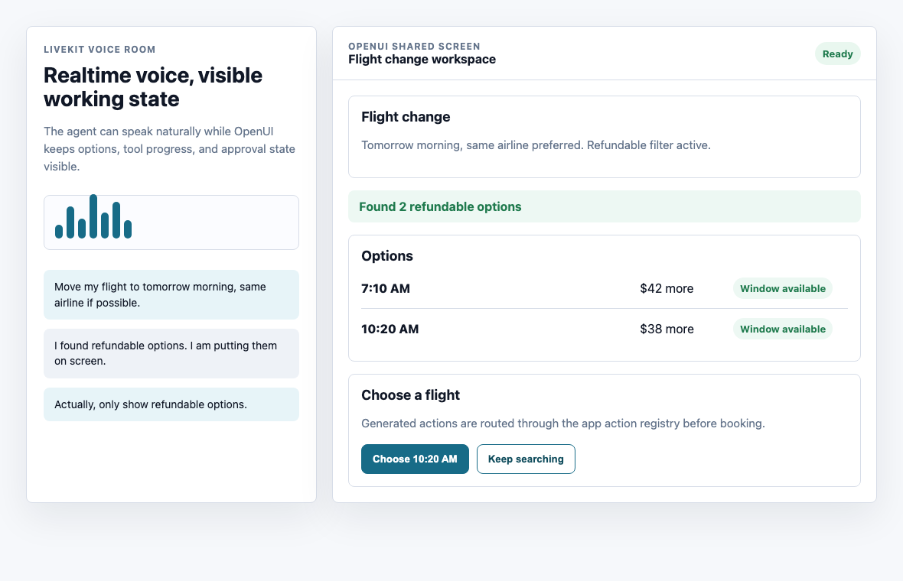
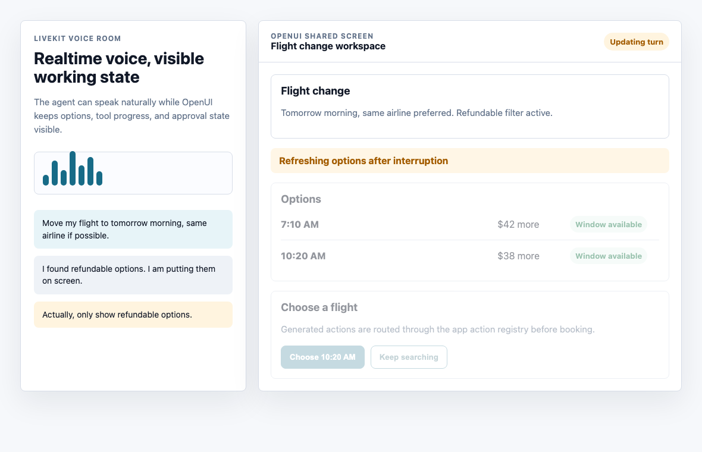

# Voice Agents Need a Shared Screen: Pairing LiveKit with OpenUI for Real-Time Visual Feedback

Voice agents are fast when the job is simple: ask a question, get an answer, move on.

They get harder the moment the conversation creates state. A user compares plans, changes one option, asks whether a fee is included, interrupts halfway through the answer, and then says "book the second one." If the only durable interface is audio, the product has to infer what "the second one" means from a fading transcript and the user's memory.

That is why serious voice agents need more than a waveform, a transcript, and a mute button. They need a shared screen.

LiveKit is a strong foundation for the realtime voice loop: rooms, WebRTC transport, audio input, agent sessions, turn handling, tool use, and deployment. OpenUI fills a different gap. It gives the agent a constrained way to stream interface state back to the app, using components the product already owns.

The useful pairing is not "voice plus some generated decoration." It is:

- LiveKit owns the realtime conversation.
- OpenUI owns the generated visual surface.
- The host application owns permissions, tools, data, and final actions.

That split keeps the voice agent natural without forcing every important decision to live only in speech.

## The problem with voice-only state

Voice is great for intent. It is poor at persistence.

Imagine a travel support agent:

> "Move my flight to tomorrow morning, but keep the same airline if possible."

The agent finds three options. In a text chat, it might print a table. In a voice-only experience, it reads them out:

> "There is a 7:10 AM for $42 more, an 8:35 AM for $61 more, and a 10:20 AM for $38 more."

That is fine once. It falls apart when the user asks:

> "Which one has a window seat?"

Now the agent has to restate the options, map availability, and hope the user tracks the list. If the user interrupts, asks a side question, or returns later with "choose the cheaper one," the interaction becomes fragile.

The failure is not the voice model. The failure is that the product is asking audio to do the job of an interface.

Some state should be spoken. Some state should remain visible:

- candidate options,
- prices and tradeoffs,
- form fields,
- confirmation summaries,
- tool progress,
- warnings,
- editable choices,
- and final approval controls.

The user should not have to remember everything the agent said. The application should carry the important state forward.

## Why LiveKit and OpenUI fit together

LiveKit Agents are designed for realtime agent participation. The agent joins a room, processes voice and other inputs, uses models and tools, and returns output through the realtime session. The frontend can be web, mobile, or another LiveKit-connected surface.

OpenUI approaches the output problem from the interface side. Instead of asking the model to return markdown, arbitrary React, or a large JSON tree, OpenUI uses OpenUI Lang: a compact line-oriented format that can be parsed progressively and rendered through approved React components. The OpenUI docs describe the renderer as mapping streamed lines to real components as they arrive, so structure can appear before all data is complete.

Together, they give you a clean architecture:

```txt
microphone
  -> LiveKit room
  -> LiveKit agent session
  -> tools and application data
  -> spoken response
  -> OpenUI visual state stream
  -> React renderer
  -> user action back to app code
```

The important part is that OpenUI is not a second agent. It is the visual expression of the agent's state. LiveKit keeps the conversation realtime. OpenUI makes the agent's working memory inspectable and actionable.

The companion demo code for the examples in this article lives in
[`examples/livekit-openui-shared-screen-demo`](../examples/livekit-openui-shared-screen-demo/).
It includes a TypeScript-shaped frame/action model and a small static browser demo used for the
screenshots below.





## A practical architecture

A production voice-agent UI usually needs four channels, not one:

1. Audio: what the user says and hears.
2. Transcript: what happened in the conversation.
3. Visual state: what the user can inspect, compare, or edit.
4. Actions: what the user can approve or trigger.

LiveKit naturally covers the realtime media and room participation. OpenUI can cover the generated visual state, as long as you keep the component library narrow and application-owned.

For example, a flight-change assistant might expose these components to OpenUI:

```ts
const voiceComponents = {
  SummaryCard,
  OptionList,
  OptionRow,
  PriceDelta,
  SeatBadge,
  ToolProgress,
  ConfirmationPanel,
  ActionButton,
  WarningBanner,
};
```

That component set is intentionally boring. Boring is good here. A voice agent does not need unlimited UI freedom. It needs reliable building blocks for the states users actually hit while talking.

The agent should not invent a new payment form, bypass authorization, or create an action the frontend cannot enforce. It should compose approved components:

```txt
root = Stack([summary, options, confirm])
summary = SummaryCard("Flight change", "Same airline preferred")
options = OptionList([morning, midmorning, late])
morning = OptionRow("7:10 AM", "$42 more", "Window available")
midmorning = OptionRow("8:35 AM", "$61 more", "No window seats")
late = OptionRow("10:20 AM", "$38 more", "Window available")
confirm = ConfirmationPanel("Choose a flight", [chooseLate, keepSearching])
chooseLate = ActionButton("Choose 10:20 AM", "flight.select.late")
keepSearching = ActionButton("Keep searching", "flight.search.more")
```

The user hears a concise summary, but the screen keeps the options alive. The user can say "choose the 10:20" or tap the button. Both paths route through the same application action.

## The visual surface is not the source of truth

This is the most important implementation rule: generated UI should display state and request actions. It should not become the authority for state.

The source of truth stays in your app:

- reservation records,
- account permissions,
- payment eligibility,
- current room/session state,
- available tool calls,
- and action authorization.

OpenUI can render a button with an action id like `flight.select.late`, but the app decides whether that action is valid when it is clicked. The voice agent can suggest a refund, but the backend decides whether the refund can be issued.

That distinction matters because voice interactions are full of partial information. Users interrupt. Tools return late. A newer turn can supersede an older one. Network conditions vary. A generated panel might be visually correct for the previous turn but stale for the current one.

The fix is to treat every generated visual update as scoped to a turn.

```ts
type VisualFrame = {
  conversationId: string;
  turnId: string;
  status: "streaming" | "ready" | "superseded" | "error";
  openui: string;
};
```

When a new user turn starts, the frontend can mark the previous visual frame as superseded. The screen does not have to disappear, but unsafe actions should be disabled until the new state is ready.

That lets the UI say, in product terms, "the agent is updating this answer," instead of leaving the user to guess whether an old button is still safe.

## Handling interruptions

Interruptions are where voice agents become real.

A user might cut in with:

> "Actually, only show refundable options."

LiveKit can handle the realtime turn and interruption behavior. The visual layer needs a parallel rule: old generated state must be visibly downgraded as soon as the user's new intent changes the task.

Good interruption handling looks like this:

1. User interrupts.
2. Current speech stops or changes course.
3. Current visual state is marked "updating."
4. Pending actions are disabled or require re-confirmation.
5. The agent runs the new search.
6. OpenUI streams the replacement state.

That is a better user experience than trying to hide all latency. The user can see that the system heard the correction and is rebuilding the options.

For a voice agent, visual feedback is not just decoration. It is how the product proves that it understood the latest turn.

## Tool progress should be visible

Voice agents often call tools: search inventory, check account status, query a calendar, draft an email, open a support ticket, or trigger a workflow.

If the agent only says "one moment," the user has no sense of what is happening. A shared screen can make tool progress explicit:

```txt
root = Stack([progress, details])
progress = ToolProgress("Checking refundable flights", "running")
details = SummaryCard("Filters", "Same airline, tomorrow morning, refundable only")
```

Then:

```txt
root = Stack([progress, options])
progress = ToolProgress("Found 2 refundable options", "complete")
options = OptionList([early, late])
```

This is especially useful for slow or multi-step tasks. The agent can keep speaking naturally while the screen gives the user a stable view of what the system is doing.

It also makes failure recoverable. If one tool fails, the visual state can show which part failed and what the user can do next:

```txt
root = Stack([warning, retry])
warning = WarningBanner("Seat availability could not be refreshed.")
retry = ActionButton("Try again", "flight.refreshSeats")
```

That is much better than a voice apology followed by silence.

## Forms are better when they are seen

Voice-only forms are awkward because the user has to remember what has been collected, what is missing, and what will be submitted.

With OpenUI, the agent can maintain a visible form while LiveKit handles the conversational input:

```txt
root = Stack([title, form, submit])
title = SummaryCard("Expense report", "3 fields left")
form = Form([
  Field("Amount", "$42.18", "complete"),
  Field("Merchant", "Railway Cafe", "complete"),
  Field("Category", "", "missing"),
  Field("Receipt", "receipt.jpg", "complete")
])
submit = ActionButton("Submit expense", "expense.submit")
```

The user can say "category is travel meals" or edit the field directly. Either way, the app validates the form before submission.

The key is not whether the user speaks or clicks. The key is that both inputs update the same state model. Voice becomes one input method into a visible workflow, not the entire workflow.

## Design the component contract for voice

A component library for voice agents should be smaller than a general app design system. Optimize it for the states people need during a conversation.

Useful components include:

- `StatusCard` for current task state.
- `OptionList` for choices.
- `ComparisonTable` for tradeoffs.
- `ConfirmationPanel` for final review.
- `ToolProgress` for long-running work.
- `WarningBanner` for recoverable failures.
- `EditableField` for collected information.
- `ActionButton` for approved actions.

Avoid exposing raw layout primitives first. If the model can choose arbitrary spacing, nesting, and styling, it will spend tokens on presentation and increase the chance of invalid output. Give it semantic components instead.

The model should think in product states:

- "show these three options,"
- "confirm this risky action,"
- "collect the missing fields,"
- "show tool progress,"
- "explain why this cannot proceed."

Your React components can handle the visual design.

## Keep action ids stable

Generated UI becomes dangerous when actions are ambiguous.

Do not let the model invent action handlers like `doTheThing` and hope the frontend understands them. Define a registry:

```ts
const actions = {
  "flight.select": selectFlight,
  "flight.refreshSeats": refreshSeats,
  "expense.submit": submitExpense,
  "support.createTicket": createSupportTicket,
};
```

Then make generated actions include structured payloads or references:

```txt
choose = ActionButton("Choose 10:20 AM", "flight.select", "option_10_20")
```

On click, the app checks:

- Is this action allowed for the current user?
- Is this action still valid for the current turn?
- Does the referenced option still exist?
- Does this require confirmation?
- Has the backend state changed since the UI was generated?

That may sound defensive, but it is what makes voice plus generated UI production-safe. The agent can propose. The product must dispose.

## What the user should feel

The best version of this pattern does not feel like two separate products glued together. The user should feel that the agent has a working surface.

When the agent says "I found three options," the options appear.

When the user interrupts, the stale panel visibly updates.

When the agent calls a tool, progress appears.

When the user is about to commit money, delete data, book travel, or send a message, the confirmation is visible and reviewable.

When something fails, the screen shows the exact recovery path.

Voice remains fast and human. The screen handles memory, precision, and action.

## A minimal implementation checklist

If you are pairing LiveKit and OpenUI in a real app, start with this checklist:

- Define the voice agent's task states before defining components.
- Keep the OpenUI component library semantic and small.
- Attach every visual update to a conversation id and turn id.
- Disable stale actions when a new turn supersedes old state.
- Route all generated action ids through an application-owned registry.
- Treat generated UI as a view over backend state, not the backend state itself.
- Show tool progress and failure recovery visually.
- Keep spoken responses short when the screen can carry detail.
- Test interruptions, late tool results, and repeated corrections.

The payoff is not only a nicer UI. It is a more reliable agent.

## Conclusion

Voice agents should not force users to hold the whole interaction in their heads.

LiveKit gives developers the realtime voice foundation: rooms, media, agent sessions, turn handling, tools, and deployment. OpenUI gives the agent a way to stream structured visual feedback through approved components. Used together, they let teams build agents that can talk naturally while still showing durable, inspectable, actionable state.

That is the practical shape of multimodal agent UX: voice for intent, generated UI for shared context, and application code for authority.

The screen does not replace the conversation. It gives the conversation a memory.

## References

- [OpenUI documentation](https://www.openui.com/docs)
- [OpenUI Renderer docs](https://www.openui.com/docs/openui-lang/core-concepts/the-renderer)
- [OpenUI Interactivity docs](https://www.openui.com/docs/openui-lang/core-concepts/interactivity)
- [LiveKit Agents documentation](https://docs.livekit.io/agents/)
- [LiveKit Voice AI quickstart](https://docs.livekit.io/agents/start/voice-ai/)
