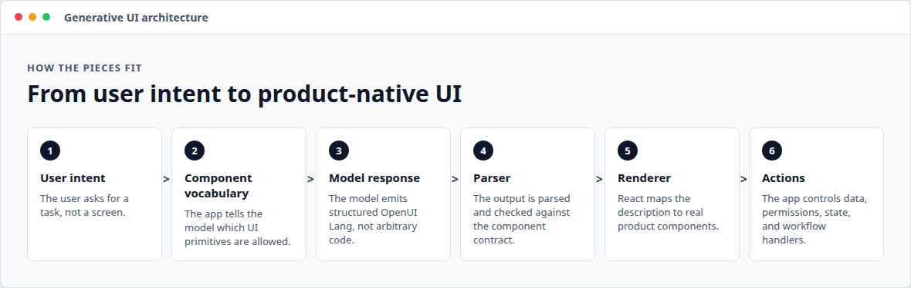
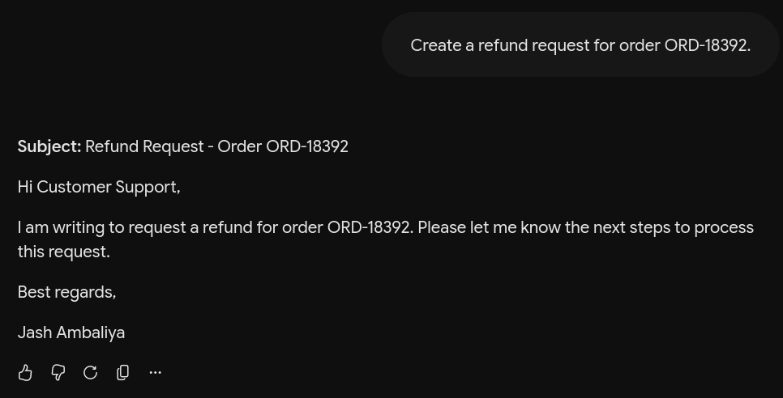
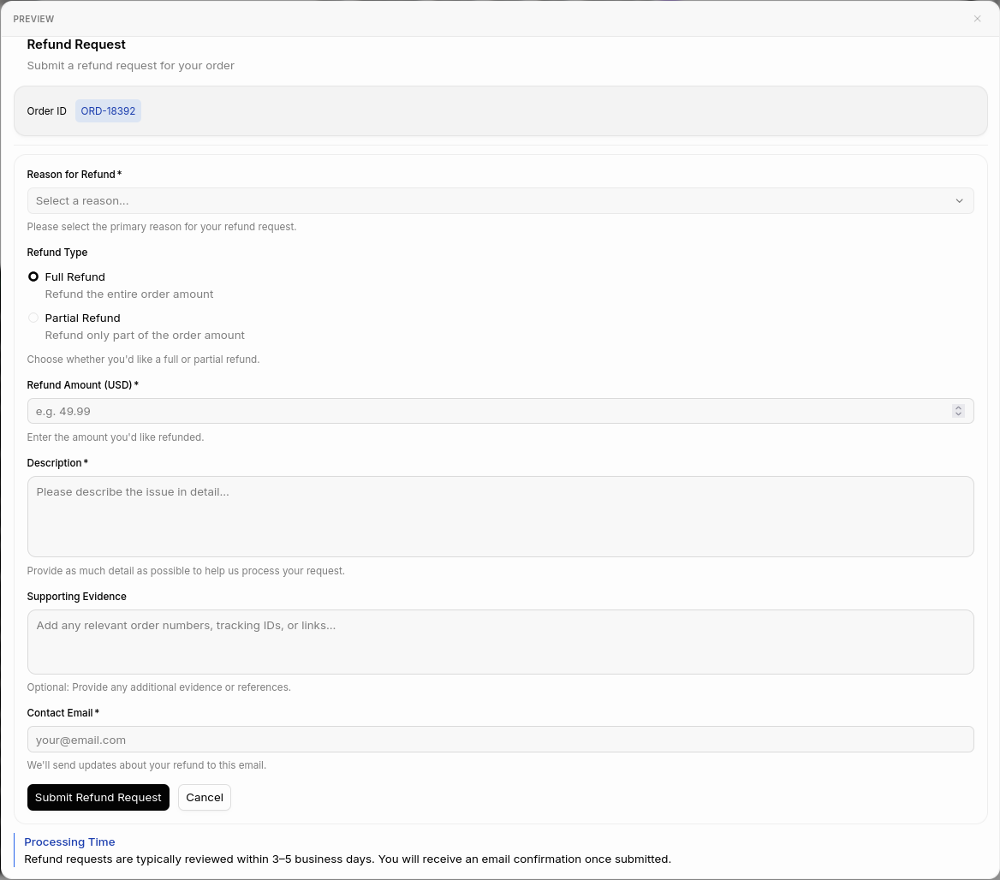

# What Is Generative UI? (And Why Text Output Is No Longer Enough)

Most AI apps still treat the model response as text.

That is understandable. Text is the native output format of an LLM. It is easy to stream, easy to log, easy to copy, and easy to display in a chat bubble. If the user asks for an explanation, a summary, a draft, or a piece of code, text is often the right interface.

But a lot of real software work is not just reading an answer. It is comparing options, editing fields, approving changes, inspecting data, choosing between actions, and moving through workflows. Those jobs do not become simple just because an LLM can describe them in a paragraph.

That is the gap generative UI is trying to close.

Generative UI is the practice of letting an AI system generate an interface, not just a text response, for the task the user is trying to complete. The model still reasons in language, but the product output can be a table, form, chart, card layout, confirmation step, or multi-part workflow assembled from components the application knows how to render.

The short version:

> Generative UI is AI output as interactive product UI instead of plain text.

That sounds simple. The important part is what it is not.

Generative UI is not "let the model write arbitrary React." It is not a random layout generator. It is not a replacement for product design or frontend engineering. A good generative UI system gives the model a controlled vocabulary of interface primitives and lets it compose those primitives based on user intent, available data, and application context.



## Why Text Was the Default

The first wave of AI products copied the chat interface because chat matches how LLMs work. A prompt goes in. Tokens come out. The UI can stream those tokens as they arrive.

That model works well when the user's goal is informational:

- "Explain this error."
- "Summarize this meeting."
- "Write a follow-up email."
- "Generate a SQL query."

The answer can be a paragraph, a list, or a code block. The user reads it, copies it, or asks a follow-up question.

The problem starts when the user's goal is operational:

- "Compare these vendors."
- "Create a refund request."
- "Show me which accounts need attention."
- "Prepare a deployment approval."
- "Find anomalies in this dashboard."

For these tasks, a wall of text is usually a lossy representation of the real job. It may contain the right information, but it does not give the user the right controls.

A markdown table is not a data grid. A bullet list is not a workflow. A paragraph that recommends an action is not the same as a confirmation UI with permissions, context, and auditability.

## The Core Idea

Generative UI starts from a different assumption: the model should not always answer with prose. It should answer with the interface shape that best fits the task.

If the user asks for a comparison, generate a comparison table.

If the user asks to submit something, generate a form.

If the user asks what changed, generate a summary with supporting metrics.

If the user is about to take a risky action, generate a review screen with explicit confirmation.

The model is still doing what LLMs are good at: interpreting intent, selecting relevant information, and deciding what should come next. The difference is that the final response is not forced through a single text-shaped pipe.

In practice, a generative UI system usually has five parts:

- a component library the model is allowed to use,
- a prompt or schema that describes those components,
- a model that emits a structured UI description,
- a parser or renderer that turns that description into real UI,
- and application handlers for data, state, permissions, and actions.

That architecture matters because it keeps the model inside product boundaries. The model can choose a table or form, but the application still controls what a valid table or form is.

## Same Prompt, Two Outputs

Imagine a support agent asks:

> Create a refund request for order ORD-18392.

The same input prompt can lead to two very different product experiences.

A text-only assistant might respond like this:




That is readable, but it is not much of an interface. The agent still has to trust the summary, move into another system, validate the amount, change the reason if needed, and take the actual approval action somewhere else.

A generative UI response can answer the same prompt as an interactive form:

```txt
root = Stack([header, orderInfo, sep1, formCard, callout])
header = Card([cardHeader], "clear")
cardHeader = CardHeader("Refund Request", "Submit a refund request for your order")
orderInfo = Card([orderRow], "sunk", "row", "s", "center", "between")
orderRow = Stack([orderLabel, orderTag], "row", "m", "center", "between")
orderLabel = TextContent("Order ID", "small")
orderTag = Tag("ORD-18392", null, "md", "info")
sep1 = Separator("horizontal", true)
formCard = Card([form])
form = Form("refund-request", formButtons, [reasonField, categoryField, amountField, descField, evidenceField, contactField])
reasonField = FormControl("Reason for Refund", Select("reason", reasonOptions, "Select a reason...", {required: true}), "Please select the primary reason for your refund request.")
reasonOptions = [SelectItem("damaged", "Item Damaged or Defective"), SelectItem("not-received", "Item Not Received"), SelectItem("wrong-item", "Wrong Item Sent"), SelectItem("not-as-described", "Item Not as Described"), SelectItem("changed-mind", "Changed My Mind"), SelectItem("duplicate", "Duplicate Order")]
categoryField = FormControl("Refund Type", RadioGroup("refund-type", refundTypeOptions, "full"), "Choose whether you'd like a full or partial refund.")
refundTypeOptions = [RadioItem("Full Refund", "Refund the entire order amount", "full"), RadioItem("Partial Refund", "Refund only part of the order amount", "partial")]
amountField = FormControl("Refund Amount (USD)", Input("amount", "e.g. 49.99", "number", {required: true, numeric: true, min: 0.01}), "Enter the amount you'd like refunded.")
descField = FormControl("Description", TextArea("description", "Please describe the issue in detail...", 4, {required: true, minLength: 20, maxLength: 1000}), "Provide as much detail as possible to help us process your request.")
evidenceField = FormControl("Supporting Evidence", TextArea("evidence", "Add any relevant order numbers, tracking IDs, or links...", 3), "Optional: Provide any additional evidence or references.")
contactField = FormControl("Contact Email", Input("contact-email", "your@email.com", "email", {required: true, email: true}), "We'll send updates about your refund to this email.")
formButtons = Buttons([submitBtn, cancelBtn])
submitBtn = Button("Submit Refund Request", Action([@ToAssistant("Submit refund request for ORD-18392")]), "primary")
cancelBtn = Button("Cancel", Action([@ToAssistant("Cancel refund request")]), "secondary")
callout = Callout("info", "Processing Time", "Refund requests are typically reviewed within 3–5 business days. You will receive an email confirmation once submitted.")
```

The input prompt did not change. The output contract changed.

In the text-only version, the model describes the refund request. In the generative UI version, the model composes a reviewable surface from approved components: a title, a form, editable fields, a select menu, and action buttons. The application still decides what `submit:refund-request` or `action:cancel` actually does.

Rendered through OpenUI, the same structured response becomes a product-native form:



Here is the same OpenUI response being generated and rendered in the chat interface:

<video controls src="../assets/Generate_Refund_Request_with_OpenUI.webm"></video>

This example uses OpenUI Lang, but the concept is broader than one syntax. The important shift is that the model returns a structured interface description. The application renders that description using known components and decides what the actions actually do.

## How This Differs From Dynamic UI

Developers have built dynamic UI for decades. Feature flags, conditional rendering, CMS-driven pages, dashboards, and form builders all generate interfaces from data.

Generative UI is different because the interface is chosen at runtime from user intent.

A traditional dynamic UI might say:

> If the user is an admin, show the admin panel.

A generative UI system might say:

> The user is asking to compare quarterly pipeline risk. Generate a table, a few metric cards, and follow-up actions using the components this product allows.

The difference is not that generative UI is "more dynamic." It is that the model participates in deciding which interface is appropriate for the current task.

That comes with tradeoffs. You need constraints. You need validation. You need fallback states when the model emits something invalid. You need to decide which actions can be triggered by generated UI and which actions require additional confirmation. Generative UI is powerful precisely because it is not just free-form generation.

## How This Differs From Tool Calling

Tool calling lets a model request structured operations:

```txt
get_refund_status(orderId: "ORD-18392")
```

That is useful, but it mostly answers the question, "What should the backend do?"

Generative UI answers a different question:

> What should the user see and interact with next?

The two patterns work well together. A model might call a tool to fetch order details, then generate a form or confirmation UI from the result. Tool calling gives the model access to capabilities. Generative UI gives the user a usable surface for the next step.

If tool calling is the bridge between AI and backend systems, generative UI is the bridge between AI and product experience.

## Why This Matters for AI Products

The more capable AI systems become, the more obvious the UI problem gets.

When an assistant can only answer simple questions, a chat bubble is enough. When it can inspect business data, compare options, prepare workflows, and recommend changes, the output needs more structure.

Text creates a few recurring problems:

- It hides structure inside prose.
- It makes comparisons harder than they need to be.
- It turns workflows into instructions instead of controls.
- It makes risky actions harder to review.
- It forces users to copy information between systems.

Generative UI does not remove the need for chat. In many products, chat remains the best input method. The user can describe intent in natural language. The difference is that the output can become product-native.

The future shape is less "chatbot that answers everything in text" and more "assistant that creates the right working surface when text is not enough."

## Where OpenUI Fits

OpenUI is a concrete implementation of this idea.

The OpenUI GitHub repository describes it as a full-stack generative UI framework built around OpenUI Lang, a compact streaming-first language, a React runtime, built-in component libraries, and chat/app surfaces. Its docs describe the basic flow:

1. Define or reuse a component library.
2. Generate model instructions from that library.
3. Send those instructions to the model.
4. Stream OpenUI Lang back to the client.
5. Render it progressively with the React renderer.

That design is important because it avoids two common extremes.

On one side, plain text is too limited. It cannot represent rich interaction without making the user do the work manually.

On the other side, asking a model to generate arbitrary frontend code is too loose for most production applications.

OpenUI sits in the middle. The model emits a compact UI language constrained by components the developer has defined or allowed. The renderer maps that output to real React components. The application remains responsible for data access, state, permissions, and action behavior.

That is a healthier contract for AI-native interfaces: generative where the product needs flexibility, controlled where the product needs safety.

OpenUI also focuses on streaming. That matters because model-generated interfaces should not feel like waiting for a full JSON blob to finish before anything appears. A line-oriented format can be parsed and rendered progressively as the model emits output.

## What Developers Should Design

If you are building with generative UI, the main design question changes.

Instead of asking only, "What screens should we build?" you also ask:

> What interface vocabulary should the model be allowed to compose?

That vocabulary might include:

- metric cards,
- tables,
- forms,
- charts,
- recommendation cards,
- confirmation panels,
- tabs,
- step-by-step workflows,
- and action buttons.

The goal is not to let the model invent your product's UI from scratch. The goal is to give it a safe set of primitives that match your product's real workflows.

This makes frontend work more important, not less. Someone still has to design good components, define prop contracts, handle empty and error states, wire actions, enforce permissions, and decide where generated UI is appropriate.

Generative UI moves some composition decisions to runtime. It does not remove engineering judgment.

## A Practical Definition

Here is the definition I would use with a team:

> Generative UI is a pattern where an AI system generates a structured, interactive interface from a controlled component vocabulary, based on the user's intent and current context.

That definition excludes raw text, arbitrary code generation, and static templates. It includes the pieces that matter in practice: structure, interaction, constraints, context, and rendering.

It also explains why this pattern is becoming necessary. AI products are moving from answering questions to helping users do work. Work needs interfaces.

Text will remain part of AI software. It is still the best format for explanation, narration, drafting, and conversation. But when the task involves comparing, editing, approving, exploring, or acting, text becomes a bottleneck.

Generative UI is the next layer: not a replacement for chat, but the interface system that lets AI responses become usable software.

## References

- [OpenUI GitHub repository](https://github.com/thesysdev/openui)
- [OpenUI documentation and playground](https://www.openui.com/docs)
- [Thesys Blog: OpenUI launch](https://www.thesys.dev/blogs/openui)
- [OpenUI on Product Hunt](https://www.producthunt.com/products/thesys)
