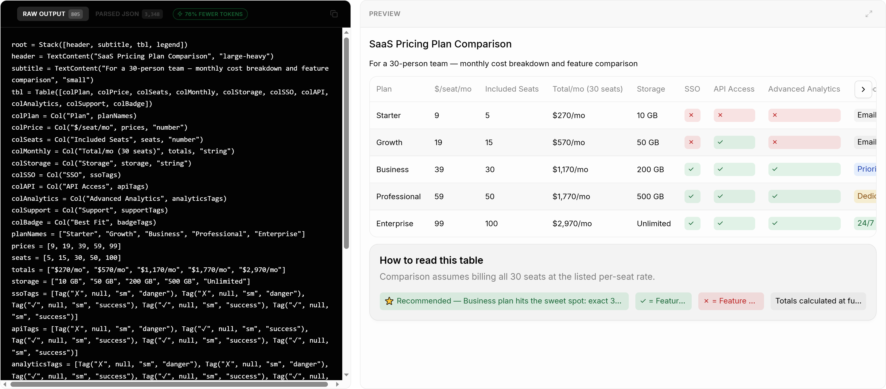
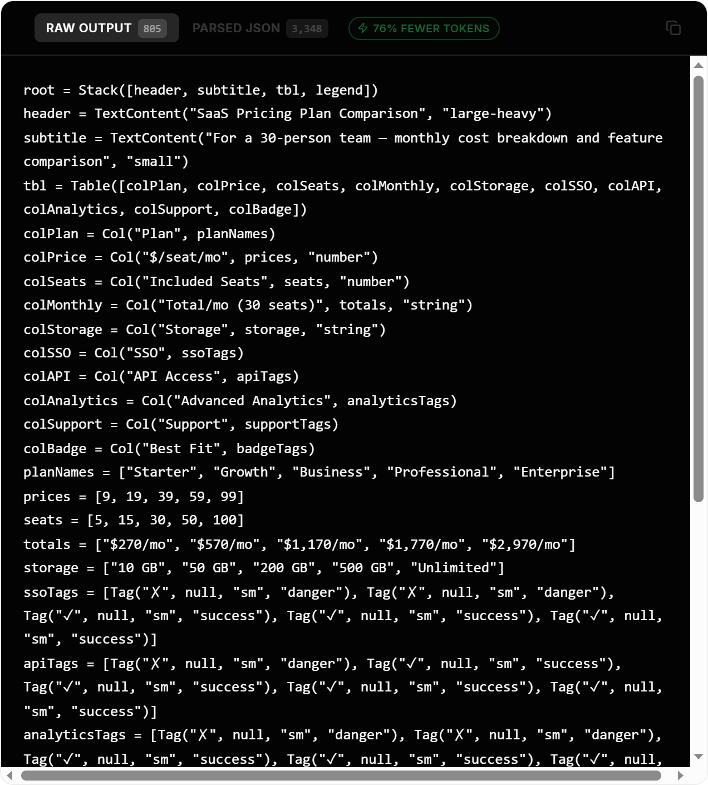

# What Is Generative UI? (And Why Text Output Is No Longer Enough)



*The same query — "compare 5 SaaS pricing plans for a 30-person team" — answered as a streaming UI instead of a paragraph. Left: the model's structured output. Right: the live, interactive result. Generated in [openui.com/playground](https://www.openui.com/playground).*

The first time I watched an LLM stream a 400-word answer that should have been a sortable table, I realized text was the wrong primitive.

The user had asked, "Compare the five plans and tell me which one fits a 30-person team." The model answered correctly. The output was a numbered list, six paragraphs long, with the comparison spread across prose. The right answer was a table the user could re-sort by price and seat count. The model knew that. The interface couldn't render it.

This is the situation most AI applications are in. The model can reason about structure; the surface can only show characters. Generative UI is the patch.

This piece is a first-principles explainer for developers and technical PMs who have heard the phrase "Generative UI" but don't yet have a working definition. I'll define it precisely, walk through the rendering pipeline, name the tradeoffs honestly, and lay out when it actually beats text output (and when it doesn't).

---

## The text ceiling

LLMs are sequence models. They output tokens. Every byte that reaches the user is, by default, a string. We've been papering over this with markdown, code fences, and the occasional table syntax, and for many tasks that's been enough. It stops being enough fast.

Four concrete failure modes, all of which I've hit shipping AI features:

**Comparison.** "Compare these vendors on cost, reliability, and integration overhead." The model returns six paragraphs. The user wanted a table they could sort. A 3×3 table communicates the same information in roughly 1/20th the tokens and zero seconds of cognitive load.

**Multi-step input.** "Configure my deployment region, instance class, and backup policy." A text prompt that asks the user to type all three is a worse interaction than a form with three selects and validation. The model can describe the form; the application has to render it.

**Interactive exploration.** "Show me my monthly spend." A summary paragraph answers the wrong question. The user wants a chart they can hover, a date range they can slide, and a category they can drill into. Text can describe data. Only an interface can let you interact with it.

**Stateful workflows.** "Walk me through onboarding a new hire." A numbered list is fine for a tutorial. It's not fine for an actual workflow where the user needs to check off steps, attach files, and resume tomorrow.

None of these are corner cases. They are the median feature in any AI application that touches real work.

The structural reason text fails is that text encodes content but not affordances. A chart isn't just a picture of numbers; it has hover targets, sort handles, and a coordinate system the cursor can interrogate. Text strips all of that away and asks the human to reconstitute it.

---

## A precise definition

**Generative UI is the pattern where a language model emits structured descriptions of interface components, and a runtime renders those descriptions as live, interactive UI in real time.**

Three load-bearing words:

- **Structured.** Not free-form text. A grammar or schema the renderer understands.
- **Components.** Reusable, typed UI primitives — `Chart`, `Table`, `Form`, `Card` — not arbitrary HTML or React code generated from scratch.
- **Live.** The output is real, interactive, accessible UI. Buttons click. Inputs validate. Charts respond to the cursor.

What it isn't:

- It is **not** the model writing React. Models can generate JSX, but JSX-from-LLM is dangerous (XSS, broken hooks, version skew) and slow (every byte of `import` and `useState` is paid for in tokens and latency). Generative UI is the model picking from a fixed component vocabulary, not authoring components from scratch.
- It is **not** the model picking from a small bag of templates. Template selection has been around since Mailchimp. The novelty is the model assembling the *composition* of components — what goes next to what, in what order, with what data bound where.
- It is **not** tool-calling. Tool calls are about the model invoking your code. Generative UI is about the model declaring what the user should see. They compose well together, but they solve different problems.

---

## The spectrum

It helps to place generative UI on a spectrum of how much rendering autonomy the model has:

| Level | Who picks the component | Who picks the layout | Who picks the data | Example |
|---|---|---|---|---|
| 1. Template fill | You | You | Model | Mailchimp variable substitution |
| 2. Component selection | You (from a list) | You | Model | Chatbot that shows a "card carousel" tool |
| 3. Component + layout | Model (from your library) | Model | Model | Generative UI |
| 4. Free-form generation | Model | Model | Model | Model writes raw HTML/JSX |

Most production AI features today are at Level 2: the developer pre-built a set of cards and the model decides which one to render. This works, and it scales until the product needs to answer a question its templates don't cover. At that point you're back to text, or you ship Level 3.

Level 4 is technically possible and usually a bad idea in production. The combination of security risk, token cost, and inconsistency makes it impractical. The interesting work is in Level 3, where the model has compositional freedom inside a vocabulary you control.

---

## The pipeline

A generative UI system, end to end:

```
User input
   ↓
[ System prompt + component vocabulary ]
   ↓
LLM (streaming tokens)
   ↓
[ Structured UI description: JSON / DSL / OpenUI Lang ]
   ↓
Parser (tolerant of partial output)
   ↓
Component resolver (vocabulary → React/Vue/Svelte)
   ↓
Streaming renderer (mounts components as they arrive)
   ↓
Live UI in the user's browser
```

Three pieces are doing the real work.

**The vocabulary.** A registered set of components the model is allowed to use, with typed props the model is allowed to set. This is what stops the model from inventing a `Frobulator` that doesn't exist, or passing `color="purplish"` into a chart that wants a hex code. The vocabulary is also what you ship to the model in the system prompt — usually as a compact schema, not raw TypeScript.

**The structured output format.** This is where the design choices get interesting. The obvious answer is JSON: every model can produce it, every parser can read it. The non-obvious problem is that JSON is verbose for UI trees. A nested layout with a chart, three cards, and a table is *a lot* of brackets and quoted keys. You pay for those tokens twice: once at generation latency, once at API cost. This is why several systems (OpenUI Lang, AI SDK's `generative_ui` mode, custom DSLs) compress the wire format. The savings are not marginal — for the pricing-comparison example below, the compact DSL came in around 75% under the equivalent JSON. At that ratio, it's the difference between a UI that streams smoothly and one that stutters.

**The streaming renderer.** This is the part most developers underestimate. The model emits tokens one at a time. The user's screen should not freeze waiting for the close-bracket of the outermost component. A good renderer mounts components as soon as their open-bracket arrives, fills in props as they stream, and gracefully handles the half-second when a `Chart` has no `data` yet. Skeleton states, optimistic mounting, and a tolerant parser are not optional polish — they're load-bearing.


*The rendered output. Real DOM, real interaction targets, real Plan Notes — not a paragraph describing them.*

---

## Why not just have the model write JSX?

This is the question every senior developer asks first, and the answer is the same five reasons every time:

1. **Token cost.** A component tree in JSX is 3–5x larger than the same tree in a compact UI DSL. Every `<` and `</ComponentName>` is a paid token. The savings show up at the wire format level too — that pricing-comparison example above generated 885 tokens of OpenUI Lang vs. the 3,348 tokens its parsed-JSON equivalent would have cost: roughly 75% fewer tokens for the same component tree.



*Same UI tree, two formats. The token counter is from the playground for the same prompt as the hero image.*

2. **Latency.** More tokens = slower first paint. Users notice.
3. **Security.** Rendering arbitrary model-generated JSX is a remote code execution vector if you're not careful, and you will not be careful enough.
4. **Consistency.** With a fixed vocabulary, every chart looks like your chart. With free-form JSX, the model invents styling, prop names, and behavior on the fly.
5. **Maintenance.** When you change your design system, you update one component definition. With free-form generation, you fight prompt drift forever.

The trade you're making is *flexibility for reliability*. Generative UI is what you ship when reliability matters more than expressive ceiling — which, in production, is almost always.

---

## What changes for developers

Three concrete shifts:

**You become a librarian.** Your job is to curate the component vocabulary. Which charts do you support? Which form controls? Which layout primitives? The model can only compose what you've registered. The art is making the vocabulary small enough that the model picks well, and large enough that it can answer real questions.

**Prompt engineering becomes layout engineering.** When the model has a vocabulary, your system prompt is half "here's what each component does" and half "here's when to use a `Chart` vs. a `Table` vs. a `MetricCard`." You're teaching the model your design system's *editorial* rules, not just its API.

**Token efficiency becomes a UI performance metric.** This will feel strange the first time. "How many tokens does this dashboard cost to render?" becomes a question alongside "how many milliseconds does it take to mount?" Both affect perceived speed; the token one also affects your bill.

You don't stop owning frontend. Components, state management, accessibility, error boundaries, theming, animation — all still yours. Generative UI moves the *composition* boundary, not the *implementation* boundary.

---

## When to use it (and when not to)

A blunt decision framework. Generative UI is the right tool when:

- The space of possible UIs is too large to template by hand.
- The user input space is open-ended (natural language, varied tasks).
- Density matters: a chart beats a paragraph, a form beats free-text capture.
- You're already paying for an LLM in the loop and want the same model to drive the surface.

It's the wrong tool when:

- The interface is well-defined and changes rarely. Build the screens. Don't pay for inference to render a login form.
- Latency budget is tight (sub-100ms). Even with streaming, an LLM-driven render adds at least the time-to-first-token.
- The interactions are conversational and short. A chat bubble of text is fine for "what's the weather." Don't generate a `WeatherCard` if the user just wanted three words.
- Reliability requirements are absolute. Generative UI is probabilistic. If a flow has to succeed 99.999% of the time, you want deterministic code rendering it.

A useful gut check: would you rather have a slightly wrong text answer or a slightly wrong interface? If the interface failure is worse, stay with text.

---

## The current landscape

Three categories of tooling have emerged:

**Library-driven generators.** [OpenUI](https://github.com/thesysdev/openui) is the most fully realized of these. It provides a compact DSL (OpenUI Lang), a streaming React renderer, automatic prompt generation from your component library, and a runtime that handles partial-output rendering. It's the "batteries included" path: register your components, point at a model, get streaming UI. The Lang format is meaningfully more token-efficient than JSON, which matters at scale.

**SDK-bundled approaches.** Vercel's AI SDK exposes a `generative_ui` mode that lets you stream React Server Components directly from a model-driven flow. It's tightly coupled to React Server Components and Next.js, which is fine if you're already there and friction if you're not.

**Roll-your-own.** Plenty of teams have built generative UI on top of structured outputs and a custom renderer, often using JSON-mode in the underlying model and a hand-rolled component dispatcher. This works, and it's instructive to build at least once — but you'll rediscover most of what the libraries above already solved, including streaming parsers, error recovery, and the token-efficiency problem.

If you're starting today and don't have a strong reason to roll your own, library-driven is the path with the highest leverage. The cost of integration is lower than the cost of solving the same problems yourself.

---

## The argument, in one paragraph

Language models reason about structure. Text-only output throws that structure away at the last mile. Generative UI keeps it, by giving the model a constrained UI vocabulary and a renderer that mounts the model's output as live components in real time. The shift this enables is small architecturally — your components don't change, your design system doesn't change — and large in product terms: AI features stop being chatbots that print and become applications that respond. The interfaces we build will look less like conversation transcripts and more like products that assemble themselves around the question being asked. That's the actual unlock. Text was a convenient lowest-common-denominator. We don't need it anymore.

---

**Next steps:**
- The [OpenUI repo](https://github.com/thesysdev/openui) for the reference implementation
- The [OpenUI docs and playground](https://www.openui.com/) to try it without setting anything up
- The [Thesys OpenUI launch post](https://www.thesys.dev/blogs/openui) for the design rationale behind the DSL choice
