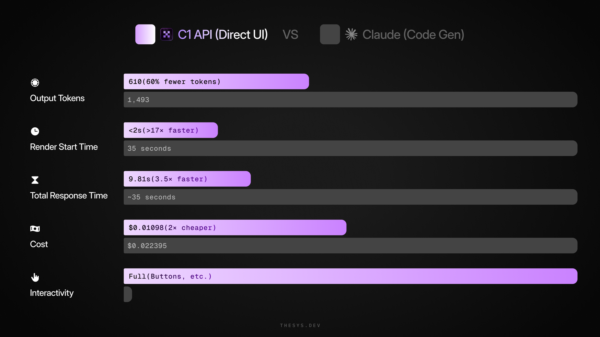
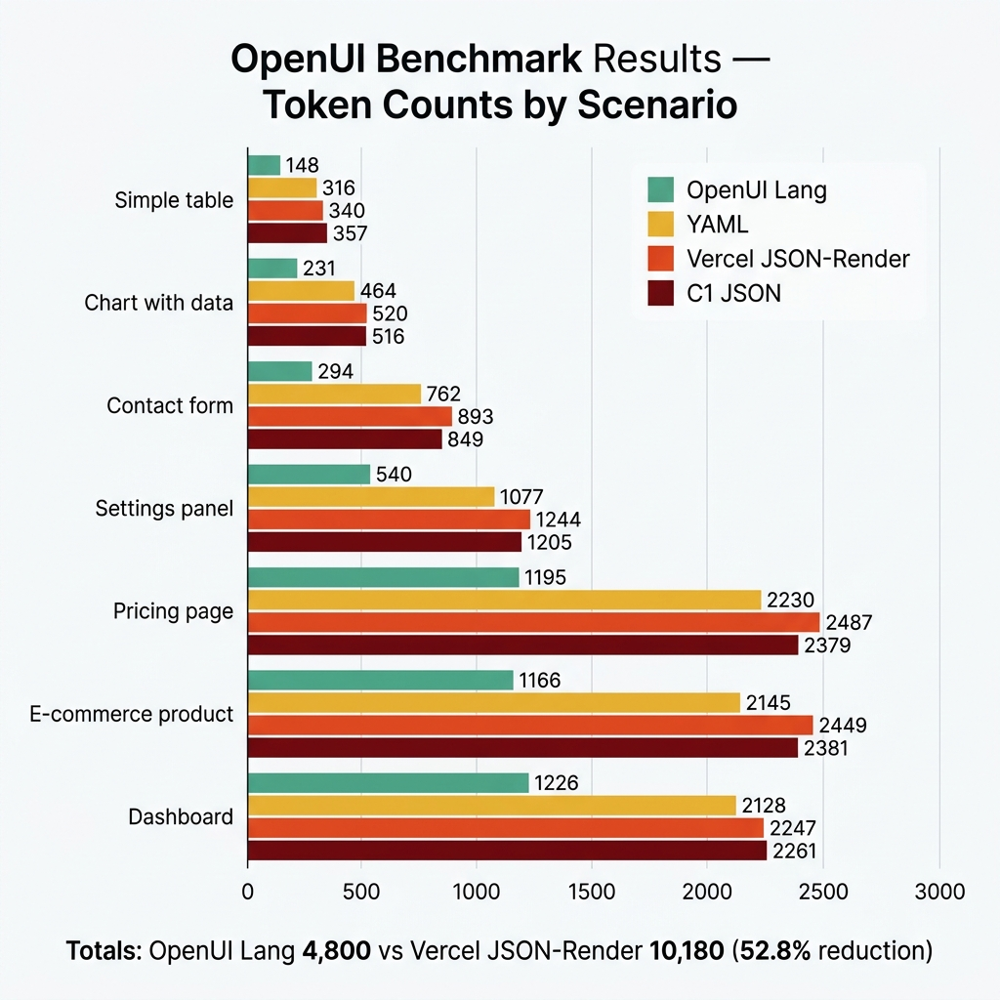
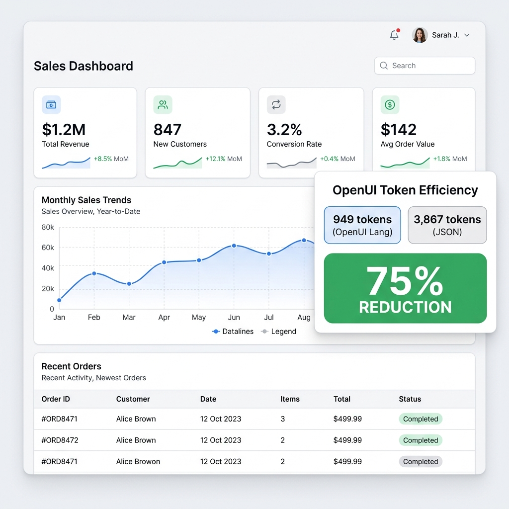

# The Token Cost of Beautiful AI: OpenUI Lang vs. AI SDK vs. JSON — What You're Actually Paying For

At some point someone on your team asks the cost question. Not "is generative UI a good idea" — the budget question. "If we generate UI on every response, what does that do to our API bill at scale?"

Most framework comparisons don't answer this. They show demos and benchmark screenshots. The mechanics of *why* one approach costs more, and by how much, rarely get a concrete treatment.

I went through the [OpenUI benchmark suite](https://github.com/thesysdev/openui/tree/main/benchmarks) and the underlying methodology to understand what's actually happening. This is what I found.

---

## Three approaches, briefly

They all solve the same problem — getting a model to describe a UI component tree — but differ significantly in what the model is actually asked to output.

### Raw JSON

You write a schema, put it in the system prompt, the model fills it out. You write a renderer that maps the JSON to components.

```json
{
  "type": "card",
  "props": {
    "title": "Monthly Revenue",
    "value": "$142,300",
    "trend": { "direction": "up", "percent": 12.4, "label": "vs last month" },
    "variant": "metric"
  }
}
```

No dependencies. Full control. Also fully your problem when the schema drifts or the model produces something malformed.

### Vercel AI SDK (streamUI / RSC)

Define tools with Zod schemas. The model calls a tool, your `generate` function maps the args to a React component.

```typescript
const result = await streamUI({
  model: openai("gpt-4o"),
  tools: {
    showMetricCard: {
      description: "Display a KPI metric with trend direction",
      parameters: z.object({
        title: z.string(),
        value: z.string(),
        trend: z.object({
          direction: z.enum(["up", "down", "flat"]),
          percent: z.number(),
          label: z.string(),
        }),
        variant: z.enum(["metric", "summary"]),
      }),
      generate: async (args) => <MetricCard {...args} />,
    },
  },
});
```

Worth knowing before you go deep on this: `streamUI` is currently marked experimental. The AI SDK team recommends `useChat` with tool calls for production work. That's not a dealbreaker, but it's the kind of thing that bites you six months in when the API changes.

### OpenUI Lang

OpenUI is framework-agnostic with first-party React support. The setup: developers define a component library, OpenUI generates a system prompt from it, the model outputs in OpenUI Lang, the renderer parses that into components. OpenUI Lang is the wire format — developers don't write it, the model does.

What comes out of the model looks like this:

```
root = Stack([header, kpiRow])
header = Card([CardHeader("Monthly Revenue", "April 2025")])
kpiRow = Stack([revenueCard, growthCard], "row", "m", "stretch")
revenueCard = Card([
  TextContent("Revenue", "small"),
  TextContent("$142,300", "large-heavy"),
  Tag("↑ 12.4% vs last month", null, "md", "success")
], "card", "column", "s", "start")
```

The renderer parses this statement by statement and renders incrementally as the stream arrives. Developers interact with the component library definition and the renderer API — not with OpenUI Lang directly.

---

## Why the format affects token count

The content being described is the same across all three — same component tree, same layout, same data. The [benchmark methodology](https://github.com/thesysdev/openui/tree/main/benchmarks) generates an AST for each scenario first using `gpt-5.2` at `temperature: 0`, then serializes it into each format using `tiktoken`. So the comparison is format-level — pure encoding overhead, nothing else.

JSON quotes every key. Every string. Every nested object needs braces, every array needs brackets. The schema in your system prompt — the thing that tells the model what to generate — is also JSON. You pay that overhead twice: once in the input, once in the output.

OpenUI Lang encodes the same tree in something closer to code. No key quoting, positional arguments, structure from grammar rather than repeated characters. Models generate it reliably because their training corpus is full of code that looks exactly like this. I suspect this is also why the structural failure rate is lower — though I haven't seen a clean benchmark isolating just that variable.

Thesys published their own head-to-head comparison showing the difference in practice. Here's C1 (using OpenUI Lang under the hood) versus Claude code generation for the same UI:



60% fewer output tokens, render start time dropping from 35 seconds to under 2 seconds, and half the cost per request. Those numbers are from Thesys's own benchmarks — the formal OpenUI benchmark suite shows similar patterns across different scenarios.

---

## The actual numbers

I went through the benchmark results across all seven scenarios. Here's the full output from running `pnpm bench` against the official sample set:



| Scenario | OpenUI Lang | YAML | Vercel JSON-Render | C1 JSON |
|---|---|---|---|---|
| Simple table | 148 | 316 | 340 | 357 |
| Chart with data | 231 | 464 | 520 | 516 |
| Contact form | 294 | 762 | 893 | 849 |
| Settings panel | 540 | 1,077 | 1,244 | 1,205 |
| Pricing page | 1,195 | 2,230 | 2,487 | 2,379 |
| E-commerce product | 1,166 | 2,145 | 2,449 | 2,381 |
| Dashboard | 1,226 | 2,128 | 2,247 | 2,261 |
| **Total** | **4,800** | **9,122** | **10,180** | **9,948** |

4,800 vs 10,180. That's 52.8% fewer output tokens on average.

The contact form is the extreme case — 67.1% reduction. Every field in JSON carries its metadata inline: label, placeholder, input type, required flag, validation rules, all repeated per field. OpenUI Lang pushes that into the component definition rather than the output. As forms get longer, this compounds.

One honest caveat: these numbers compare against Vercel's JSON-Render format, which is the full schema representation. Hand-minimized JSON closes the gap considerably. How much depends on how aggressively you strip field descriptions, flatten nesting, and remove validation metadata — in practice, production schemas rarely stay compact once enum lists and nested types accumulate, so the real-world savings tend to sit somewhere between the headline number and a much smaller figure.

---

## The cost people usually miss

Every request pays for your system prompt, not just the output.

In a JSON-based approach, the system prompt includes a JSON schema describing every component — property types, enum values, nesting, required flags. In the Vercel AI SDK approach, each tool definition is serialized as a JSON schema and attached to every request payload. OpenUI generates a compact prompt from your registered library via `openuiLibrary.prompt()`, which stays significantly shorter.

At low volume this is noise. At 1M requests per month, every 500 tokens you save from the system prompt is 500M fewer input tokens billed. The math is straightforward.

---

## Streaming — where raw JSON actually breaks

This is the part I find most underrated in most comparisons.

JSON doesn't stream cleanly. Partial JSON isn't JSON — a parser can't do anything with it until the closing brace arrives. Most renderers buffer the full output before rendering anything. So "streaming" with JSON usually means the user waits for the full generation, then sees everything at once. Calling that streaming is technically accurate and practically misleading.

The AI SDK tool-call approach is better. Each tool call renders when it completes. You get components appearing one at a time as the model finishes each tool invocation — staggered, but meaningfully better than batch rendering.

OpenUI Lang renders per statement. As soon as the model finishes one line, that component renders. For a simple card the difference is imperceptible. For a dashboard with six panels, it's the difference between "this feels fast" and "this feels like it's loading forever."

Time-to-first-meaningful-render is harder to benchmark than token counts, but it's more visible to users. That asymmetry is worth keeping in mind when comparing approaches.

---

## Reliability: the hidden cost

At 893 tokens of JSON for a contact form, the model has 893 chances to produce something the parser can't handle — a missing quote, an extra comma, a field name that doesn't match the schema. JSON parsers fail hard. The renderer throws, the user sees nothing or a fallback.

The annoying part isn't the failure itself. It's the debugging. An enum value that drifted between the renderer and the prompt. A new component added to the library without updating the schema definition. These failures don't always surface immediately — sometimes they show up only for specific component combinations or at higher output lengths.

Thesys reported an invalid output rate drop from 3% to under 0.3% after switching from JSON to OpenUI Lang. ([Thesys, OpenUI launch](https://www.thesys.dev/blogs/openui)) That's a 10x improvement. At 1 million renders a month, the difference between 3% and 0.3% is 27,000 fewer failed renders. Those failures aren't just wasted API calls — they're errors users see.

And users don't complain when format fails them. The [Thesys Generative UI Report 2025](https://www.thesys.dev/report/gen-ui-2025) — a study with 145 participants across 5 countries — found that 92% of users who found a response unsatisfactory just left without retrying. They didn't re-prompt, didn't report the issue. Silent churn.

---

## Maintenance: what you're actually signing up for

Token efficiency is a one-time calculation. Maintenance cost runs forever.

**Raw JSON:** you own the schema, the renderer, and the system prompt. Adding a component means updating all three manually. Fine at ten components. At fifty it becomes a real engineering tax — the schema and the prompt fall out of sync and you don't find out until something renders wrong in production.

**Vercel AI SDK:** each new component is a new tool definition — Zod schema plus `generate` function. The schema is attached to the code rather than floating in a prompt string, which is better. For teams already deep in the AI SDK ecosystem this fits naturally. For teams not in that ecosystem, it's overhead per component that adds up.

**OpenUI:** add a component to the library, call `openuiLibrary.prompt()`, done. The system prompt regenerates automatically. The model's component vocabulary stays synchronized. At scale this is honestly the biggest practical difference — not the token savings per se, but not having to manually keep schemas and prompts in sync as the library grows.

Here's what a generated sales dashboard looks like in practice — KPI cards, charts, tables, all rendered from a single prompt. With OpenUI Lang this kind of layout costs roughly 949 tokens versus 3,867 tokens for the equivalent JSON, a 75% reduction:



Every component in that view — KPI cards, chart, table — needs to stay synchronized between your schema definition and your system prompt. With OpenUI, that happens automatically. With raw JSON, it's a manual step every time.

---

## When each approach wins

**Raw JSON** is fine when your component surface is small — three to five types, limited nesting — and you want zero additional dependencies. Prototypes, internal tools, early-stage products where scale doesn't matter yet.

That sounds fine until your component library hits twenty types and maintaining the schema becomes its own part-time job.

**Vercel AI SDK** makes sense if you're already in the Next.js ecosystem and tool-calling semantics fit your architecture. Works well for a small number of high-specificity components. Gets awkward as component count grows and tool definitions start overlapping. The experimental RSC status is also worth tracking for production planning.

**OpenUI** is the right call when token cost is a real budget variable, your component library is large or growing, and you need reliable streaming. The learning curve is around the framework itself — defining component libraries, understanding the renderer API. OpenUI Lang is generated by the model, not written by developers.

---

## What the numbers mean in practice

The 52.8% average token reduction is measured against Vercel's verbose JSON-Render format. Against minimized JSON, the realistic range for most codebases is probably 25–50% depending on how much metadata your schemas carry.

That's still meaningful. A contact form costing 893 tokens instead of 294 is real savings at scale — plus faster generation, better streaming, and fewer parse failures in production.

Whether the switch is worth it depends on where you are in the build. For a small prototype, probably not. For a product at scale with a growing component library and user-visible generation in the hot path, the math gets clearer.

The benchmark suite is open source and reproducible if you want to run it against your own component shapes: [github.com/thesysdev/openui/tree/main/benchmarks](https://github.com/thesysdev/openui/tree/main/benchmarks).

---

*Sources: [OpenUI benchmarks](https://github.com/thesysdev/openui/tree/main/benchmarks) · [Thesys OpenUI launch](https://www.thesys.dev/blogs/openui) · [Thesys Gen UI Report 2025](https://www.thesys.dev/report/gen-ui-2025) · [AI SDK RSC docs](https://ai-sdk.dev/docs/ai-sdk-ui/generative-ui)*
