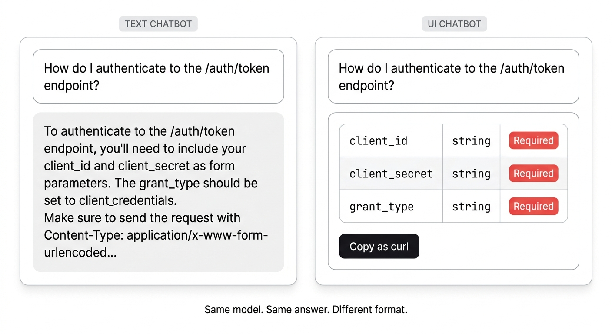
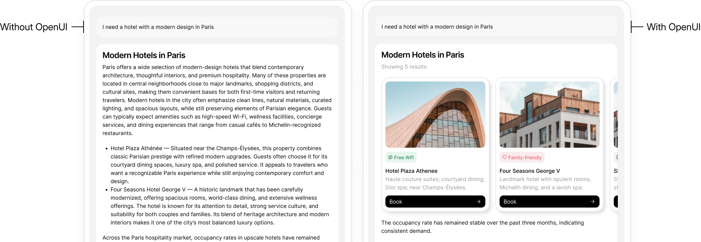
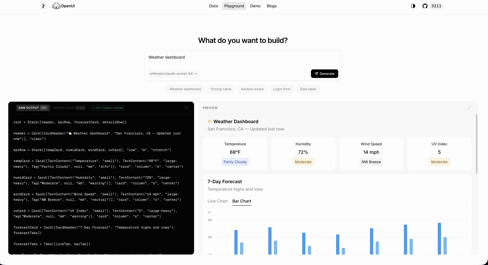
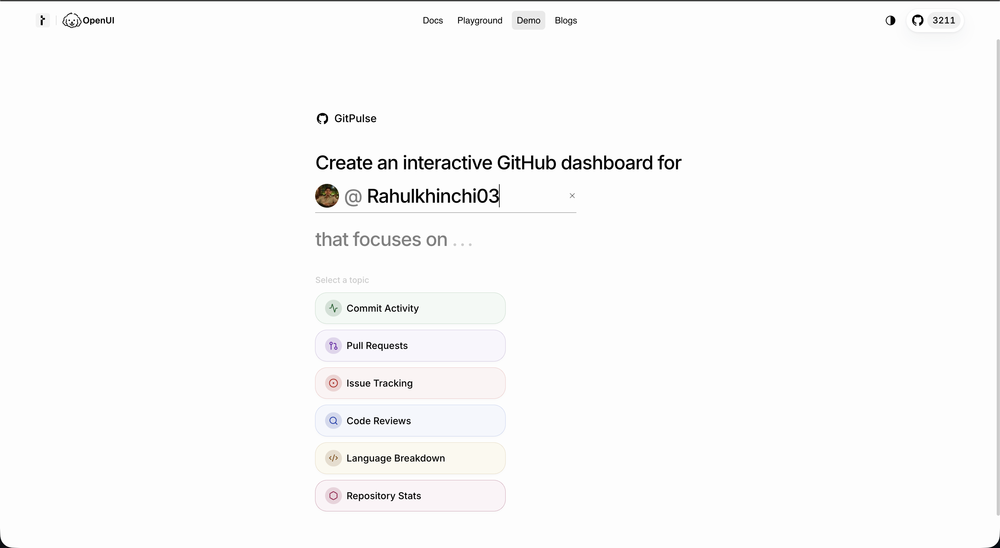
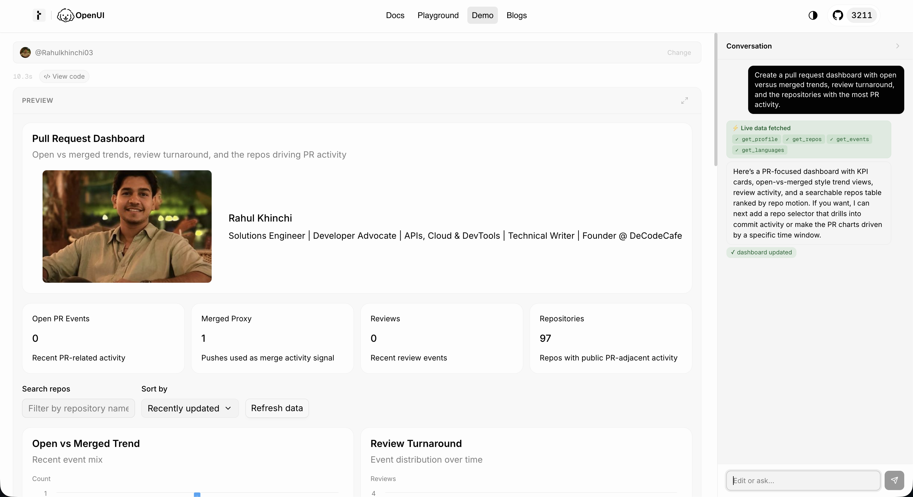
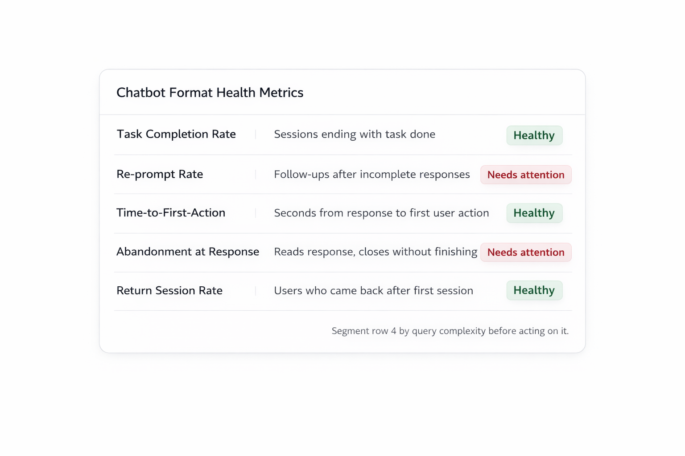

# UI-Based Chatbots vs. Text-Based Chatbots: A Performance Comparison Across Task Completion Rate, Time-on-Task, and User Satisfaction

A developer asks your support chatbot what parameters the `/auth/token` endpoint accepts.

The bot answers correctly, with full details, in two paragraphs. The developer reads it, closes the chat, opens a new tab, and looks up the same information in a table somewhere else.

- **Task:** not completed.
- **Model:** correct.
- **Format:** wrong.

This happens constantly, and most teams debug it by improving the model. They rewrite prompts, upgrade the LLM, and tune the retrieval. The task completion number barely moves, because the model was never the problem.

The output format was.



---

## Defining the spectrum

"UI-based chatbot" is a loose term. Being imprecise about it leads to bad conclusions, so let me define what I mean.

**Text-based chatbot**: the model generates a response, it renders as a chat bubble, the user reads it. This includes everything from a basic RAG assistant to a sophisticated LLM-powered support bot. The output is always prose.

**UI-based chatbot**: the chatbot returns structured, interactive components. This is a spectrum:

- **Predefined button flows**: quick-reply chips, decision trees, static menus. The paths are hardcoded by a developer before deployment.
- **Structured response components**: inline forms, tables, cards, status indicators. Richer than prose but still mostly static.
- **Generative UI**: the model decides at runtime what component to render. A form, a stepper, a chart, a parameter table. Nothing is hardcoded. The model generates the right component based on what the user actually needs.

Most of the research I'll reference covers the first two categories, because generative UI is newer. But the finding holds across all three levels, and the reason why is the same at each one.

---

## Task Completion Rate

Task completion rate measures one thing: did the user finish what they came to do? Not whether the bot gave a correct answer. Whether the user actually completed the task.

### What the research found

A 2021 study published in *Computers in Human Behavior* compared text-only chatbot interfaces against menu-based structured interfaces.

The finding: text-only chatbots produced higher cognitive load and lower perceived autonomy. Both of those directly reduce task completion. The study used self-determination theory as the framework. When users feel like the interface is driving them rather than the other way around, they disengage before they finish. ([Nguyen, Sidorova & Torres, 2021](https://www.sciencedirect.com/science/article/abs/pii/S0747563221004167))

Nielsen Norman Group's chatbot usability research found the same thing from a different angle.

The moment a user deviates from the expected text flow, rephrases a question, skips a step, or adds context the bot didn't expect, the interaction breaks. NN/G researchers watched users repeatedly abandon tasks.

Not because the bot was wrong. Because after a deviation, there was nothing in the interface to re-orient them. ([Nielsen Norman Group, "The User Experience of Chatbots"](https://www.nngroup.com/articles/chatbots/))

### Why this happens structurally

Text responses push the work of interpretation onto the user. Think about what actually happens when a chatbot answers "here's how to configure the webhook endpoint" with two paragraphs:

1. User reads the paragraphs
2. User parses which parts are relevant to their situation
3. User holds that information in working memory
4. User leaves the chat to go execute the steps somewhere else

That's four cognitive steps between answer and action. A chatbot that returns a configuration card with the exact fields pre-filled and a "Save" button collapses all four into one. The task completion is no longer separated from the response. It's inside it.

The deployment numbers match this.

A 2025 review of customer experience platforms found that RAG-based text chatbots resolve somewhere between 10% and 20% of tickets in production. When structured response components are available, that resolution rate improves because users can act directly from the response rather than having to navigate somewhere else to finish.



This is the clearest visual summary of the task completion problem I've seen. Same query. Same model. One output leaves the user to figure out what to do next. The other gives them something they can act on immediately.

---

## Time-on-Task

Time-on-task is how long it takes a user to finish their goal after starting a conversation. Lower is better. When it's high, the interface is making users work harder than they should be.

Text chatbots create two specific time costs that structured UI responses don't.

### Re-prompting

When a text response doesn't quite answer the question, users rephrase and try again.

A 2025 customer experience survey found that 90% of customers reported needing to repeat information multiple times within a single chatbot session. Each re-prompt is lost time that a structured response could have eliminated by making the right options visible the first time. ([Forethought CX Platform Review, 2025](https://forethought.ai/blog/why-are-some-chatbots-still-bad))

### Extraction time

This is the gap between reading an answer and knowing what to do with it.

Say you're building an integration and you ask a support chatbot what parameters the `/auth/token` endpoint accepts. A text response gives back a paragraph. You parse the paragraph, mentally note which fields are required, switch to your editor, and implement.

The same information as a parameter table with types, required flags, and example values takes a scan, not a reading. The information is identical. The time to use it is not.

A 2022 study in the *International Journal of Human-Computer Studies* found that button-based interaction improved both pragmatic quality and hedonic quality scores compared to free-text interaction. Users completed the same tasks faster and rated the experience better.

The improvement came from removing cognitive friction on both sides of the conversation: they didn't have to think about how to phrase input, and they didn't have to parse unstructured output. ([Følstad & Skjuve, 2022](https://www.sciencedirect.com/science/article/pii/S1071581922000179))

The framework behind this is cognitive load theory.

Working memory has a fixed capacity. When an interface forces you to hold information in mind while also figuring out what to do with it, some users drop the task before they finish. Structured UI reduces extraneous cognitive load, meaning the load that comes from the interface itself rather than the actual task.

Take that away and people move faster.



**This screenshot shows something important:** the raw OpenUI Lang output on the left is 958 tokens. The equivalent JSON representation is 4,530 tokens.

The rendered output on the right is what the user actually sees. Faster generation, less surface area for the model to produce invalid output, better user experience.

---

## User Satisfaction

User satisfaction with chatbots is tracked through **CSAT scores**, **session abandonment rate**, and **return usage rate**. All three tell the same story.

### What the research says

The 2021 *Computers in Human Behavior* study found that text-only chatbots produced lower satisfaction than structured interfaces through two independent mechanisms:

- Lower perceived autonomy: users felt the prose-heavy interaction was driving them rather than letting them navigate
- Higher cognitive effort: parsing prose requires active processing in a way that structured options don't

Both eroded satisfaction on their own, and they compounded each other.

### The emotional context problem

There's a failure mode in text chatbots that doesn't show up in accuracy benchmarks but absolutely shows up in CSAT: the way they handle messages that carry frustration or ambiguity.

When a user writes "I've been stuck on this for two hours," a text chatbot pattern-matches on keywords and returns the nearest knowledge base answer.

The tone in the user's message doesn't register in the output at all. The user gets a numbered troubleshooting list. They don't feel helped. They feel processed.

This isn't an argument that chatbots should do emotional support work. It's an observation that structured UI responses handle this situation better by default. A confirmation card after a completed action signals that something finished.

A quick-reply option that says "I need help with something different" signals that changing direction is allowed. These small things show up in satisfaction scores even when teams aren't measuring them intentionally.

### Return usage is the honest metric

Return usage rate is behavioral, not self-reported, which makes it more reliable.

Research on chatbot UX recovery found that users who hit friction during a chatbot interaction but still complete their task are 50% more likely to rate the experience positively compared to users who couldn't complete the task at all. A structured fallback that catches a broken text flow can recover satisfaction that a text-only bot loses for good.

---

## Where the format matters more than the model

For simple, single-turn queries, "is this endpoint deprecated?", "what's the rate limit?", the format barely matters. Text works. The user reads it, gets the answer, moves on.

The calculus changes when tasks become multi-step, require user input, or involve a decision. Configuring an integration. Filling out a support escalation. Completing an onboarding flow. Booking a refund.

For these tasks, text responses create a real mismatch. The user needs to do something, but the interface only gives them something to read. The best the chatbot can do is describe the action and redirect the user somewhere else to complete it. NN/G documented exactly this: users who received correct instructions still abandoned tasks because there was no clear path from "I know what to do" to "I have done it."

UI-based responses remove those redirects. A chatbot that renders a form inline doesn't need to link users to a separate form page. A chatbot that renders a status card doesn't need to tell users to go check their dashboard. The conversation becomes the place where the task gets done.

This is where **generative UI** is a different category from predefined button flows. With button flows, you're limited to the branches you designed before deployment.

If a user's situation doesn't match one of those branches, the flow breaks. NN/G documented that too: bots that forced users to start over at the top of a decision tree when they deviated.

Generative UI handles the cases you didn't design for. The model understands at runtime that this particular user, asking about this specific configuration, needs a table rather than a paragraph. It renders the table. You didn't write that branch. The model inferred it from context.

The GitPulse demo is a good concrete example.



The same query that would return a paragraph in a text chatbot returns a set of structured topic cards the user can tap directly. The conversation is still happening. The interface just gives the user something to act on instead of something to read.

---

## How OpenUI handles this technically

[OpenUI](https://www.openui.com) is an open-source toolkit from Thesys that lets your AI respond with your UI components rather than just text. The architecture is straightforward:

```
Component Library → System Prompt → LLM → OpenUI Lang Stream → Renderer → Live UI
```

Here's how each step works:

**1. Install and import**

```bash
npm install @openuidev/react-ui @openuidev/react-lang @openuidev/react-headless
```

```ts
import "@openuidev/react-ui/components.css";
```

**2. Use the shipped component library with the Renderer**

The quickest path is using `openuiLibrary` from `@openuidev/react-ui`, a full set of built-in components (charts, tables, forms, cards) that models can generate via OpenUI Lang. You don't build these components. They ship with the package.

```tsx
import { Renderer } from "@openuidev/react-lang";
import { openuiLibrary } from "@openuidev/react-ui";
import "@openuidev/react-ui/components.css";

function AssistantMessage({ content, isStreaming }) {
  return (
    <Renderer
      response={content}
      library={openuiLibrary}
      isStreaming={isStreaming}
    />
  );
}
```

The `Renderer` parses the OpenUI Lang stream from the model and renders components progressively as tokens arrive. The user sees the interface build in real time, not after generation finishes.

**3. Generate the system prompt from your library**

```ts
import { openuiLibrary, openuiPromptOptions } from "@openuidev/react-ui/genui-lib";

const systemPrompt = openuiLibrary.prompt(openuiPromptOptions);
```

This is the system prompt you send to your LLM. OpenUI generates it directly from the component library, so the model only knows about components you've registered. You don't write the prompt by hand.

**4. Or scaffold a full chat app in one command**

```bash
npx @openuidev/cli@latest create --name my-chat-app
cd my-chat-app
echo "OPENAI_API_KEY=sk-your-key" > .env
npm run dev
```

This gives you a working chat app with streaming, built-in UI, and OpenUI Lang support out of the box.

**What the LLM actually sends back**

OpenUI Lang is a code-like syntax, not JSON. The playground screenshot above shows what it looks like in practice:

```
root = Stack([header, kpiRow, forecastCard, detailsRow])
header = Card([CardHeader("Weather Dashboard", "San Francisco, CA"), "clear"])
kpiRow = Stack([tempCard, humidCard, windCard, uvCard], "row", "m", "stretch")
tempCard = Card([TextContent("Temperature", "small"), TextContent("68°F", "large-heavy"), Tag("Partly Cloudy", null, "md", "info")], "card", "column", "s", "center")
```

This resembles function calls, not nested data structures. Models generate it reliably because their training corpus is full of code that looks like this. Generating deeply nested JSON schemas is a different task, and models are measurably worse at it.

The token efficiency numbers from the [OpenUI benchmarks](https://github.com/thesysdev/openui/tree/main/benchmarks):

| Scenario | Vercel JSON-Render | OpenUI Lang | Reduction |
|---|---|---|---|
| Contact form | 893 tokens | 294 tokens | 67.1% |
| Dashboard | 2,247 tokens | 1,226 tokens | 45.4% |
| Settings panel | 1,244 tokens | 540 tokens | 56.6% |
| Simple table | 340 tokens | 148 tokens | 56.5% |

The 67% reduction on a contact form matters. Every token saved is faster generation and less surface area for the model to produce malformed output. At Thesys, they took invalid output rates from 3% down to under 0.3% after switching from JSON to OpenUI Lang. ([Source: Thesys OpenUI launch post](https://www.thesys.dev/blogs/openui))

OpenUI works with any LLM stack: Vercel AI SDK, LangChain, OpenAI Agents SDK, Anthropic SDK. It replaces the output layer, not the model layer.



This is the full PR dashboard generated from a single text prompt. What would have been a paragraph describing your PR activity is now an interactive dashboard with real data, charts, and search.

The model is the same. The output format changed.

---

## What to track if you're evaluating your chatbot

If you want to understand where your chatbot's format is costing you, here are the metrics worth tracking:



- **Task completion rate**: track whether sessions end with the task done, not just answered. A bot can be accurate and have a low completion rate if the output format doesn't support action. These are different measurements.
- **Re-prompt rate**: how often users send a follow-up because the previous response didn't give them enough to act on. High re-prompt rate on specific query types tells you exactly where structured output would help.
- **Time-to-first-action**: from the moment the bot responds, how long before the user does something: clicks, fills a field, navigates. This measures whether your response enables action or just delivers information.
- **Abandonment at response**: users who read a response and close the session without completing their task. Segment this by query complexity. If abandonment spikes on multi-step tasks but not simple lookups, you have a format problem, not a model problem.
- **Return session rate**: did users come back? Users whose task got done return. Users who left before finishing usually don't.

---

*Research cited: Nguyen, Q.N., Sidorova, A. & Torres, R. (2021). "User interactions with chatbot interfaces vs. menu-based interfaces: An empirical study." Computers in Human Behavior, 125. https://www.sciencedirect.com/science/article/abs/pii/S0747563221004167 | Følstad, A. & Skjuve, M. (2022). "Understanding the user experience of customer service chatbots." International Journal of Human-Computer Studies, 161. https://www.sciencedirect.com/science/article/pii/S1071581922000179 | Nielsen Norman Group. "The User Experience of Chatbots." https://www.nngroup.com/articles/chatbots/ | Forethought. "It's 2025, Why Are Some Chatbots Still So Bad?" https://forethought.ai/blog/why-are-some-chatbots-still-bad*